- # 背景
	- APP包大小是应用优化的重要一项，更小的包体积意味着更高的下载转化率，更快的安装速度和更小的运行时内存。58同城APP对于包大小治理时间很长，经历了资源处理，代码优化，升级编译工具等一系列操作，同时又自研了包大小监控平台，对每次版本内包大小增长做到AAR级别监控。
	- 下面就主要介绍一下58同城APP在包大小缩减和监控方面是如果做的。
- # 包APK组成
  collapsed:: true
	- Android应用的apk文件其实是一个zip压缩包，下面以58APP 某个版本的安装包为例，将apk文件直接拖入到Android Studio中，此时Studio会分析apk内各文件大小，并依据每个文件及目录大小进行排序。可以看到apk主要是由res和assets为代表的资源文件，以及代码编译后的dex文件和lib库内的so文件为包大小组成的大头。
	  collapsed:: true
		- 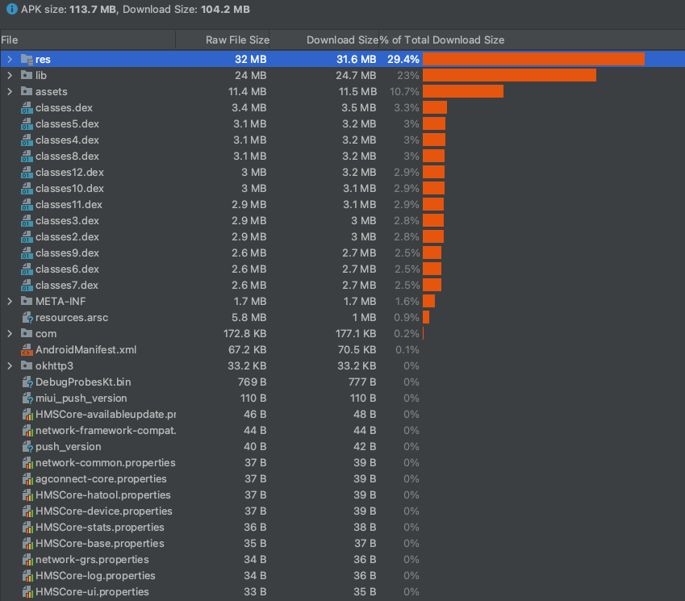
	- 下面按包体积的占比介绍一下各模块主要是做什么的
	- res目录：res是resource的缩写，这个目录存放项目中的资源文件，比如占比很大的drawable文件夹以及常用的layout、values文件夹
	- lib目录:存放应用程序依赖的native库文件, .so的形式存在
	- assets目录：用于存放需要打包到APK中的静态文件。和res的不同点在于，assets目录支持任意深度的子目录，用户可以根据自己的需求任意部署文件夹架构，而且res目录下的文件会在.R文件中生成对应的资源ID，assets不会自动生成对应的ID(在不动业务逻辑，或者代码逻辑的情况下,针对此项很难优化)
	- classes.dex文件：dex文件是工程中java、kotlin源代码编译后生成的class文件经过dexBuilder工具生成的特殊可执行文件
	- resources.arsc文件：编译后的二进制资源文件，生成一个资源映射表
	- META-INF目录：保存应用签名信息，此处可验证APK的完整性，签名等
	- AndroidManifest.xml：应件文件配置信息
- # 优化项
	- # 代码优化
		- ## ProGuard
		  collapsed:: true
			- 在未经混淆的class文件中可以很直观的看到源代码信息，如类名、方法名、变量名等，这些 符号带有许多语义信息，很容易被反编译成 Java 源代码。为了防止出现这种情况，我们可以使用ProGuard对 Java 字节码进行混淆。
			- 代码混淆也被称为 花指令，它 将计算机程序的代码转换成一种功能上等价，但是难以阅读和直接理解的形式。混淆就是对发布出去的程序进行重新组织和处理，使得处理后的代码与处理前代码完成相同的功能，而混淆后的代码很难被反编译，即使反编译成功也很难得出程序的真正语义。ProGuard的 作用 不仅仅是 保护代码，它也有 精简编译后程序大小 的作用，其 通过缩短变量和函数名以及丢失部分无用信息等方式，能使得应用包体积减小。
			- ## ProGuard的作用有3点：
			  collapsed:: true
				- ## 压缩（Shrinking）
				  collapsed:: true
					- 默认开启，以减小应用体积，移除未被使用的类和成员，并且 会在优化动作执行之后再次执行，因为优化后可能会再次暴露一些未被使用的类和成员。我们可以使用如下规则来关闭压缩：
					- -dontshrink 关闭压缩
				- ## 优化（Optimization）
				  collapsed:: true
					- 默认开启，在 字节码级别执行优化，让应用 运行的更快。使用如下规则可进行优化相关操作：
					- ```
					  -dontoptimize 关闭优化
					  -optimizationpasses n 表示proguard对代码进行迭代优化的次数，Android一般为5
					  ```
				- ## 混淆（Obfuscation）
				  collapsed:: true
					- 默认开启，增大反编译难度，类和类成员会被随机命名，除非用 优化字节码 等规则进行保护。使用如下规则可以关闭混淆：
					- ```
					  -dontobfuscate 关闭混淆
					  ```
			- ## gradle配置
			  collapsed:: true
				- 混淆之后，默认会在工程目录 app/build/outputs/mapping/release 下生成一个 mapping.txt 文件，这就是 混淆规则，所以我们可以根据这个文件把混淆后的代码反推回原本的代码。要使用混淆，我们只需配置如下代码即可：
				- ```
				  buildTypes {
				      release {
				          // 1、是否进行混淆
				          minifyEnabled true
				          // 2、开启zipAlign可以让安装包中的资源按4字节对齐，这样可以减少应用在运行时的内存消耗
				          zipAlignEnabled true
				          // 3、移除无用的resource文件：当ProGuard 把部分无用代码移除的时候，
				          // 这些代码所引用的资源也会被标记为无用资源，然后
				          // 系统通过资源压缩功能将它们移除。
				          // 需要注意的是目前资源压缩器目前不会移除values/文件夹中
				          // 定义的资源（例如字符串、尺寸、样式和颜色）
				          // 开启后，Android构建工具会通过ResourceUsageAnalyzer来检查
				          // 哪些资源是无用的，当检查到无用的资源时会把该资源替换
				          // 成预定义的版本。主要是针对.png、.9.png、.xml提供了
				          // TINY_PNG、TINY_9PNG、TINY_XML这3个byte数组的预定义版本。
				          // 资源压缩工具默认是采用安全压缩模式来运行，可以通过开启严格压缩模式来达到更好的瘦身效果。
				          shrinkResources true
				          // 4、混淆文件的位置，其中 proguard-android.txt 为sdk默认的混淆配置，
				          // 它的位置位于android-sdk/tools/proguard/proguard-android.txt，
				          // 此外，proguard-android-optimize.txt 也为sdk默认的混淆配置，
				          // 但是它默认打开了优化开关。并且，我们可在配置混淆文件将android.util.Log置为无效代码，
				          // 以去除apk中打印日志的代码。而 proguard-rules.pro 是该模块下的混淆配置。
				          proguardFiles getDefaultProguardFile('proguard-android-optimize.txt'), 'proguard-rules.pro'
				          signingConfig signingConfigs.release
				      }
				  }
				  ```
				- 58同城APP目前仅开启了混淆操作，对于zipAlign和shrinkResources并未开启，因为开启后会出现某些页面打开失败的情况。
				- 开启混淆是一个常规操作，这个举动能给我们应用带来极大的包大小收益。
		- ## AndResGuard
		  collapsed:: true
			- Android在构建过程中会根据资源生成R文件，里面包含了资源索引，使用该索引可以在最终生成的resources.arsc资源映射表中找到对应资源，对于开发者来说在代码中引用资源很方便。
			- 资源混淆主要为了混淆资源ID长度(例如将res/drawable/welcome.png混淆为r/s/a.png)，同时利用7z深度压缩，大大减少了安装包体积，同时提升了反破解难度。
			- 介绍微信的AndResGuard前，先看一下resource.arsc文件的结构，有助于我们更好的理解ResGuard原理
			  collapsed:: true
				- 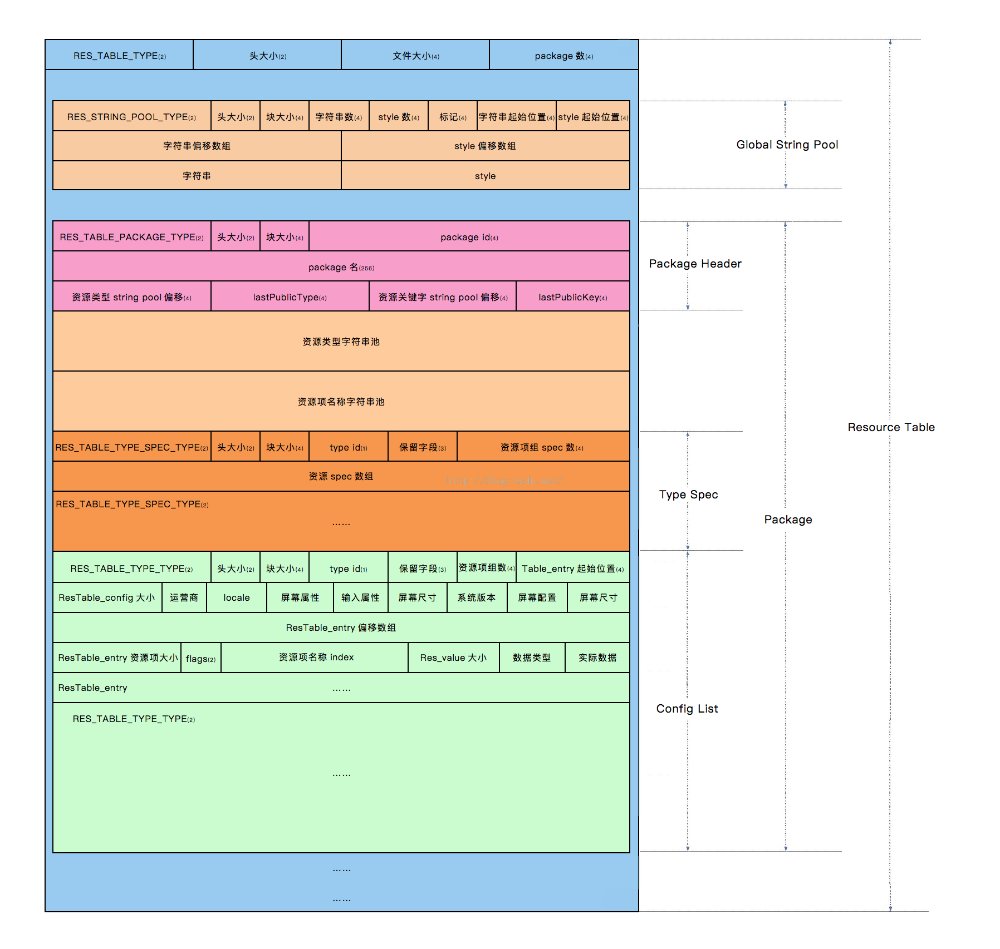
			- resources.arsc一共有五种chunk类型：
			- –table，是整个reousces table的开始，它的chunksize即是整个文件的大小。
			- –package，指的是一个package的开始，其实在resources,arsc是可以有多个package的。而packageID即是资源resID的最高八位，一般来说系统android的是1(0x01)，普通的例如com.tencent.mm会是127(0x7f)，剩下的是从2开始起步。当然这个我们在aapt也是可以指定的(1-127即八位的合法空间,一些混合编译就是改这个packageID)。
			- –string, 代表stringblock，我们一共有三种类型的stringblock。分别是table stringblock,typename stringblock, specsname stringblock。
			- –type，这里讲的是typename stringblock里面我们用到的各种type(用到多少种类型的type,就有多少个type chunk)，例如attr, drawable, layout, id, color, anim等，Type ID是紧跟着Package ID。
			- –config, 即是Android用来描述资源维度，例如横竖屏，屏幕密度，语言等。对于每一种type，它定义了多少种config，它后面就紧跟着多少个config chunk,例如我们定义了drawable-mdpi,drawable-hdpi,那后面就会有两个config。
			- –entry，尽管没有entry这个chunk,但是每个config里面都会有很多的entry，例如drawable-mdpi中有icon1.png,icon2.png两个drawable,那在mdpi这个config中就存在两个entry。
			- ## ResTable_header(资源索引表头)
			  collapsed:: true
				- 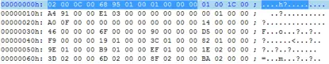
				- ResTable_header的chunk(02 00 0C 00 6895 01 00 01 000000)
				  02 00 位置0~ 1,共2字节，表示该chunk的类型，值为0x0002表示类型为RES_TABLE_TYPE.
				  0C 00 位置2 ~ 3 ,共2字节，表示该chunk类型的头长度，
				  值为0x000C表示该类型的头长度为12字节长度。
				  6895 01 00位置4~7，共4字节，表示该chunk的总长度
				  ，值为0x00019568表示该chunk的总长度(这里为整个文件的大小)为103784字节长度。
				  01 000000 被编译的资源包的个数，这里只有一个。
			- ## ResStringPool_header(全局字符串资源)
				- 紧跟着资源索引表头部的是资源项的全局字符串资源,这个字符串资源池包含了所有的在资源包里面所定义的资源项的全局字符串,包括android工程中部分资源文件名（如res/drawable-hdpi/ic_launcher.png，res/layout/activity_main.xml等）及res/values/strings.xml中的字符串值
				- 上图简化如下：
				  collapsed:: true
					- 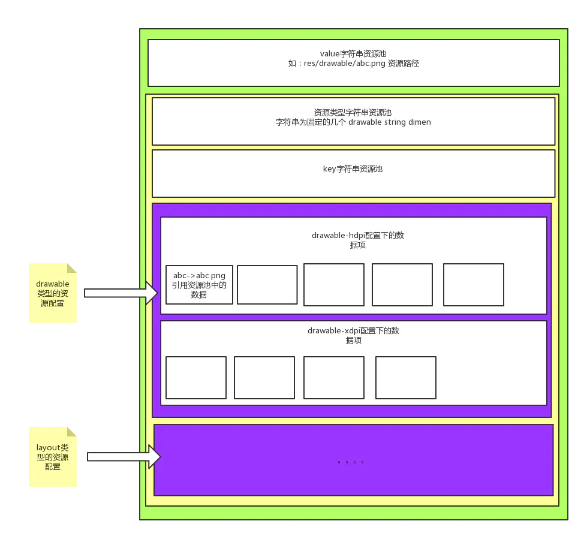
				- AndResGuard流程：
				  collapsed:: true
					- 1. table stringblock	把文件指向路径改变，例如res/layout/test.xml,改为res/layout/a.xml
					  2. 资源的文件名	需要将资源的文件名改为对应1，即将test.xml重命名为a.xml
					  3. specsname stringblock	旧的specsname除了白名单部分全部废弃，替换成所有我们混淆方案中用到的字符。由于大家都重复使用[a-z0-9_],specsname的总数量会大大减少。
					  4. entry中指向的specsname 中的id	例如原本test.xml它指向specsname中的第十项，我们需要用混淆后的a项的位置改写。
					  5. table chunk的大小	修改table chunk的最后大小
					  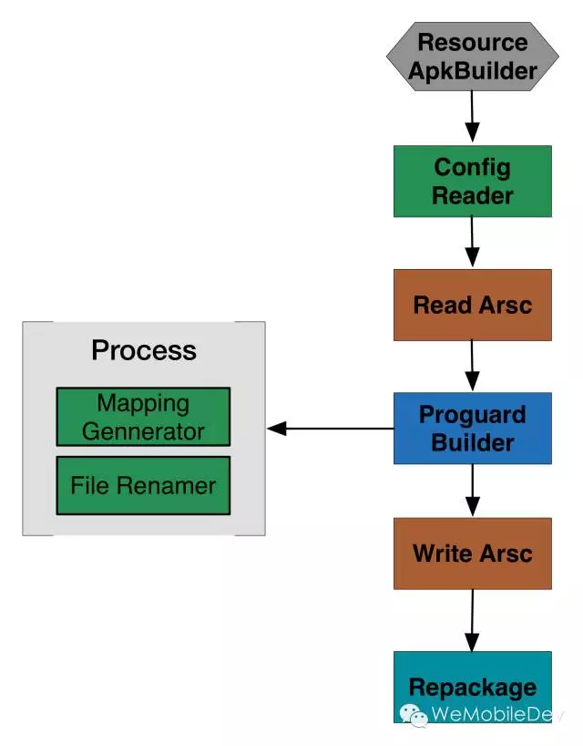{:height 826, :width 640}
		- ## R资源文件内联
		  collapsed:: true
			- Android 在构建的过程中，会为每个模块（库、应用）生成一份资源索引，诸如：Rid.class*，*Rlayout.class 等等，这对于开发者来说，在代码里引用资源十分的方便。
			- 为什么会出现内联？
			  在Library工程中引用的R资源索引不是final的不是常量，所以我们在Library工程不能在switch - case 和Annotation中使用资源索引。由于引用的资源不是final的，所以Library的产物aar中包含的class中使用的资源索引还是会以包名存在。
			- 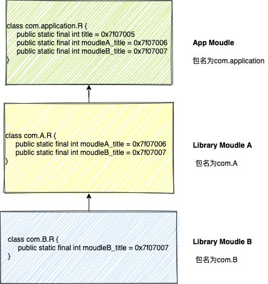
			- 在App工程中构建时会将依赖的AAR资源进行合并，根据合并的结果生成最终的R资源索引，这时的资源索引已经确定，所以全部是final的，java编译器在编译时会将final常量进行inline内联操作，也就是App工程中的java源码编译后的class中使用的R资源索引全部会替换为常量值。但resource.arsc文件中有关library的R资源类型还依然存在。
			- 我们采用了业界比较优秀的方案[ByteX R文件瘦身](https://github.com/bytedance/ByteX/blob/master/shrink-r-plugin/README-zh.md)。他是通过编译时使用Transform处理R文件的class，收集R资源相关的信息。流程如下：
			- 首先默认当前R文件class是可以被删除的。
			  如果是静态final int的field并且没有在白名单中则添加到shouldBeInlinedRFields集合中，否则添加到shouldSkipInlineRFields集合中，标记当前class不能被删除。
			  如果当前R文件所有field没有在白名单中则添加到shouldDiscardRClasses集合中，也就是该R文件class是可以被删除的。
			  如果扫描到Styleable class的方法时，方法用于初始化静态变量和静态代码块，并且不需要保留该类时，会使用AnalyzeStyleableClassVisitor处理，如果数组大小和计算的大小一致则加到shouldBeInlinedRFields集合，否则抛出异常。
			  真正开始Transform处理R文件，扫描filed判断进行删除
			  58app在使用ByteX将R资源inline后，包大小减少了4.6M，dex数量从16个减到了11个。
		- ## 资源优化
		  collapsed:: true
			- ## 图片压缩、使用WebP等
				- 图片资源是res文件夹下占比最大的，也是处理方式最简单的。我们拿到UI提供的图片资源后，直接使用压缩工具进行压缩即可。
				- 应用中使用最多的图片格式就是PNG。PNG图片主要有三个类型，分别为 PNG-8，PNG-24，PNG-32，数字越大代表可表现的色彩越丰富，但对于移动端来说，色彩越多意味着文件体积和占用的内存越大，对于APP中简单的icon或图片直接选择png-8更合适。
				- 对于带透明度的PNG可以选择[TinyPNG](https://tinypng.com/)、[pngquant](https://pngquant.org/)进行有损压缩，通常能有30-60%的压缩收益。
				- 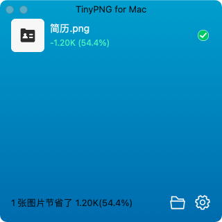
				- WebP 是 Google 的一种可以同时提供有损压缩（像 JPEG 一样）和透明度（像 PNG 一样）的图片文件格式，不过与 JPEG 或 PNG 相比，这种格式可以提供更小的文件大小。
				- Android Studio中提供了比较便捷的工具将PNG图片转为WebP，同时可以选择图片质量，更高的质量意味着更大的体积，这里需要做一个平衡。
				  collapsed:: true
					- 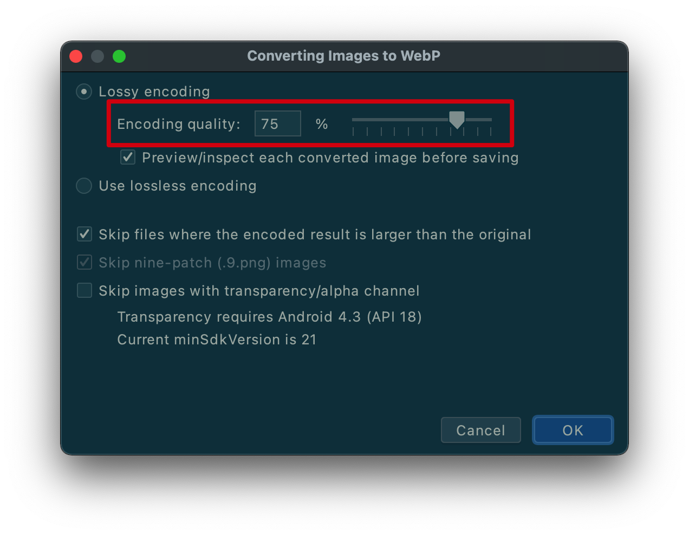
					- 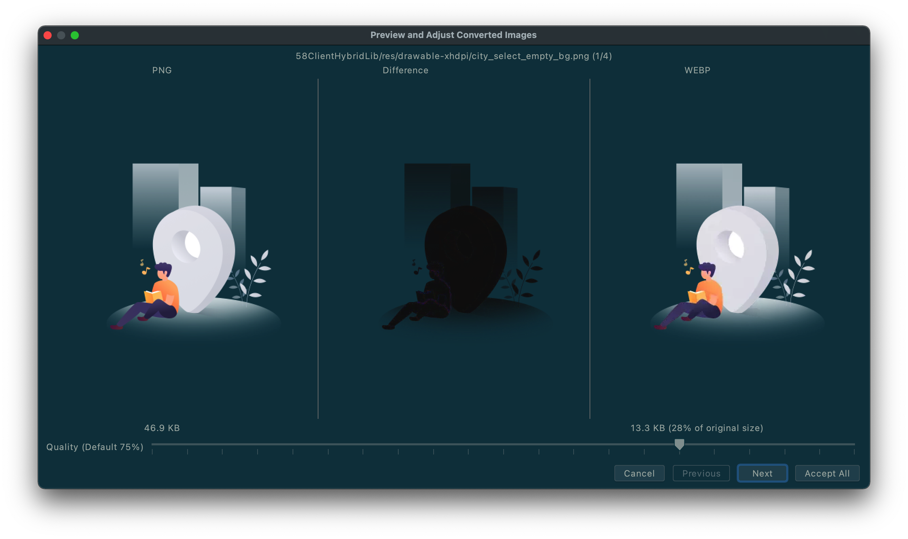
				- 在Android 4.0（API 级别 14）就已经支持显示 WebP 图片，Android 4.3（API 级别 18）及更高版本支持无损且透明的 WebP 图片，对于我们应用最低版本是5.0的来说，不用考虑兼容情况。目前我们项目中大量的使用了webp格式的图片，在包大小方面也有很大的收益。
			-
		- ## 语言配置只保留中文
		  collapsed:: true
			- 58同城作为深耕国内生活类应用，主要用户群也是中文用户，因此保留一个zh-rCN目录，去除其他语言配置即可达到缩减资源的目的。
		- # 非全屏图片只保留一套
		  collapsed:: true
			- 我们的项目中只保留drawable-xxhdpi一套超超高精度图片，确保大部分机型都可使用而不会模糊，因为我们调研了APP使用Top10以上的机型和近2年发布的新机型屏幕分辨率都在1080p以上，及少数在720p。提供一套xxhdpi的图片就可以满足业务需要，且不会有包大小的负担。
			  collapsed:: true
				- 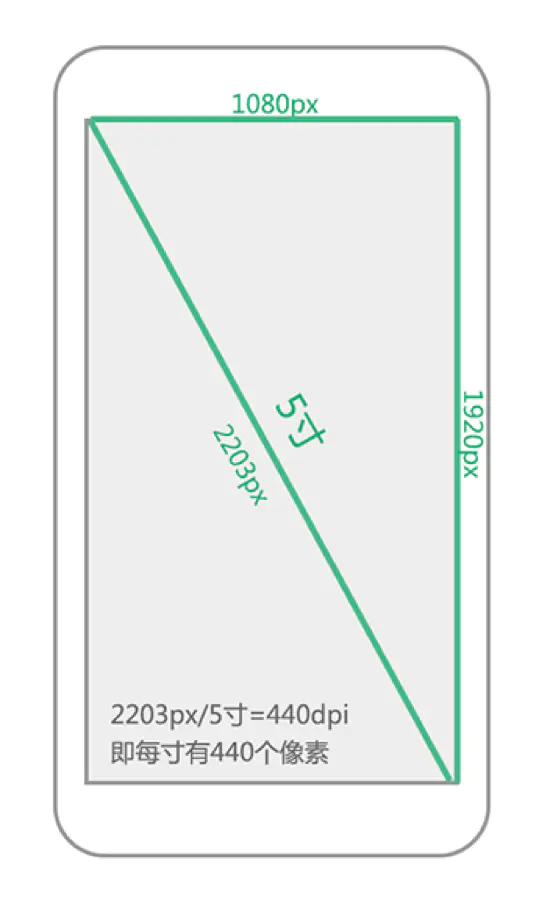
				-
			- 屏幕像素密度(dpi)
			  屏幕像素密度是指每英寸上的像素点数，单位是dpi，即“dot per inch”的缩写。屏幕像素密度与屏幕尺寸和屏幕分辨率有关，在单一变化条件下，屏幕尺寸越小、分辨率越高，像素密度越大，反之越小。假设1英寸上像素点为160个，那么该屏幕像素密度为160dpi,同理可知其余屏幕像素密度。
			- 为简便起见，Android 将所有屏幕密度分组为六种通用密度： 低、中、高、超高、超超高和超超超高。
			- ldpi（低）~ 120dpi
			  mdpi（中）~ 160dpi
			  hdpi（高）~ 240dpi
			  xhdpi（超高）~ 320dpi
			  xxhdpi（超超高） ~ 480dpi
			  xxxhdpi（超超超高）~ 640dpi
			- 屏幕适配
			  collapsed:: true
				- 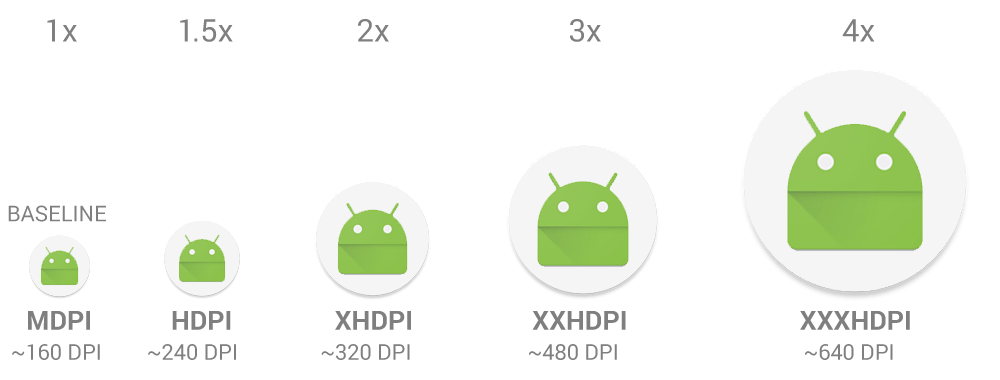
			- 对于5种主流的像素密度(mdpi,hdpi,xhdpi,xxhdpi和xxxdpi)应按照2:3:4:6:8的比例进行缩放。例如一个启动图片ic_launcher.png,它在各个像素密度文件夹下大小为：
			- ldpi（低）36*36 (0.75x)
			  mdpi（中）48*48 (1x)
			  hdpi（高）72*72 (1.5x)
			  xhdpi（超高）96*96 (2x)
			  xxhdpi（超超高）144*144 (3x)
			  xxxhdpi（超超超高）192*192 (4x)
			  Android SDK加载图片流程：
			- Android SDK会根据屏幕密度自动选择对应的资源文件进行渲染加载，比如说，SDK检测到你手机的分辨率是xhdpi，会优先到xhdpi文件夹下找对应的图片资源
			- 如果xhdpi文件夹下没有图片资源，那么就会去分辨率高的文件夹下查找，比如xxhdpi，直到找到同名图片资源，将它按比例缩小成xhpi图片
			- 如果往上查找图片还是没有找到，那么就会往低分辨率的文件夹查找，比如hdpi，直到找到同名图片资源，将它按比例放大成xhpi图片
		- ## 单架构so
		  collapsed:: true
			- lib文件夹主要存放了我们引用到的一些第三方so库。根据不同的架构类型，abi分多很多种。
			- ## 什么是ABI?
			  collapsed:: true
				- ABI是英文Application Binary Interface的缩写，即应用二进制接口。
				- 不同Android设备，使用的CPU架构可能不同，因此支持不同的指令集。 CPU 与指令集的每种组合都有其自己的应用二进制界面（或 ABI）,ABI非常精确地定义了应用程序的机器代码应如何在运行时与系统交互。Android目前支持以下7种ABIs:
				- mips, mips64, X86, X86–64, arm64-v8a, armeabi, armeabi-v7a
			- ## ABI 如何工作
			  collapsed:: true
				- 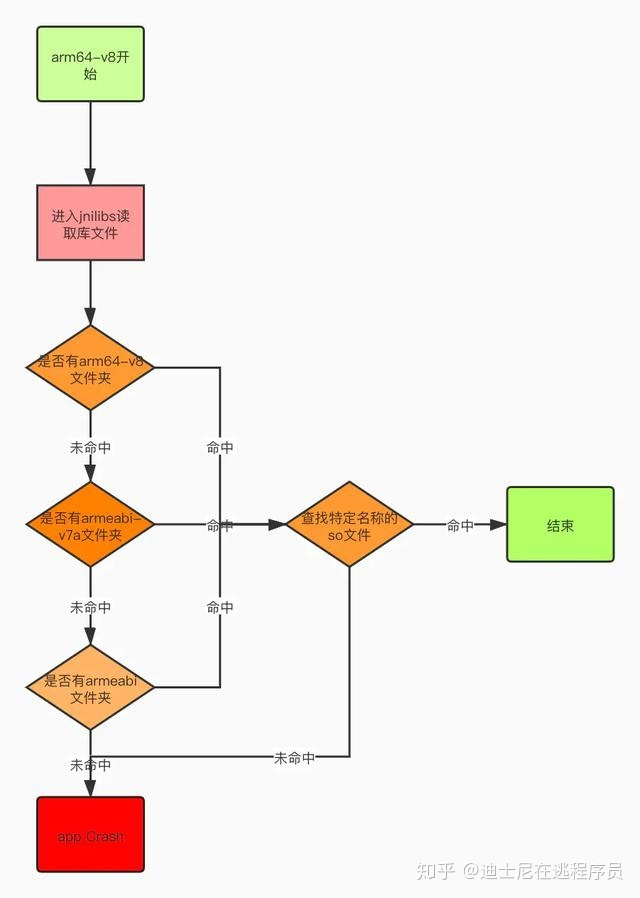
				- 对于一个cpu是arm64-v8a架构的手机，它运行app时，进入jnilibs去读取库文件时，先看有没有arm64-v8a文件夹，如果没有该文件夹，去找armeabi-v7a文件夹，如果没有，再去找armeabi文件夹，如果连这个文件夹也没有，就抛出异常；
				- 如果有arm64-v8a文件夹，那么就去找特定名称的.so文件，注意：如果没有找到想要的.so文件，不会再往下（armeabi-v7a文件夹）找了，而是直接抛出异常。
				- 目前市面上绝大部分的CPU架构都是armeabi-v7a/arm64-v8a，可以在gradle中加入配置只保留这两种so库的其中一种，具体配置如下：
					- ```
					  android {
					      ...
					      defaultConfig {
					          ...
					          ndk {
					              abiFilters "armeabi-v7a"//"arm64-v8a"
					          }
					      }
					  }
					  ```
			- 目前同城APP采用的是armeabi-v7a架构，随着国产厂商对于64位架构推进目前已经迁移到arm64-v8a架构了。
		- ## 还有哪些措施
		  collapsed:: true
			- 网络加载图片，调研过但因无法统计失败情况而放弃
			- 无用代码统计移除，工作量大，需要长时间统计数据后分析
			- 动态加载so文件
			- Facebook的Redex：将dex重新分包
			- assets文件夹内优化
		- # 包大小监控
		  collapsed:: true
			- ## 手动统计
			  collapsed:: true
				- 同城APP的包大小监控在每次版本发布后都会以邮件的方式进行展示各模块大小。
					- 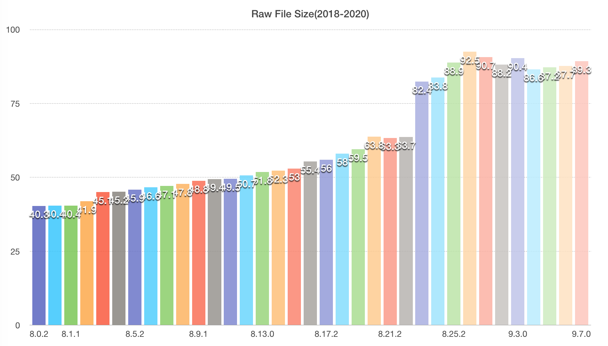
					- 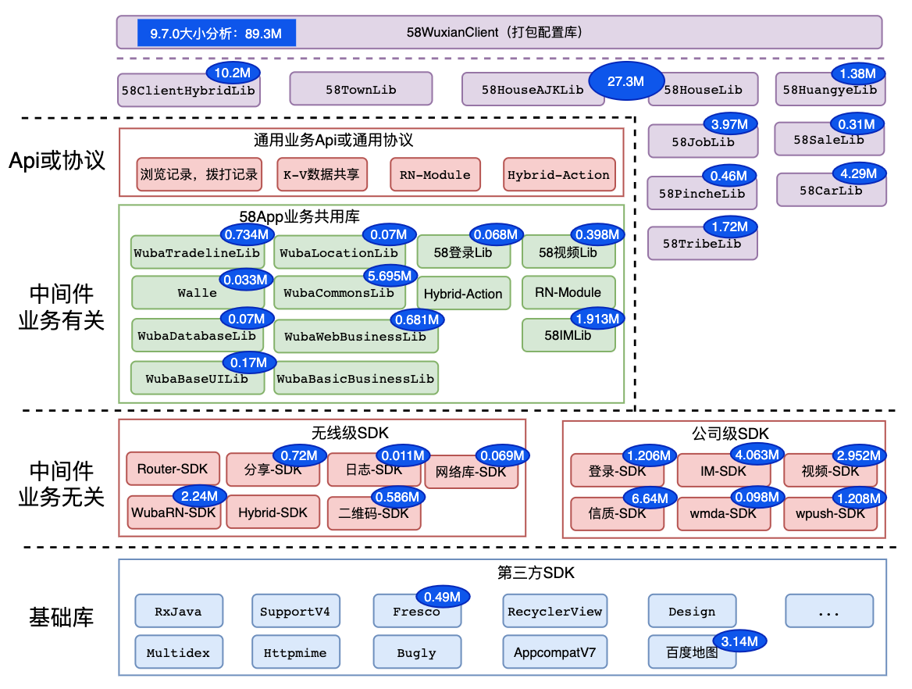
					- 在很早之前的版本都是手动统计各个模块大小，手动统计不仅费时费力，有时也会面临着统计不够全面的情况。
		- ## Zucker自动化
		  collapsed:: true
			- 19年底我们就计划将人力从繁琐的手动统计AAR大小中解放出来，我们自研并开源了Zucker工具，这可能是业界第一个从模块角度自动化统计包大小的工具。在当时Zucker有以下特点：
			- 业界首款可以从模块角度统计APK大小的工具；
			- 利用用户自身的运行环境即可运行，具有一定的通用性；
			- 使用脚本即可实现，极小的入侵用户代码，灵活性高、扩展性强；
			- 对比原有的统计方法，通过自动化，实现提效；
			- Zucker的整体架构如下：自动化打包统计、依赖分析、目标AAR模拟：
			  collapsed:: true
				- 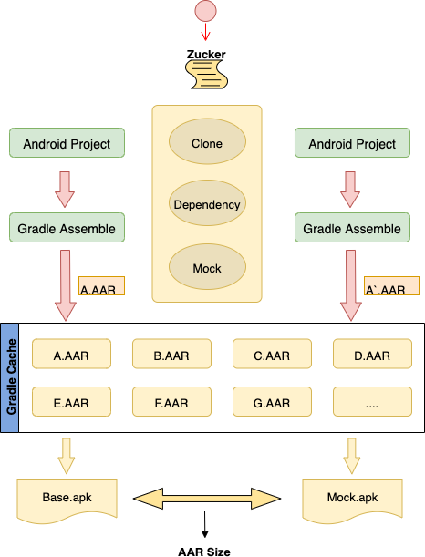
			- 但随着使用过程中，Zucker也暴露的一些问题：mock aar时会导致某些资源找不到，导致打包计算失败；打包时间虽相对手动统计有所提升，但时间上还是很长。
		- ## APS CI自动化
		  collapsed:: true
			- 与Zucker基于本项目打包计算AAR大小的思路不同，卫国创新性的使用了一个demo工程来统计AAR打入到apk中来计算AAR的大小，并修改了aapt2源码解决资源找不到的问题。这样使用APS能够解决Zucker的暴露所有问题，统计速度也更上一层楼。
			- ## APS流程
				- 首先执行打包获取demo包大小，
				- 然后获取依赖树列表，
				- 将依赖逐个添加到demo中并移除pom依赖，
				- 执行循环打包获取增量包大小，输出json结果。
				- 
				- 为了方便使用，APS与我们的AVM CI系统整合，专门用于产出包大小报告，它会自动下载58app工程源码并获取依赖树，一键式的发送包大小邮件。
				- 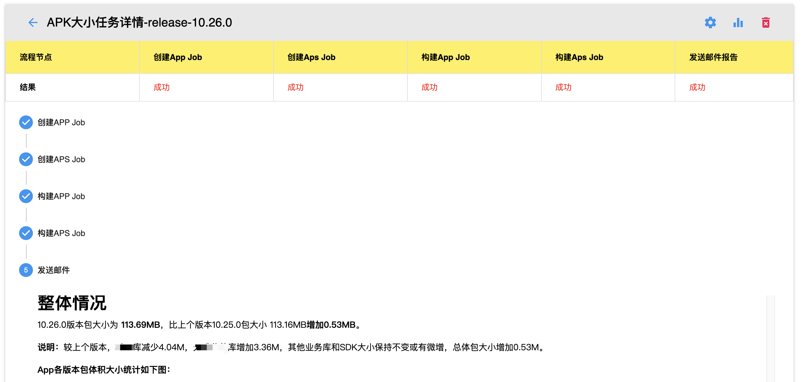
		- 总结与展望
		- 58同城APP在包大小治理上做过很多的努力，总结下来就是对APK内的各个文件进行优化，有对于res文件夹内资源的压缩与适度删除，也有对于dex文件进行的混淆和去除R文件内联等操作，还有对于resource.arsc文件内进行混淆的业界做法。我们激进地探索过内置图片网络化的功能，也有对于无用代码删除的方案踌躇过，这些都是我们对于包大小治理的方方面面。
		- 但随着时间的推移工程的越来越庞大，业务功能不断丰富累牍，包大小治理道阻且长。
		- 参考：
		- https://ishare.58corp.com/articleDetail?id=77385
		- https://ishare.58corp.com/articleDetail?id=24157
		- https://ishare.58corp.com/articleDetail?id=60576
		- https://juejin.cn/post/6844904103131234311
		- https://booster.johnsonlee.io/zh/guide/shrinking/res-index-inlining.html#%E5%88%A0%E9%99%A4%E4%B8%8D%E5%BF%85%E8%A6%81%E7%9A%84-r
		- https://mp.weixin.qq.com/s?__biz=MzAwNDY1ODY2OQ==&mid=208135658&idx=1&sn=ac9bd6b4927e9e82f9fa14e396183a8f#rd
		- https://developer.android.google.cn/training/multiscreen/screendensities?hl=zh_cn