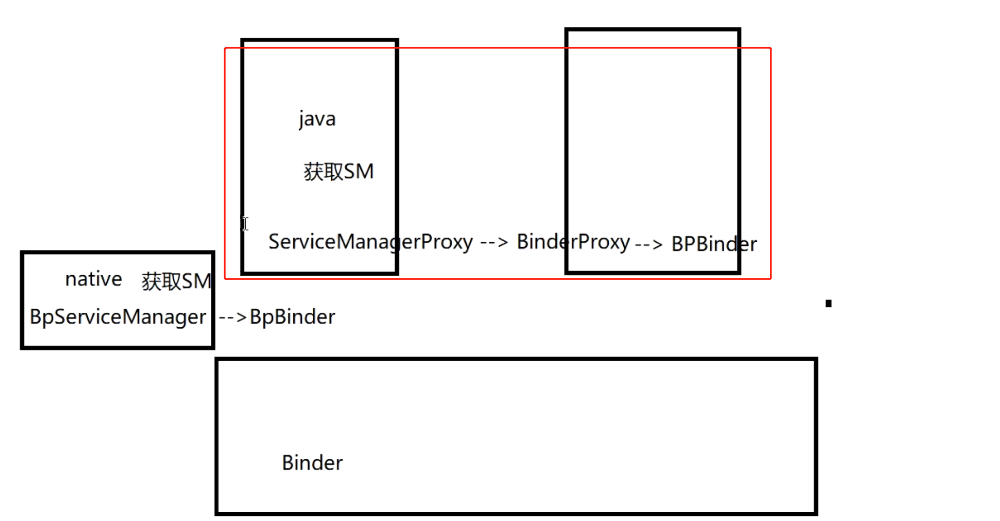
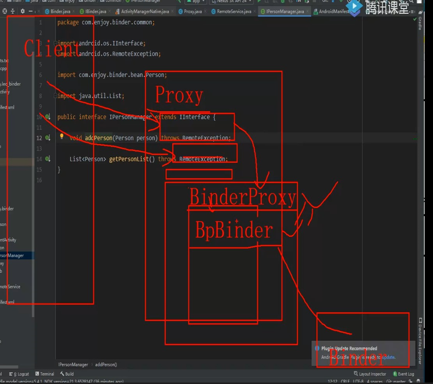

- 根据==AIDL自动生成的代码==中[[IPersonManager.java]]
- # 说明
	- ## Stub上述自动生成 继承了 Binder 实现了 IPersonManager接口
		- 相当于AMS中的[[ActivityManagerNative]]，也是相当于一个Binder
- # 客户端解析
	- ## [[#red]]==解析1、asInterface==
	  collapsed:: true
		- 使用地方：将服务端Service IBinder对象通过asInterface 转成 服务端定义的接口，这样就可以调用服务端进程的方法详见 [[绑定服务中 ServiceConnection的参数解析]]
		  collapsed:: true
			- ```java
			      private ServiceConnection connection = new ServiceConnection() {
			          @Override
			          public void onServiceConnected(ComponentName name, IBinder service) {
			              Log.e("leo", "onServiceConnected: success");
			              iPersonManager =  IPersonManager.Stub.asInterface(service);// proxy
			          }
			  
			          @Override
			          public void onServiceDisconnected(ComponentName name) {
			              Log.e("leo", "onServiceDisconnected: success");
			              iPersonManager = null;
			          }
			      };
			  ```
		- asInterface，位于Stub类中，方法如下
			- ```java
			  
			  public static com.lemonydbook.IPersonManager asInterface(android.os.IBinder obj)
			  {
			    if ((obj==null)) {
			      return null;
			    }
			    // 1、判断是否和客户端同进程，如果同进程有接口实现 直接返回
			    android.os.IInterface iin = obj.queryLocalInterface(DESCRIPTOR);
			    if (((iin!=null)&&(iin instanceof com.lemonydbook.IPersonManager))) {
			      return ((com.lemonydbook.IPersonManager)iin);
			    }
			    // 2，跨进程返回代理对象 
			    return new com.lemonydbook.IPersonManager.Stub.Proxy(obj);
			  }
			  ```
			- ## ==方法作用==
				- 1、判断是否和客户端同进程，如果同进程有接口实现类 直接返回
				- 2、否则非同进程，返回IPersonManager的代理类Stub.Proxy，给客户端用，实现跨进程
			- ## 详细解析
			  collapsed:: true
				- 看java层获取SM示例图
					- 
				- .Stub.Proxy(IBinder) 相当于ServiceManagerProxy(binderProxy)
				- [[ServiceManager的获取]]之前Binder机制Native层获取SM步骤中，Proxy(IBinder)相当于
				- Native层的new BpServiceManager（new BpBinder）等价 Proxy(IBinder 等价 BinderProxy)
	- ## [[#red]]==解析2==、通过1方法拿到了，服务端进程的IPersonManager接口代理对象，现看[[#red]]==代理类Proxy==中具体跨进程实现
		- 客户端用代理对象，调用远程服务的接口方法，addPerson，传入person对象
			- ```java
			  iPersonManager.addPerson(new Personon("xxx", 3));
			  ```
		- 看具体代理类Proxy的实现，怎么实现跨进程，transac
			- ```java
			      @Override
			      public void addPerson(Person person) throws RemoteException {
			          // 客户端 给 服务端的数据 打包到data
			          Parcel data = Parcel.obtain();
			          // 服务端 返回 给 客户端的数据 打包到 reply
			          Parcel reply = Parcel.obtain();
			          try {
			              data.writeInterfaceToken(DESCRIPTOR);
			              if ((person != null)) {
			                  data.writeInt(1);
			                  person.writeToParcel(data, 0);
			              } else {
			                  data.writeInt(0);
			              }
			              Log.e("leo", "Proxy,addPerson: " + Thread.currentThread());
			              // 调用  IBinder的 transact 实现跨进程 进行远程方法调用 
			              mRemote.transact(Stub.TRANSACTION_addPerson, data, reply, 0);
			              reply.readException();
			          } finally {
			              reply.recycle();
			              data.recycle();
			          }
			      }
			  ```
			- ## 加深理解
			  collapsed:: true
				- 
				- java 层 调用 Proxy
				- Proxy 调用Native 层 的  BinderProxy/BpBinder
				- BpBinder 再去调用 内核层的Binder。实现跨进程的传输
			- ##  [[#red]]==代理类中方法调用 addPerson做的事情==
				- 1、将 客户端数据 和 服务端数据 打包
				- 2、检测
				- 3、调用transact，执行跨进程
					- （同步的情况，客户端调用后，当前线程会挂起，等服务器返回数据）
					- 异步情况，不会挂起
	- ## [[解析3、transact方法]]
		- ## 需要讲
			- ### code就是那个第一个参数常量
			- ### 服务端的OnTransact方法
			- ### 数据发送（data reply）
				- 客户端发送的时候，把
				- data(客户端给服务端处理的数据)
				- reply(方法有返回值时，服务端会把数据放这里，返回，可以看onTransact中getPersonList具体实现)
				- 一起发给服务端。