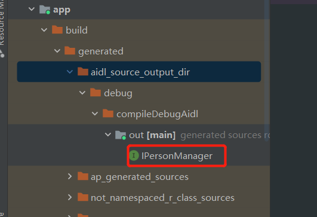

- # 需求
	- 进程A : 客户端ClientActivity  和 进程B  RmoteService 通信
- # 背景
  collapsed:: true
	- # 普通类与类之间的调用，模块化都是需要提供接口的
	- # AIDL也是如此
- # 示例1、AIDL支持的默认数据类型
  collapsed:: true
	- # 进程B服务端
	  collapsed:: true
		- ## 1、==创建AIDL 文件来定义接口规范==，创建名为 `IMyService.aidl`
		  collapsed:: true
			- ```aidl
			  // IMyService.aidl
			  
			  // 定义接口
			  interface IMyService {
			      int add(int a, int b);  // 定义一个加法方法
			  }
			  
			  ```
		- ## 2、服务端应用程序需要实现这个接口。==创建一个 Service，并在 onBind() 方法中返回接口的实现类==。
			- MyService.java
			- ```java
			  // MyService.java
			  
			  public class MyService extends Service {
			  
			      // 在 onBind() 方法中返回接口实现类的实例
			      @Override
			      public IBinder onBind(Intent intent) {
			          return mBinder;
			      }
			  
			      // 创建一个继承自 IMyService.Stub 的 Binder 子类
			      private final IMyService.Stub mBinder = new IMyService.Stub() {
			          @Override
			          public int add(int a, int b) throws RemoteException {
			              return a + b;
			          }
			      };
			  }
			  
			  ```
		- ## 3、在服务端的 AndroidManifest.xml 文件中==声明服务==：
			- ```xml
			  <!-- AndroidManifest.xml -->
			  
			  <service
			      android:name=".MyService"
			      android:exported="true">
			      <intent-filter>
			          <action android:name="com.example.MyService" />
			      </intent-filter>
			  </service>
			  ```
	- # 进程A客户端：绑定服务的方式获取远程服务的实例并调用其中的方法。
	  collapsed:: true
		- ```java
		  // MainActivity.java
		  
		  public class MainActivity extends AppCompatActivity {
		  
		      private IMyService mService;
		  
		      private ServiceConnection mConnection = new ServiceConnection() {
		          @Override
		          public void onServiceConnected(ComponentName name, IBinder service) {
		              // 获取远程服务的实例
		              mService = IMyService.Stub.asInterface(service);
		  
		              // 调用远程服务的方法
		              try {
		                  int result = mService.add(2, 3);
		                  Log.d("MainActivity", "Result: " + result);
		              } catch (RemoteException e) {
		                  e.printStackTrace();
		              }
		          }
		  
		          @Override
		          public void onServiceDisconnected(ComponentName name) {
		              mService = null;
		          }
		      };
		  
		      @Override
		      protected void onCreate(Bundle savedInstanceState) {
		          super.onCreate(savedInstanceState);
		          setContentView(R.layout.activity_main);
		  
		          // 根据全包名  绑定服务
		          Intent intent = new Intent("com.example.MyService");
		          intent.setPackage("com.example.serverapp"); // 服务端应用的包名
		          bindService(intent, mConnection, Context.BIND_AUTO_CREATE);
		      }
		  
		      @Override
		      protected void onDestroy() {
		          super.onDestroy();
		          // 解绑服务
		          unbindService(mConnection);
		      }
		  }
		  
		  ```
	- # SDK生成对应.java文件和Stub内部类
		- 当编译APP时，SDK工具会将项目**`/src/<SourceSet>/aidl`目录**下的.aidl文件一个个在项目**`/build/generated/source/aidl`目录**下生成IBinder接口.java文件。两个文件名一样，只是后缀不同。如**IRemoteService.aidl生成IRemoteService.java**。
		- ## Stub内部类
			- .aidl文件编译后生成的.java文件中自动生成的内部类。
			- public static abstract声明。
			- extends android.os.Binder。
			- 实现.aidl文件中定义的接口，且声明其所有方法。
		-
		- ## 实现Stub内部类要注意
			- 对于传过来的调用，无法保证是在主线程中执行的。Service必须要考虑多线程和线程安全。
			- 默认情况下，RPC都是异步的。**避免在主线程中调用AIDL**，不然可能会导致ANR。
			- 不能给调用方回抛异常。。
-
- # 使用流程
	- # 1、build.gradle,设置AIDL路径
	  collapsed:: true
		- ```gradle
		  sourceSets {
		      main {
		          manifest.srcFile 'src/main/AndroidManifest.xml'
		          java.srcDirs = ['src/main/java', 'src/main/aidl']
		          resources.srcDirs = ['src/main/java', 'src/main/aidl']
		          aidl.srcDirs = ['src/main/aidl']
		          res.srcDirs = ['src/main/res']
		          assets.srcDirs = ['src/main/assets']
		      }
		  }
		  ```
	- # 2、服务端Demo：
	  collapsed:: true
		- ## 2-1、新建aidl文件夹
		- ## 2-2、创建供客户端调用的aidl接口，定义相关被调用的方法
			- IPersonManager.aidl,放到一个包下，指定包名，生成的java类才可以被引用
				- ```aidl
				  package com.lemonydbook;
				  // 导入所需要使用的非默认支持数据类型的包
				  import com.lemonydbook.bean.Personon;
				  import com.lemonydbook.bean.Test;
				  
				  interface IPersonManager{
				      // 要加定向tag
				      void addPerson(in Personon person);
				  
				      void addTest(in Test test);
				  
				      List<Personon> getPersonList();
				  }
				  ```
			- ## 用到的java类
			  collapsed:: true
				- 作用：这个文件的作用是引入了一个序列化对象 Personon 供其他的AIDL文件使用
				- Personon.aidl
				  collapsed:: true
					- ```aidl
					  // 包名和javabean的包名一致
					  package com.lemonydbook.bean;
					  
					  parcelable Personon;
					  ```
				- Test.aidl
				  collapsed:: true
					- ```aidl
					  package com.lemonydbook.bean;
					  
					  parcelable Test;
					  ```
			- ## ==注意点：==
			  collapsed:: true
				- 导入所需要使用的非默认支持数据类型的包
				- 对外提供的接口方法，入参还需要添加定向tag
				  collapsed:: true
					- 入参时除了Java基本类型以及String，CharSequence之外的类型都需要在前面加上定向tag，具体加什么量需而定
				- 用到的java类，也需要aidl声明
					- 这个文件的作用是引入了一个序列化对象 Personon 供其他的AIDL文件使用
		- ## 2-3,build后IPersonManager.aidl会自动生成IPersonManager.java类
			- 路径：
			  collapsed:: true
				- 
			- 自动生成的IPersonManager.java代码：
			  collapsed:: true
				- ```java
				  /*
				   * This file is auto-generated.  DO NOT MODIFY.
				   */
				  public interface IPersonManager extends android.os.IInterface
				  {
				    /** Default implementation for IPersonManager. */
				    public static class Default implements IPersonManager
				    {
				      @Override public void addPerson(com.lemonydbook.bean.Personon person) throws android.os.RemoteException
				      {
				      }
				      @Override public void addTest(com.lemonydbook.bean.Test test) throws android.os.RemoteException
				      {
				      }
				      @Override public java.util.List<com.lemonydbook.bean.Personon> getPersonList() throws android.os.RemoteException
				      {
				        return null;
				      }
				      @Override
				      public android.os.IBinder asBinder() {
				        return null;
				      }
				    }
				    /** Local-side IPC implementation stub class. */
				    public static abstract class Stub extends android.os.Binder implements IPersonManager
				    {
				      private static final java.lang.String DESCRIPTOR = "IPersonManager";
				      /** Construct the stub at attach it to the interface. */
				      public Stub()
				      {
				        this.attachInterface(this, DESCRIPTOR);
				      }
				      /**
				       * Cast an IBinder object into an IPersonManager interface,
				       * generating a proxy if needed.
				       */
				      public static IPersonManager asInterface(android.os.IBinder obj)
				      {
				        if ((obj==null)) {
				          return null;
				        }
				        android.os.IInterface iin = obj.queryLocalInterface(DESCRIPTOR);
				        if (((iin!=null)&&(iin instanceof IPersonManager))) {
				          return ((IPersonManager)iin);
				        }
				        return new IPersonManager.Stub.Proxy(obj);
				      }
				      @Override public android.os.IBinder asBinder()
				      {
				        return this;
				      }
				      @Override public boolean onTransact(int code, android.os.Parcel data, android.os.Parcel reply, int flags) throws android.os.RemoteException
				      {
				        java.lang.String descriptor = DESCRIPTOR;
				        switch (code)
				        {
				          case INTERFACE_TRANSACTION:
				          {
				            reply.writeString(descriptor);
				            return true;
				          }
				          case TRANSACTION_addPerson:
				          {
				            data.enforceInterface(descriptor);
				            com.lemonydbook.bean.Personon _arg0;
				            if ((0!=data.readInt())) {
				              _arg0 = com.lemonydbook.bean.Personon.CREATOR.createFromParcel(data);
				            }
				            else {
				              _arg0 = null;
				            }
				            this.addPerson(_arg0);
				            reply.writeNoException();
				            return true;
				          }
				          case TRANSACTION_addTest:
				          {
				            data.enforceInterface(descriptor);
				            com.lemonydbook.bean.Test _arg0;
				            if ((0!=data.readInt())) {
				              _arg0 = com.lemonydbook.bean.Test.CREATOR.createFromParcel(data);
				            }
				            else {
				              _arg0 = null;
				            }
				            this.addTest(_arg0);
				            reply.writeNoException();
				            return true;
				          }
				          case TRANSACTION_getPersonList:
				          {
				            data.enforceInterface(descriptor);
				            java.util.List<com.lemonydbook.bean.Personon> _result = this.getPersonList();
				            reply.writeNoException();
				            reply.writeTypedList(_result);
				            return true;
				          }
				          default:
				          {
				            return super.onTransact(code, data, reply, flags);
				          }
				        }
				      }
				      private static class Proxy implements IPersonManager
				      {
				        private android.os.IBinder mRemote;
				        Proxy(android.os.IBinder remote)
				        {
				          mRemote = remote;
				        }
				        @Override public android.os.IBinder asBinder()
				        {
				          return mRemote;
				        }
				        public java.lang.String getInterfaceDescriptor()
				        {
				          return DESCRIPTOR;
				        }
				        @Override public void addPerson(com.lemonydbook.bean.Personon person) throws android.os.RemoteException
				        {
				          android.os.Parcel _data = android.os.Parcel.obtain();
				          android.os.Parcel _reply = android.os.Parcel.obtain();
				          try {
				            _data.writeInterfaceToken(DESCRIPTOR);
				            if ((person!=null)) {
				              _data.writeInt(1);
				              person.writeToParcel(_data, 0);
				            }
				            else {
				              _data.writeInt(0);
				            }
				            boolean _status = mRemote.transact(Stub.TRANSACTION_addPerson, _data, _reply, 0);
				            if (!_status && getDefaultImpl() != null) {
				              getDefaultImpl().addPerson(person);
				              return;
				            }
				            _reply.readException();
				          }
				          finally {
				            _reply.recycle();
				            _data.recycle();
				          }
				        }
				        @Override public void addTest(com.lemonydbook.bean.Test test) throws android.os.RemoteException
				        {
				          android.os.Parcel _data = android.os.Parcel.obtain();
				          android.os.Parcel _reply = android.os.Parcel.obtain();
				          try {
				            _data.writeInterfaceToken(DESCRIPTOR);
				            if ((test!=null)) {
				              _data.writeInt(1);
				              test.writeToParcel(_data, 0);
				            }
				            else {
				              _data.writeInt(0);
				            }
				            boolean _status = mRemote.transact(Stub.TRANSACTION_addTest, _data, _reply, 0);
				            if (!_status && getDefaultImpl() != null) {
				              getDefaultImpl().addTest(test);
				              return;
				            }
				            _reply.readException();
				          }
				          finally {
				            _reply.recycle();
				            _data.recycle();
				          }
				        }
				        @Override public java.util.List<com.lemonydbook.bean.Personon> getPersonList() throws android.os.RemoteException
				        {
				          android.os.Parcel _data = android.os.Parcel.obtain();
				          android.os.Parcel _reply = android.os.Parcel.obtain();
				          java.util.List<com.lemonydbook.bean.Personon> _result;
				          try {
				            _data.writeInterfaceToken(DESCRIPTOR);
				            boolean _status = mRemote.transact(Stub.TRANSACTION_getPersonList, _data, _reply, 0);
				            if (!_status && getDefaultImpl() != null) {
				              return getDefaultImpl().getPersonList();
				            }
				            _reply.readException();
				            _result = _reply.createTypedArrayList(com.lemonydbook.bean.Personon.CREATOR);
				          }
				          finally {
				            _reply.recycle();
				            _data.recycle();
				          }
				          return _result;
				        }
				        public static IPersonManager sDefaultImpl;
				      }
				      static final int TRANSACTION_addPerson = (android.os.IBinder.FIRST_CALL_TRANSACTION + 0);
				      static final int TRANSACTION_addTest = (android.os.IBinder.FIRST_CALL_TRANSACTION + 1);
				      static final int TRANSACTION_getPersonList = (android.os.IBinder.FIRST_CALL_TRANSACTION + 2);
				      public static boolean setDefaultImpl(IPersonManager impl) {
				        if (Stub.Proxy.sDefaultImpl == null && impl != null) {
				          Stub.Proxy.sDefaultImpl = impl;
				          return true;
				        }
				        return false;
				      }
				      public static IPersonManager getDefaultImpl() {
				        return Stub.Proxy.sDefaultImpl;
				      }
				    }
				    public void addPerson(com.lemonydbook.bean.Personon person) throws android.os.RemoteException;
				    public void addTest(com.lemonydbook.bean.Test test) throws android.os.RemoteException;
				    public java.util.List<com.lemonydbook.bean.Personon> getPersonList() throws android.os.RemoteException;
				  }
				  
				  ```
		- ## 2-4、新建远程Service，onBind（）方法返回IPersonManager.Stub的子类对象（是一个Ibinder），实现IPersonManager.aidl定义的接口方法
			- RemoteService.java
			  collapsed:: true
				- ```java
				  package com.lemonydbook.server;
				  
				  import android.app.Service;
				  import android.content.Intent;
				  import android.os.IBinder;
				  import android.os.RemoteException;
				  import android.util.Log;
				  
				  import com.lemonydbook.bean.Personon;
				  import com.lemonydbook.bean.Test;
				  
				  import java.util.ArrayList;
				  import java.util.List;
				  
				  import androidx.annotation.Nullable;
				  
				  /**
				   *  另一个进程的远程服务
				   */
				  public class RemoteService extends Service {
				  
				      private ArrayList<Personon> Personons;
				      private ArrayList<Test> Tests;
				      @Nullable
				      @Override
				      public IBinder onBind(Intent intent) {
				          Personons = new ArrayList<>();
				          Tests = new ArrayList<>();
				          Log.e("LeoAidlService", "success onBind");
				          return iBinder;
				      }
				  
				      /**
				       *  返回 IPersonManager.Stub()子类对象，实现IPersonManager.aidl接口方法
				       */
				      private IBinder iBinder = new IPersonManager.Stub() {
				          // 存test到服务端
				          @Override
				          public void addTest(Test test) throws RemoteException {
				              Tests.add(test);
				          }
				  
				          // 存person到服务端
				          @Override
				          public void addPerson(Personon Personon) throws RemoteException {
				              Personons.add(Personon);
				          }
				  
				          // 取person
				          @Override
				          public List<Personon> getPersonList() throws RemoteException {
				              return Personons;
				          }
				      };
				  }
				  
				  ```
		- ## 2-5：最后在清单文件里 注册服务，其中属性要加上export:true 让外部程序可以访问。
		  collapsed:: true
			- ```xml
			  <service
			              android:name=".server.RemoteService"
			              android:exported="true"
			              android:process=":remote">
			              <intent-filter>
			                  <action android:name="com.enjoy.binder" />
			                  <category android:name="android.intent.category.DEFAULT" />
			              </intent-filter>
			          </service>
			  ```
	- # 3、客户端Demo：
		- ## 非同一个项目需要：
			- 1：将服务端的IPersonManager.aidl文件拷贝到main文件夹下，
			- 2：重建一下项目检查一下IPersonManager.aidl是否构建成功
		- ## 3：连接绑定服务，定义ICompute对象aaa，通过绑定服务连接成功的asInteface接口返回对象赋值给aaa。之后就可以随意调用服务端接口了
		  collapsed:: true
			- activitybind服务
				- ```java
				  package com.lemonydbook;
				  
				  import android.content.ComponentName;
				  import android.content.Context;
				  import android.content.Intent;
				  import android.content.ServiceConnection;
				  import android.os.Bundle;
				  import android.os.IBinder;
				  import android.os.RemoteException;
				  import android.util.Log;
				  import android.view.View;
				  
				  import com.lemonydbook.bean.Personon;
				  import com.lemonydbook.server.RemoteService;
				  import com.lemonydbook.IPersonManager;
				  
				  import java.util.List;
				  
				  import androidx.annotation.Nullable;
				  import androidx.appcompat.app.AppCompatActivity;
				  
				  public class ClientActivity extends AppCompatActivity {
				  
				      private IPersonManager iPersonManager;
				  
				      @Override
				      protected void onCreate(@Nullable Bundle savedInstanceState) {
				          super.onCreate(savedInstanceState);
				  
				          setContentView(R.layout.activity_main);
				  
				          Intent intent = new Intent(this, RemoteService.class);
				          intent.setAction("com.enjoy.binder");
				          bindService(intent, connection, Context.BIND_AUTO_CREATE);
				  
				          //测试进程间通信
				          findViewById(R.id.btn).setOnClickListener(new View.OnClickListener() {
				              @Override
				              public void onClick(View v) {
				                  try {
				                      Log.e("leo", "------------onClick:" + Thread.currentThread());
				                      iPersonManager.addPerson(new Personon("leo", 3));
				                      List<Personon> persons = iPersonManager.getPersonList();
				                      Log.e("leo", persons.toString() + "," + Thread.currentThread());
				                  } catch (RemoteException e) {
				                      e.printStackTrace();
				                  }
				              }
				          });
				      }
				  
				      private ServiceConnection connection = new ServiceConnection() {
				          @Override
				          public void onServiceConnected(ComponentName name, IBinder service) {
				              Log.e("leo", "onServiceConnected: success");
				              iPersonManager =  IPersonManager.Stub.asInterface(service);// proxy
				          }
				  
				          @Override
				          public void onServiceDisconnected(ComponentName name) {
				              Log.e("leo", "onServiceDisconnected: success");
				              iPersonManager = null;
				          }
				      };
				  }
				  
				  ```
	-