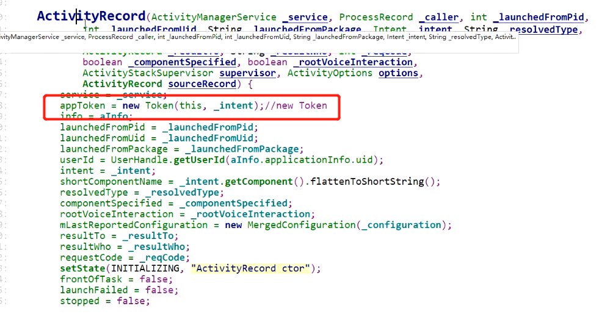
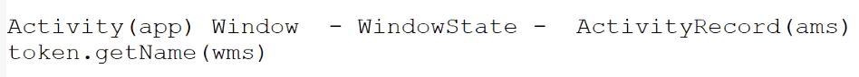

- 在ActivityRecord中创建的
	- 
- ## Token
	- ```java
	    static class Token extends IApplicationToken.Stub {
	          private final WeakReference<ActivityRecord> weakActivity;// 对应Activity
	          private final String name;
	  
	          Token(ActivityRecord activity, Intent intent) {
	              weakActivity = new WeakReference<>(activity);
	              name = intent.getComponent().flattenToShortString();
	          }
	  
	          private static @Nullable ActivityRecord tokenToActivityRecordLocked(Token token) {
	              if (token == null) {
	                  return null;
	              }
	              ActivityRecord r = token.weakActivity.get();
	              if (r == null || r.getActivityStack() == null) {
	                  return null;
	              }
	              return r;
	          }
	  
	          @Override
	          public String toString() {
	              StringBuilder sb = new StringBuilder(128);
	              sb.append("Token{");
	              sb.append(Integer.toHexString(System.identityHashCode(this)));
	              sb.append(' ');
	              sb.append(weakActivity.get());
	              sb.append('}');
	              return sb.toString();
	          }
	  
	      // 在wms里区分 当前window 是哪个ActivityRecord 的窗口
	          @Override
	          public String getName() { // 返回的应该是Activity的全报名
	              return name;
	          }
	      }
	  ```
## getName作用（返回的Activity的全包名，相当于唯一编号）
	- 
	- 拿到token就知道window属于哪个 ActivityRecord的
	- 拿到token就知道属于哪个Activity的
-