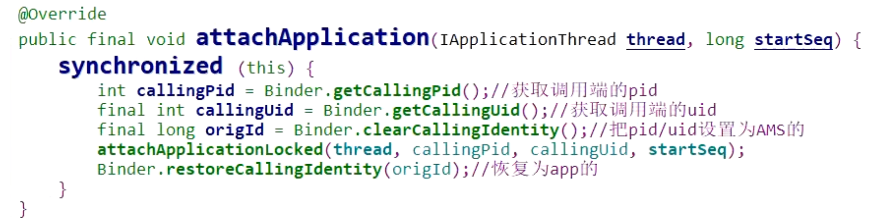

- 在Activity启动流程中，有个应用程序进程启动其中
- AMS的attachApplication 方法有个权限验证
- 
- 它的大概流程
	- 1、获取客户端的pid,uid
	- 2、将这2项设置为ams对应的id，然后去执行attachApplicationLoacked功能去了
		- 相当于先替换id拿带有权限的id去干活，干完活再恢复原来的id
	- 3、执行完功能，把pid，uid再恢复成app调用方的。
- 形象比喻
	- 公司课程 7000，卖课老师有内部价格 5000
	- 这相当于熟人找卖课老师走内部优惠的过程
	- 1、熟人的id都获取到 拿这个id去买课肯定不行
		- Binder.getCallingPid/uid，
	- 2、替换成卖课老师的id相当于
		- clearCallingIdentity
	- 3、买课
		- attachApplicationLoacked
	- 4、再把人家的id恢复
		- ->  restoreCallingIdentity