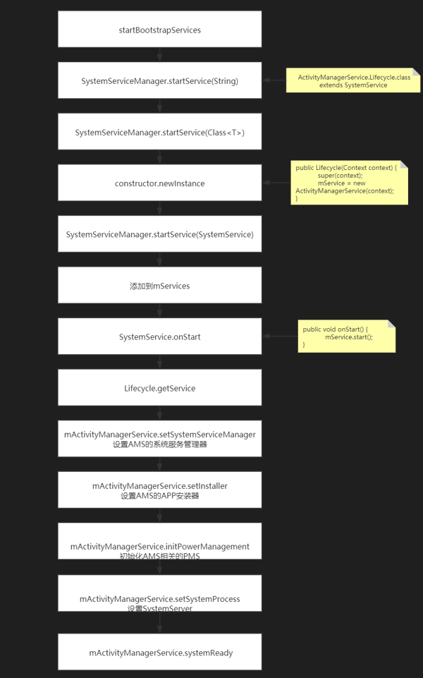

- # 流程图
	- 
- ## 1、AMS是在SystemServer中被添加的， 所以先到SystemServer中查看初始化
  collapsed:: true
	- SystemServer.java
		- ```java
		  public static void main(String[] args) {
		  	new SystemServer().run();
		  }
		  
		  private void run() {
		            ...
		            createSystemContext();
		            // Create the system service manager.
		            mSystemServiceManager = new SystemServiceManager(mSystemContext);
		            mSystemServiceManager.setStartInfo(mRuntimeRestart, mRuntimeStartElapsedTime, mRuntimeStartUptime);
		            LocalServices.addService(SystemServiceManager.class,mSystemServiceManager);
		            // Prepare the thread pool for init tasks that can be parallelized
		            SystemServerInitThreadPool.get();
		      } finally {
		      	  traceEnd(); // InitBeforeStartServices
		      }
		      // Start services. 启动服务
		      try {
		          traceBeginAndSlog("StartServices");
		          startBootstrapServices();
		          startCoreServices();
		          startOtherServices();
		          SystemServerInitThreadPool.shutdown();
		      } catch (Throwable ex) {
		      	throw ex;
		      } finally {
		      	traceEnd();
		      }
		      // Loop forever.
		      Looper.loop();
		      throw new RuntimeException("Main thread loop unexpectedly exited");
		  }
		  ```
	-
- ## 2、在SystemServer中，在startBootstrapServices()中去启动了AMS
  collapsed:: true
	- SystemServer.java
	- ```java
	  private void startBootstrapServices() {
	        ...
	        // Activity manager runs the show.
	        traceBeginAndSlog("StartActivityManager");
	        //启动了AMS
	        mActivityManagerService = mSystemServiceManager.startService(
	  							ActivityManagerService.Lifecycle.class).getService();
	        mActivityManagerService.setSystemServiceManager(mSystemServiceManager);
	        mActivityManagerService.setInstaller(installer);
	        traceEnd();
	        ...
	        // Now that the power manager has been started, let the activity manager
	        // initialize power management features.
	        traceBeginAndSlog("InitPowerManagement");
	        mActivityManagerService.initPowerManagement();
	        traceEnd();
	        // Set up the Application instance for the system process and get started.
	        traceBeginAndSlog("SetSystemProcess");
	        mActivityManagerService.setSystemProcess();
	        traceEnd();
	  }
	  ```
- ## 3、AMS是通过SystemServiceManager.startService去启动的，参数是ActivityManagerService.Lifecycle.class， 首先看看startService方法
  collapsed:: true
	- SystemServiceManager.startService
		- ```java
		      public SystemService startService(String className) {
		          final Class<SystemService> serviceClass;
		          try {
		              serviceClass = (Class<SystemService>)Class.forName(className);
		          } catch (ClassNotFoundException ex) {
		              Slog.i(TAG, "Starting " + className);
		              throw new RuntimeException("Failed to create service " + className
		                      + ": service class not found, usually indicates that the caller should "
		                      + "have called PackageManager.hasSystemFeature() to check whether the "
		                      + "feature is available on this device before trying to start the "
		                      + "services that implement it", ex);
		          }
		          return startService(serviceClass);
		      }
		  
		  	 public <T extends SystemService> T startService(Class<T> serviceClass) {
		          try {
		              final String name = serviceClass.getName();
		              Slog.i(TAG, "Starting " + name);
		              Trace.traceBegin(Trace.TRACE_TAG_SYSTEM_SERVER, "StartService " + name);
		  
		              // Create the service.
		              if (!SystemService.class.isAssignableFrom(serviceClass)) {
		                  throw new RuntimeException("Failed to create " + name
		                          + ": service must extend " + SystemService.class.getName());
		              }
		              final T service;
		              try {
		                  Constructor<T> constructor = serviceClass.getConstructor(Context.class);
		                  service = constructor.newInstance(mContext);
		              } catch (InstantiationException ex) {
		                  throw new RuntimeException("Failed to create service " + name
		                          + ": service could not be instantiated", ex);
		              } catch (IllegalAccessException ex) {
		                  throw new RuntimeException("Failed to create service " + name
		                          + ": service must have a public constructor with a Context argument", ex);
		              } catch (NoSuchMethodException ex) {
		                  throw new RuntimeException("Failed to create service " + name
		                          + ": service must have a public constructor with a Context argument", ex);
		              } catch (InvocationTargetException ex) {
		                  throw new RuntimeException("Failed to create service " + name
		                          + ": service constructor threw an exception", ex);
		              }
		  
		              startService(service);
		              return service;
		          } finally {
		              Trace.traceEnd(Trace.TRACE_TAG_SYSTEM_SERVER);
		          }
		      }
		  
		  
		  	public void startService(@NonNull final SystemService service) {
		          // Register it.
		          mServices.add(service);
		          // Start it.
		          long time = SystemClock.elapsedRealtime();
		          try {
		              service.onStart();
		          } catch (RuntimeException ex) {
		              throw new RuntimeException("Failed to start service " + service.getClass().getName()
		                      + ": onStart threw an exception", ex);
		          }
		          warnIfTooLong(SystemClock.elapsedRealtime() - time, service, "onStart");
		      }
		  ```
	- startService方法很简单，是通过传进来的class然后反射创建对应的service服务。所以此处创建的是Lifecycle的实例， 然后通过startService启动了AMS服务
- ## 4、那我们再去看看ActivityManagerService.Lifecycle这个类的构造方法
  collapsed:: true
	- Lifecycle.java,构造函数中初始化了ActivityManagerService
	  collapsed:: true
		- ```java
		   public static final class Lifecycle extends SystemService {
		          private final ActivityManagerService mService;
		          private static ActivityTaskManagerService sAtm;
		  
		          public Lifecycle(Context context) {
		              super(context);
		              mService = new ActivityManagerService(context, sAtm);
		          }
		  
		          public static ActivityManagerService startService(
		                  SystemServiceManager ssm, ActivityTaskManagerService atm) {
		              sAtm = atm;
		              return ssm.startService(ActivityManagerService.Lifecycle.class).getService();
		          }
		  
		          @Override
		          public void onStart() {
		              mService.start();
		          }
		  
		          @Override
		          public void onBootPhase(int phase) {
		              mService.mBootPhase = phase;
		              if (phase == PHASE_SYSTEM_SERVICES_READY) {
		                  mService.mBatteryStatsService.systemServicesReady();
		                  mService.mServices.systemServicesReady();
		              } else if (phase == PHASE_ACTIVITY_MANAGER_READY) {
		                  mService.startBroadcastObservers();
		              } else if (phase == PHASE_THIRD_PARTY_APPS_CAN_START) {
		                  mService.mPackageWatchdog.onPackagesReady();
		              }
		          }
		  
		          @Override
		          public void onCleanupUser(int userId) {
		              mService.mBatteryStatsService.onCleanupUser(userId);
		          }
		  
		          public ActivityManagerService getService() {
		              return mService;
		          }
		      }
		  ```
	- 再来开课AMS初始化做了什么，AMS构造函数
		- API 29
		  collapsed:: true
			- ```java
			      public ActivityManagerService(Context systemContext, ActivityTaskManagerService atm) {
			          LockGuard.installLock(this, LockGuard.INDEX_ACTIVITY);
			          mInjector = new Injector();
			          // //赋值mContext
			          mContext = systemContext;
			  
			          mFactoryTest = FactoryTest.getMode();
			          // 获取当前的ActivityThread
			          mSystemThread = ActivityThread.currentActivityThread();
			         // //赋值mUiContext
			          mUiContext = mSystemThread.getSystemUiContext();
			  
			          Slog.i(TAG, "Memory class: " + ActivityManager.staticGetMemoryClass());
			  		
			        	//创建Handler线程，用来处理handler消息
			          mHandlerThread = new ServiceThread(TAG,
			                  THREAD_PRIORITY_FOREGROUND, false /*allowIo*/);
			          mHandlerThread.start();
			          mHandler = new MainHandler(mHandlerThread.getLooper());
			          //处理ui相关msg的Handler
			          mUiHandler = mInjector.getUiHandler(this);
			  
			          mProcStartHandlerThread = new ServiceThread(TAG + ":procStart",
			                  THREAD_PRIORITY_FOREGROUND, false /* allowIo */);
			          mProcStartHandlerThread.start();
			          mProcStartHandler = new Handler(mProcStartHandlerThread.getLooper());
			  
			          //管理AMS的一些常量，厂商定制系统就可能修改此处
			          mConstants = new ActivityManagerConstants(mContext, this, mHandler);
			          final ActiveUids activeUids = new ActiveUids(this, true /* postChangesToAtm */);
			          mProcessList.init(this, activeUids);
			          mLowMemDetector = new LowMemDetector(this);
			          mOomAdjuster = new OomAdjuster(this, mProcessList, activeUids);
			  
			          // Broadcast policy parameters
			          final BroadcastConstants foreConstants = new BroadcastConstants(
			                  Settings.Global.BROADCAST_FG_CONSTANTS);
			          foreConstants.TIMEOUT = BROADCAST_FG_TIMEOUT;
			  
			          final BroadcastConstants backConstants = new BroadcastConstants(
			                  Settings.Global.BROADCAST_BG_CONSTANTS);
			          backConstants.TIMEOUT = BROADCAST_BG_TIMEOUT;
			  
			          final BroadcastConstants offloadConstants = new BroadcastConstants(
			                  Settings.Global.BROADCAST_OFFLOAD_CONSTANTS);
			          offloadConstants.TIMEOUT = BROADCAST_BG_TIMEOUT;
			          // by default, no "slow" policy in this queue
			          offloadConstants.SLOW_TIME = Integer.MAX_VALUE;
			  
			          mEnableOffloadQueue = SystemProperties.getBoolean(
			                  "persist.device_config.activity_manager_native_boot.offload_queue_enabled", false);
			  
			          //初始化管理前台、后台广播的队列， 系统会优先遍历发送前台广播
			          mFgBroadcastQueue = new BroadcastQueue(this, mHandler,
			                  "foreground", foreConstants, false);
			          mBgBroadcastQueue = new BroadcastQueue(this, mHandler,
			                  "background", backConstants, true);
			          mOffloadBroadcastQueue = new BroadcastQueue(this, mHandler,
			                  "offload", offloadConstants, true);
			          mBroadcastQueues[0] = mFgBroadcastQueue;
			          mBroadcastQueues[1] = mBgBroadcastQueue;
			          mBroadcastQueues[2] = mOffloadBroadcastQueue;
			  
			        	//初始化管理Service的 ActiveServices对象
			          mServices = new ActiveServices(this);
			        	
			        	//初始化Provider的管理者
			          mProviderMap = new ProviderMap(this);
			          mPackageWatchdog = PackageWatchdog.getInstance(mUiContext);
			        	//初始化APP错误日志的打印器  
			          mAppErrors = new AppErrors(mUiContext, this, mPackageWatchdog);
			  
			          final File systemDir = SystemServiceManager.ensureSystemDir();
			  
			          // TODO: Move creation of battery stats service outside of activity manager service.
			         //创建电池统计服务， 并输出到指定目录 
			         mBatteryStatsService = new BatteryStatsService(systemContext, systemDir,
			                  BackgroundThread.get().getHandler());
			          mBatteryStatsService.getActiveStatistics().readLocked();
			          mBatteryStatsService.scheduleWriteToDisk();
			        
			          // 创建进程统计分析服务，追踪统计哪些进程有滥用或不良行为
			          mOnBattery = DEBUG_POWER ? true
			                  : mBatteryStatsService.getActiveStatistics().getIsOnBattery();
			          mBatteryStatsService.getActiveStatistics().setCallback(this);
			          mOomAdjProfiler.batteryPowerChanged(mOnBattery);
			  
			          mProcessStats = new ProcessStatsService(this, new File(systemDir, "procstats"));
			  
			          mAppOpsService = mInjector.getAppOpsService(new File(systemDir, "appops.xml"), mHandler);
			  
			          mUgmInternal = LocalServices.getService(UriGrantsManagerInternal.class);
			  
			        //负责管理多用户
			          mUserController = new UserController(this);
			  
			          mPendingIntentController = new PendingIntentController(
			                  mHandlerThread.getLooper(), mUserController);
			  
			          if (SystemProperties.getInt("sys.use_fifo_ui", 0) != 0) {
			              mUseFifoUiScheduling = true;
			          }
			  
			          mTrackingAssociations = "1".equals(SystemProperties.get("debug.track-associations"));
			          mIntentFirewall = new IntentFirewall(new IntentFirewallInterface(), mHandler);
			  
			          mActivityTaskManager = atm;
			          mActivityTaskManager.initialize(mIntentFirewall, mPendingIntentController,
			                  DisplayThread.get().getLooper());
			          mAtmInternal = LocalServices.getService(ActivityTaskManagerInternal.class);
			  
			        //启动一个线程专门跟进cpu当前状态信息，AMS对当前cpu状态了如指掌，
			        // 可以更加高效的安排其他工作
			          mProcessCpuThread = new Thread("CpuTracker") {
			              @Override
			              public void run() {
			                  synchronized (mProcessCpuTracker) {
			                      mProcessCpuInitLatch.countDown();
			                      mProcessCpuTracker.init();
			                  }
			                  while (true) {
			                      try {
			                          try {
			                              synchronized(this) {
			                                  final long now = SystemClock.uptimeMillis();
			                                  long nextCpuDelay = (mLastCpuTime.get()+MONITOR_CPU_MAX_TIME)-now;
			                                  long nextWriteDelay = (mLastWriteTime+BATTERY_STATS_TIME)-now;
			                                  //Slog.i(TAG, "Cpu delay=" + nextCpuDelay
			                                  //        + ", write delay=" + nextWriteDelay);
			                                  if (nextWriteDelay < nextCpuDelay) {
			                                      nextCpuDelay = nextWriteDelay;
			                                  }
			                                  if (nextCpuDelay > 0) {
			                                      mProcessCpuMutexFree.set(true);
			                                      this.wait(nextCpuDelay);
			                                  }
			                              }
			                          } catch (InterruptedException e) {
			                          }
			                          updateCpuStatsNow();
			                      } catch (Exception e) {
			                          Slog.e(TAG, "Unexpected exception collecting process stats", e);
			                      }
			                  }
			              }
			          };
			  
			          mHiddenApiBlacklist = new HiddenApiSettings(mHandler, mContext);
			  		//看门狗，监听进程。这个类每分钟调用一次监视器。 如果进程没有任何返回就杀掉
			          Watchdog.getInstance().addMonitor(this);
			          Watchdog.getInstance().addThread(mHandler);
			  
			          // bind background threads to little cores
			          // this is expected to fail inside of framework tests because apps can't touch cpusets directly
			          // make sure we've already adjusted system_server's internal view of itself first
			          updateOomAdjLocked(OomAdjuster.OOM_ADJ_REASON_NONE);
			          try {
			              Process.setThreadGroupAndCpuset(BackgroundThread.get().getThreadId(),
			                      Process.THREAD_GROUP_SYSTEM);
			              Process.setThreadGroupAndCpuset(
			                      mOomAdjuster.mAppCompact.mCompactionThread.getThreadId(),
			                      Process.THREAD_GROUP_SYSTEM);
			          } catch (Exception e) {
			              Slog.w(TAG, "Setting background thread cpuset failed");
			          }
			  
			      }
			  ```
		- api
		  collapsed:: true
			- ```java
			  // Note: This method is invoked on the main thread but may need to attach
			  // various
			  // handlers to other threads. So take care to be explicit about the looper.
			  public ActivityManagerService(Context systemContext) {
			          LockGuard.installLock(this, LockGuard.INDEX_ACTIVITY);
			          mInjector = new Injector();
			          mContext = systemContext;//赋值mContext
			          mFactoryTest = FactoryTest.getMode();
			          mSystemThread = ActivityThread.currentActivityThread();//获取当前的
			          ActivityThread
			          mUiContext = mSystemThread.getSystemUiContext();//赋值mUiContext
			          Slog.i(TAG, "Memory class: " + ActivityManager.staticGetMemoryClass());
			          mPermissionReviewRequired = mContext.getResources().getBoolean(
			          com.android.internal.R.bool.config_permissionReviewRequired);
			          //创建Handler线程，用来处理handler消息
			          mHandlerThread = new ServiceThread(TAG,
			          THREAD_PRIORITY_FOREGROUND, false /*allowIo*/);
			          mHandlerThread.start();
			          mHandler = new MainHandler(mHandlerThread.getLooper());
			          mUiHandler = mInjector.getUiHandler(this);//处理ui相关msg的Handler
			          mProcStartHandlerThread = new ServiceThread(TAG + ":procStart",
			          THREAD_PRIORITY_FOREGROUND, false /* allowIo */);
			          mProcStartHandlerThread.start();
			          mProcStartHandler = new Handler(mProcStartHandlerThread.getLooper());
			          //管理AMS的一些常量，厂商定制系统就可能修改此处
			          mConstants = new ActivityManagerConstants(this, mHandler);
			          /* static; one-time init here */
			          if (sKillHandler == null) {
			                sKillThread = new ServiceThread(TAG + ":kill",
			                THREAD_PRIORITY_BACKGROUND, true /* allowIo */);
			                sKillThread.start();
			                sKillHandler = new KillHandler(sKillThread.getLooper());
			          }
			          //初始化管理前台、后台广播的队列， 系统会优先遍历发送前台广播
			          mFgBroadcastQueue = new BroadcastQueue(this, mHandler,
			          "foreground", BROADCAST_FG_TIMEOUT, false);
			          mBgBroadcastQueue = new BroadcastQueue(this, mHandler,
			          "background", BROADCAST_BG_TIMEOUT, true);
			          mBroadcastQueues[0] = mFgBroadcastQueue;
			          mBroadcastQueues[1] = mBgBroadcastQueue;
			          //初始化管理Service的 ActiveServices对象
			          mServices = new ActiveServices(this);
			          mProviderMap = new ProviderMap(this);//初始化Provider的管理者
			          mAppErrors = new AppErrors(mUiContext, this);//初始化APP错误日志的打印器
			          //创建电池统计服务， 并输出到指定目录
			          File dataDir = Environment.getDataDirectory();
			          File systemDir = new File(dataDir, "system");
			          systemDir.mkdirs();
			          mAppWarnings = new AppWarnings(this, mUiContext, mHandler, mUiHandler,
			          systemDir);
			          // TODO: Move creation of battery stats service outside of activity manager service.
			          mBatteryStatsService = new BatteryStatsService(systemContext, systemDir, mHandler);
			          mBatteryStatsService.getActiveStatistics().readLocked();
			          mBatteryStatsService.scheduleWriteToDisk();
			          mOnBattery = DEBUG_POWER ? true
			          		mBatteryStatsService.getActiveStatistics().getIsOnBattery();//创建进程统计分析服务，追踪统计哪些进程有滥用或不良行为 :
			          mBatteryStatsService.getActiveStatistics().setCallback(this);
			          mProcessStats = new ProcessStatsService(this, new File(systemDir,"procstats"));
			          mAppOpsService = mInjector.getAppOpsService(new File(systemDir,"appops.xml"), mHandler);
			          //加载Uri的授权文件
			          mGrantFile = new AtomicFile(new File(systemDir, "urigrants.xml"), "urigrants");
			          //负责管理多用户
			          mUserController = new UserController(this);
			          //vr功能的控制器
			          mVrController = new VrController(this);
			          //初始化OpenGL版本号
			          GL_ES_VERSION = SystemProperties.getInt("ro.opengles.version",
			          ConfigurationInfo.GL_ES_VERSION_UNDEFINED);
			          if (SystemProperties.getInt("sys.use_fifo_ui", 0) != 0) {
			          		mUseFifoUiScheduling = true;
			          }
			          mTrackingAssociations = "1".equals(SystemProperties.get("debug.trackassociations"));
			          mTempConfig.setToDefaults();
			          mTempConfig.setLocales(LocaleList.getDefault());
			          mConfigurationSeq = mTempConfig.seq = 1;
			          //管理ActivityStack的重要类，这里面记录着activity状态信息，是AMS中的核心类
			          mStackSupervisor = createStackSupervisor();
			          mStackSupervisor.onConfigurationChanged(mTempConfig);
			          //根据当前可见的Activity类型，控制Keyguard遮挡，关闭和转换。 Keyguard就是我们的锁
			          // 屏相关页面
			          mKeyguardController = mStackSupervisor.getKeyguardController();
			          // 管理APK的兼容性配置 解析/data/system/packages-compat.xml文件，
			            // 该文件用于存储那些需要考虑屏幕尺寸的APK信息，
			          mCompatModePackages = new CompatModePackages(this, systemDir, mHandler);
			          //Intent防火墙，Google定义了一组规则，来过滤intent，如果触发了，则intent会被系统丢
			          // 弃，且不会告知发送者
			          mIntentFirewall = new IntentFirewall(new IntentFirewallInterface(),mHandler);
			          mTaskChangeNotificationController =
			                  new TaskChangeNotificationController(this, mStackSupervisor,mHandler);
			          //这是activity启动的处理类，这里管理者activity启动中用到的intent信息和flag标识，也
			          // 和stack和task有重要的联系
			          mActivityStartController = new ActivityStartController(this);
			          mRecentTasks = createRecentTasks();
			          mStackSupervisor.setRecentTasks(mRecentTasks);
			          mLockTaskController = new LockTaskController(mContext, mStackSupervisor,mHandler);
			          mLifecycleManager = new ClientLifecycleManager();
			          //启动一个线程专门跟进cpu当前状态信息，AMS对当前cpu状态了如指掌，可以更加高效的安排其他工作
			          mProcessCpuThread = new Thread("CpuTracker") {
			              @Override
			              public void run() {
			                  synchronized (mProcessCpuTracker) {
			                      mProcessCpuInitLatch.countDown();
			                      mProcessCpuTracker.init();
			                  }
			          while (true) {
			          	try {
			                     try {
			                          synchronized(this) {
			                              final long now = SystemClock.uptimeMillis();
			                              long nextCpuDelay =
			                              (mLastCpuTime.get()+MONITOR_CPU_MAX_TIME)-now;
			                              long nextWriteDelay =
			                              (mLastWriteTime+BATTERY_STATS_TIME)-now;
			                              //Slog.i(TAG, "Cpu delay=" + nextCpuDelay
			                              // + ", write delay=" + nextWriteDelay);
			                              if (nextWriteDelay < nextCpuDelay) {
			                                  nextCpuDelay = nextWriteDelay;
			                              }
			                              if (nextCpuDelay > 0) {
			                                  mProcessCpuMutexFree.set(true);
			                                  this.wait(nextCpuDelay);
			                              }
			                           }
			                    } catch (InterruptedException e) {
			          			}
			          		updateCpuStatsNow();
			         	 	} catch (Exception e) {
			                  Slog.e(TAG, "Unexpected exception collecting process
			                  stats", e);
			          	}
			          	}
			         
			          };
			          mHiddenApiBlacklist = new HiddenApiSettings(mHandler, mContext);
			          //看门狗，监听进程。这个类每分钟调用一次监视器。 如果进程没有任何返回就杀掉
			          Watchdog.getInstance().addMonitor(this);
			          Watchdog.getInstance().addThread(mHandler);
			          // bind background thread to little cores
			          // this is expected to fail inside of framework tests because apps can't
			          touch cpusets directly
			          // make sure we've already adjusted system_server's internal view of
			          itself first
			          updateOomAdjLocked();
			          try {
			              Process.setThreadGroupAndCpuset(BackgroundThread.get().getThreadId(),
			              Process.THREAD_GROUP_BG_NONINTERACTIVE);
			          } catch (Exception e) {
			          	Slog.w(TAG, "Setting background thread cpuset failed");
			          }
			  }
			  ```
	- start
		- ```java
		  private void start() {
		        removeAllProcessGroups();
		        mProcessCpuThread.start();
		        mBatteryStatsService.publish();
		        mAppOpsService.publish(mContext);
		        Slog.d("AppOps", "AppOpsService published");
		        LocalServices.addService(ActivityManagerInternal.class, new
		        LocalService());
		        // Wait for the synchronized block started in mProcessCpuThread,
		        // so that any other acccess to mProcessCpuTracker from main thread
		        // will be blocked during mProcessCpuTracker initialization.
		        //等待mProcessCpuThread完成初始化后， 释放锁，初始化期间禁止访问
		        try {
		        		mProcessCpuInitLatch.await();
		        } catch (InterruptedException e) {
		          Slog.wtf(TAG, "Interrupted wait during start", e);
		  		Thread.currentThread().interrupt();
		  		throw new IllegalStateException("Interrupted wait during start");
		  	}
		  }
		  ```
- ## 5、然后来看看setSystemProcess 干了什么事情
  collapsed:: true
	- ```java
	  public void setSystemProcess() {
	      try {
	            ServiceManager.addService(Context.ACTIVITY_SERVICE, this, /*
	                    allowIsolated= */ true,
	                    DUMP_FLAG_PRIORITY_CRITICAL | DUMP_FLAG_PRIORITY_NORMAL | DUMP_FLAG_PROTO);
	            ServiceManager.addService(ProcessStats.SERVICE_NAME, mProcessStats);
	            ServiceManager.addService("meminfo", new MemBinder(this), /*
	            allowIsolated= */ false, DUMP_FLAG_PRIORITY_HIGH);
	            ServiceManager.addService("gfxinfo", new GraphicsBinder(this));
	            ServiceManager.addService("dbinfo", new DbBinder(this));
	            if (MONITOR_CPU_USAGE) {
	                ServiceManager.addService("cpuinfo", new CpuBinder(this),
	                /* allowIsolated= */ false,
	                DUMP_FLAG_PRIORITY_CRITICAL);
	            }
	            ServiceManager.addService("permission", new PermissionController(this));
	            ServiceManager.addService("processinfo", new  ProcessInfoService(this));
	            ApplicationInfo info =  mContext.getPackageManager().getApplicationInfo(
	                                       "android", STOCK_PM_FLAGS | MATCH_SYSTEM_ONLY);
	            mSystemThread.installSystemApplicationInfo(info,getClass().getClassLoader());
	            synchronized (this) {
	                ProcessRecord app = newProcessRecordLocked(info,
	                info.processName, false, 0);
	                app.persistent = true;
	                app.pid = MY_PID;
	                app.maxAdj = ProcessList.SYSTEM_ADJ;
	                app.makeActive(mSystemThread.getApplicationThread(),
	                mProcessStats);
	                synchronized (mPidsSelfLocked) {
	                      mPidsSelfLocked.put(app.pid, app);
	                }
	                updateLruProcessLocked(app, false, null);
	                updateOomAdjLocked();
	            }
	      } catch (PackageManager.NameNotFoundException e) {
	          throw new RuntimeException("Unable to find android system package", e);
	      }
	      // Start watching app ops after we and the package manager are up and running.
	  
	       mAppOpsService.startWatchingMode(AppOpsManager.OP_RUN_IN_BACKGROUND,
	              null, new IAppOpsCallback.Stub() {
	                    @Override public void opChanged(int op, int uid, String packageName) {
	                        if (op == AppOpsManager.OP_RUN_IN_BACKGROUND && packageName != null) {
	                            if (mAppOpsService.checkOperation(op, uid,packageName) != AppOpsManager.MODE_ALLOWED) {
	                                runInBackgroundDisabled(uid);
	                            }
	                        }
	                    }
	              });
	      }
	  ```
	- 注册服务。首先将ActivityManagerService注册到ServiceManager中，其次将几个与系统性能调试相关的服务注册到ServiceManager。
	-
	- 查询并处理ApplicationInfo。首先调用PackageManagerService的接口，查询包名为android的应用程序的ApplicationInfo信息，对应于framework-res.apk。然后以该信息为参数调用ActivityThread上的installSystemApplicationInfo方法。
	-
	- 创建并处理ProcessRecord。调用ActivityManagerService上的newProcessRecordLocked，创建一个ProcessRecord类型的对象，并保存该对象的信息
- # [[AMS启动流程-粗略]]