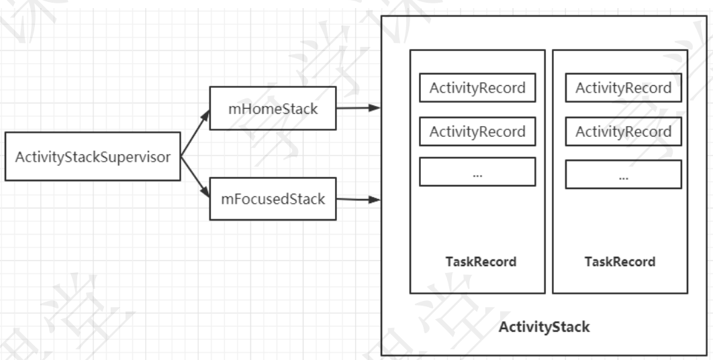

- # ProcessRecord数据结构
	- # 第一类数据：描述身份的数据
	  collapsed:: true
		- 1.ApplicationInfo info：AndroidManifest.xml中定义的Application信息
		- 2.boolean isolated：是不是isolated进程
		- 3.int uid：进程uid
		- 4.int userId：这个是android做的多用户系统id，就像windows可以登录很多用户一样，android
		- 也希望可以实现类似的多用户
		- 5.String processName：进程名字，默认情况下是包名
		- 6.UidRecord uidRecord：记录已经使用的uid
		- 7.IApplicationThread thread：这个很重要，它是ApplicationThread的客户端，AMS就是通过这
		- 个对象给apk进程发送异步消息的（管理四大组件的消息），所以只有这个对象不为空的情况下，
		- 才代表apk进程可是使用了
		- 8.int pid：进程的pid
		- 9.String procStatFile：proc目录下每一个进程都有一个以pid命名的目录文件，这个目录下记载着
		- 进程的详细信息，这个目录及目录下的文件是内核创建的， proc是内核文件系统，proc就是
		- process的缩写，涉及的目的就是导出进程内核信息
		- 10.int[] gids：gid组
		- 11.CompatibilityInfo compat : 兼容性信息
		- 12.String requiredAbi : abi信息
		- 13.String instructionSet : 指令集信息
	- # 第二类数据：描述进程中组件的数据
	  collapsed:: true
		- 1.pkgList：进程中运行的包
		- 2.ArraySet pkgDeps：进程运行依赖的包
		- 3.ArrayList activities：进程启动的所有的activity组件记录表
		- 4.ArraySet services：进程启动的所有的service组件记录表
		- 5.ArraySet executingServices：正在运行（executing）是怎么定义的？首先需要明确的是系统是
		- 怎么控制组件的？发送消息给apk进程，apk进程处理消息，上报消息完成，这被定义为一个完整
		- 的执行过程，因此正在执行（executing）被定义为发送消息到上报完成这段时间
		- 6.ArraySet connections：绑定service的客户端记录表
		- 7.ArraySet receivers：广播接收器的记录表
		- 8.ContentProviderRecord pubProviders：pub是publish（发布）的意思，ContentProvider需要
		- 安装然后把自己发布到系统（AMS）中后，才能使用，安装指的是apk进程加载ContentProvider
		- 子类、初始化、创建数据库等过程，发布是将ContentProvider的binder客户端注册到AMS中
		- 9.ArrayList conProviders：使用ContentProvider的客户端记录表
		- 10.BroadcastRecord curReceiver：当前进程正在执行的广播 在本节中以上组件信息只是做一个
		- 简单的描述，以后单独分析组件管理的时候在详细介绍
	- # 第三类数据：描述进程状态的数据
		- 1.int[[ maxAdj]]：进程的adj上限（adjustment）
		- 2.int curRawAdj：当前正在计算的adj，这个值有可能大于maxAdj
		- 3.int setRawAdj：上次计算的curRawAdj设置到lowmemorykiller系统后的adj
		- 4.int curAdj：当前正在计算的adj，这是curRawAdj被maxAdj削平的值
		- 5.int setAdj：上次计算的curAdj设置到lowmemorykiller系统后的adj
		- 6.int verifiedAdj：setAdj校验后的值
		- 7.int curSchedGroup：正在计算的调度组
		- 8.int setSchedGroup：保存上次计算的调度组
		- 9.int curProcState：正在计算的进程状态
		- 10.int repProcState：发送给apk进程的状态
		- 11.int setProcState：保存上次计算的进程状态
		- 12.int pssProcState：pss进程状态
		- 13.ProcessState baseProcessTracker：进程状态监测器
		- 14.int adjSeq：计算adj的序列数
		- 15.int lruSeq：lru序列数
		- 16.IBinder forcingToForeground:强制将进程的状态设置为前台运行的IBinder，IBinder代表的是
		- 组件的ID，这个是整个android系统唯一
	- # 第四类数据：和pss相关的数据 我们先来普及一下一些名词：
	  collapsed:: true
		- - VSS- Virtual Set Size 虚拟耗用内存（包含共享库占用的内存） RSS- Resident Set Size 实际使用
		  物理内存（包含共享库占用的内存） PSS- Proportional Set Size 实际使用的物理内存（比例分配
		  共享库占用的内存） USS- Unique Set Size 进程独自占用的物理内存（不包含共享库占用的内存） 一般来说内存占用大小有如下规律：VSS >= RSS >= PSS >= USS
		- 1.long initialIdlePss：初始化pss
		- 2.long lastPss：上次pss
		- 3.long lastSwapPss：上次SwapPss数据
		- 4.long lastCachedPss：上次CachedPss数据
		- 5.long lastCachedSwapPss：上次CachedSwapPss数据
	- # 第五类数据：和时间相关的数据
	  collapsed:: true
		- 1.long lastActivityTime：上次使用时间
		- 2.long lastPssTime：上次计算pss的时间
		- 3.long nextPssTime：下次计算pss的时间
		- 4.long lastStateTime：上次设置进程状态的时间
		- 5.long lastWakeTime：持有wakelock的时长
		- 6.long lastCpuTime：上次计算占用cpu的时长
		- 7.long curCpuTime：当前最新占用cpu的时长
		- 8.long lastRequestedGc：上次发送gc命令给apk进程的时间
		- 9.long lastLowMemory：上次发送低内存消息给apk进程的时间
		- 10.long lastProviderTime：上次进程中ContentProvider被使用的时间
		- 11.long interactionEventTime：上次发送交互时间时间
		- 12.long fgInteractionTime：变成前台的时间
	- # 第六类数据：crash和anr相关的数据
	  collapsed:: true
		- 1.IBinder.DeathRecipient deathRecipient：apk进程退出运行的话，会触发这个对象的binderDied()方法，来回收系统资源
		- 2.boolean crashing：进程已经crash
		- 3.Dialog crashDialog：crash对话框
		- 4.boolean forceCrashReport：强制crash对话框显示
		- 5.boolean notResponding：是否处于anr状态
		- 6.Dialog anrDialog：anr显示对话框
		- 7.Runnable crashHandler：crash回调
		- 8.ActivityManager.ProcessErrorStateInfo crashingReport:crash报告的进程状态
		- 9.ActivityManager.ProcessErrorStateInfo notRespondingReport:anr报告的进程状态
		- 10.String waitingToKill:后台进程被kill原因
		- 11.ComponentName errorReportReceiver:接收error信息的组件
	- # 第七类数据：和instrumentation相关的数据
	  collapsed:: true
		- instrumentation 也可以说是apk的一个组件，如果我们提供的话，系统会默认使用Instrumentation.java类，按照我们一般的理解，UI 线程控制activity的生命周期，是是直接调用Activity类的方法，时间是这样子的，UI线程调用的是instrumentation的方法，由它在调用Activity涉及生命周期的方法，所有如果我们覆写了instrumentation的这些方法，就可以了解所有的Activity的生命周期了
		- 1.ComponentName instrumentationClass：AndroidManifest.xml中定义的instrumentation信
		- 息
		- 2.ApplicationInfo instrumentationInfo：instrumentation应用信息
		- 3.String instrumentationProfileFile：instrumentation配置文件
		- 4.IInstrumentationWatcher instrumentationWatcher：instrumentation监测器
		- 5.IUiAutomationConnection instrumentationUiAutomationConnection：UiAutomation连接器
		- 6.ComponentName instrumentationResultClass：返回结果组件
	- # 第八类数据：电源信息和调试信息
	  collapsed:: true
		- 1.BatteryStatsImpl mBatteryStats:电量信息
		- 2.BatteryStatsImpl.Uid.Proc curProcBatteryStats：当前进程电量信息
		- 3.boolean debugging:处于调试中
		- 4.boolean waitedForDebugger:等待调试
		- 5.Dialog waitDialog:等待对话框
		- 6.String adjType:adj类型（或者说标示）
		- 7.int adjTypeCode:adj类型码（也是一种标示）
		- 8.Object adjSource:改变adj的组件记录表
		- 9.int adjSourceProcState:影响adj的进程状态
		- 10.Object adjTarget：改变adj的组件
		- 11.String shortStringName：进程记录表的字符串显示
		- 12.String stringName：进程记录表的字符串显示
	- # 第九类数据：最后我们来看一下31个boolean值
	  collapsed:: true
		- 1.进程声明周期相关的
			- a.boolean starting:进程正在启动
			- b.boolean removed:进程系统资源已经清理
			- c.boolean killedByAm:进程被AMS主动kill掉
			- d.boolean killed:进程被kill掉了
			- e:boolean persistent:常驻内存进程
		- 2.组件状态影响进程行为的
		  collapsed:: true
			- a.boolean empty:空进程，不含有任何组件的进程
			- b.boolean cached:缓存进程
			- c.boolean bad:60s内连续crash两次的进程被定义为bad进程
			- d.boolean hasClientActivities:进程有Activity绑定其他Service
			- e.boolean hasStartedServices:进程中包含启动了的Service
			- f.boolean foregroundServices:进程中包含前台运行的Service
			- g.boolean foregroundActivities:进程中包含前台运行的Activity
			- h.boolean repForegroundActivities:
			- i.boolean systemNoUi:系统进程，没有显示UI
			- j.boolean hasShownUi:重进程启动开始，是否已经显示UI
			- k.boolean pendingUiClean:
			- l.boolean hasAboveClient:进程中有组件使用BIND_ABOVE_CLIENT标志绑定其他Service
			- m.boolean treatLikeActivity:进程中有组件使用BIND_TREAT_LIKE_ACTIVITY标志绑定其他
			- Service
			- n.boolean execServicesFg:前台执行Service
			- o.boolean setIsForeground:设置运行前台UI
		- 3.其他
		  collapsed:: true
			- a. boolean serviceb:进程存在service B list中
			- b.boolean serviceHighRam:由于内存原因，进程强制存在service B list中
			- c.boolean notCachedSinceIdle:进程自从上次空闲，是否属于缓存进程
			- d.boolean procStateChanged:进程状态改变
			- e.boolean reportedInteraction:是否报告交互事件
			- f.boolean unlocked:解锁状态下进程启动
			- g.boolean usingWrapper:zygote是否使用了wrapper启动apk进程
			- h.boolean reportLowMemory:报告低内存
			- i.boolean inFullBackup:进程中存在backup组件在运行
			- j.boolean whitelistManager:和电源管理相关
- # 进程主要占用的资源：ProcessRecord容器 和 组件记录表的容器
- # **ProcessRecord****容器**
  collapsed:: true
	- 永久性容器
		- 1.mProcessNames：根据进程名字检索进程记录表
		- 2.mPidsSelfLocked：根据进程pid检索进程记录表
		- 3.mLruProcesses：lru进程记录表容器，这个容器使用的是最近最少使用算法对进程记录表进行排
		- 序，越是处于上层的越是最近使用的，对于系统来说就是最重要的，在内存吃紧回收进程时，越不
		- 容易被回收，实现起来也很简单
	- 临时性容器
		- 1.mPersistentStartingProcesses：常驻内存进程启动时容器
		- 2.mProcessesOnHold：进程启动挂起容器
		- 3.mProcessesToGc：将要执行gc回收的进程容器
		- 4.mPendingPssProcesses：将要计算Pss数据的进程容器
	- 一个特别的容器
		- 1.mRemovedProcesses:从名字上的意思是已经移除的进程，那么什么是已经移除的进程？移除的
		- 进程为什么还需要保存？后面的（进程管理(六)apk进程的回收）小节会提到
- # 内部四大组件记录表的容器
	- 组件运行才是进程存在的意义，由于android系统进程间的无缝结合，所以系统需要控制到组件级别，所有的组件信息都需要映射到系统，
	- 一个ActivityRecord记录对应一个Activity的信息，
	- 一个ServiceRecord记录对应一个Service的信息，
	- 一个ConnectionRecord记录对应一个bind service的客户端信息，
	- 一个ReceiverList对应处理同一事件的一组广播，
	- 一个ContentProviderRecord记录对应一个ContentProvider信息，
	- 一个ContentProviderConnection对应一个进程中的所有ContentProvider客户端
	- ## activity记录
		- 1. activities：ActivityRecord的容器，进程启动的所有的activity组件记录表
	- ## service记录
		- 1.services：ServiceRecord的容器，进程启动的所有的service组件记录表
		- 2.executingServices：正在运行（executing）的ServiceRecord是怎么定义的？首先需要明确的是系统是怎么控制组件的？发送消息给apk进程，apk进程处理消息，上报消息完成，这被定义为一个完整的执行过程，因此正在执行（executing）被定义为发送消息到上报完成这段时间
		- 3.connections：ConnectionRecord容器，绑定service的客户端记录表
	- ## 广播接收器记录
		- 1.receivers：ReceiverList容器，广播接收器的记录表
	- ## ContentProvider记录
		- 1.pubProviders：名字到ContentProviderRecord的映射容器，pub是publish（发布）的意思，ContentProvider需要安装然后把自己发布到系统（AMS）中后，才能使用，安装指的是apk进程加载ContentProvider子类、初始化、创建数据库等过程，发布是将ContentProvider的binder客户端注册到AMS中
		- 2.conProviders：ContentProviderConnection容器，使用ContentProvider的客户端记录表
- # 与Activity管理有关的数据结构
	- 
	- ## [[ActivityRecord]]
	- ## [[TaskRecord]]
	- ## **ActivityStarter**
	  collapsed:: true
		- frameworks/base/services/core/java/com/android/server/am/ActivityStarter.java
		- ```java
		  class ActivityStarter {
		      private int setTaskFromReuseOrCreateNewTask(TaskRecord taskToAffiliate,
		      						int preferredLaunchStackId, ActivityStack topStack) {
		            mTargetStack = computeStackFocus(mStartActivity, true,
		            									mLaunchBounds, mLaunchFlags, mOptions);
		            if (mReuseTask == null) {
		  //创建一个createTaskRecord，实际上是调用ActivityStack里面的 createTaskRecord（）方法，
		              // ActivityStack下面会讲到
		                final TaskRecord task = mTargetStack.createTaskRecord(
		                          mSupervisor.getNextTaskIdForUserLocked(mStartActivity.userId),
		                          mNewTaskInfo != null ? mNewTaskInfo :
		                          mStartActivity.info,
		                          mNewTaskIntent != null ? mNewTaskIntent : mIntent,
		                          mVoiceSession,
		                          mVoiceInteractor, !mLaunchTaskBehind /* toTop */,
		                          mStartActivity.mActivityType);
		                //其他代码略
		            }
		      }
		  }
		  ```
	- ## [[ActivityStack]]
	- ## [[ActivityStackSupervisor]]