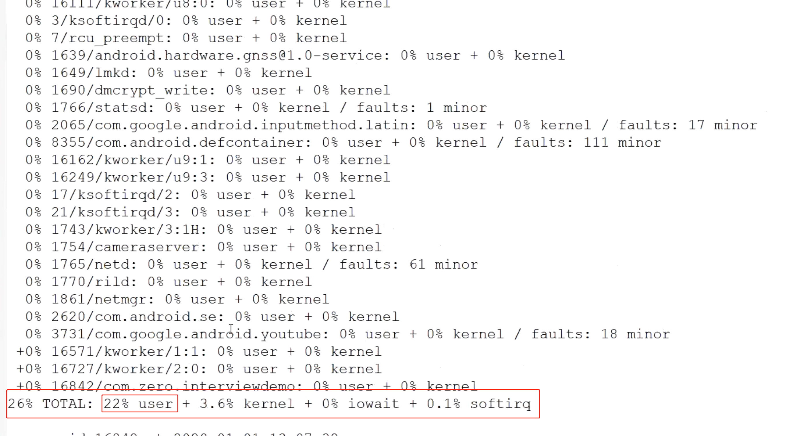
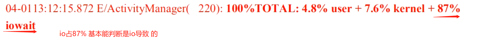

# 1、ANR概念#card
	- ANR(Application Not responding)，是指==**应用程序未响应**==，Android系统对于[[#red]]==**一些事件超过预定时间未完成就会报**==。
	- ### 特定触发场景：
		- 1、Service服务超时：==**前台服务20s,后台服务200s**==
		- 2、广播超时，[[#red]]==**前台广播10s.后台广播60s**==
		- 3、[[#green]]==**ContentProvider 超时10s**==
		- 4、[[#blue]]==**输入性事件5s**==，包括按键和触摸。输入性事件比较特殊，即便某次事件超过5s未得到响应。只要后续没再产生输入事件，不会触发ANR.
	- AMS、WMS负责监视报出的
- # 2、如何避免ANR#card
	- ### 1、==主线程不做耗时操作==,生命周期方法少做创建的事情
	- ### 2、避免在广播和service做耗时操作,
		- 广播也不能起子线程做耗时操作，因为生命周期短 耗时服务考虑IntentService代替(不是说广播启动服务，广播不能启动服务的。是程序启动服务)
	- ### 3、避免主线程跟工作线程发生[[#red]]==**锁的竞争**==，减少系统耗时binder的调用
	- ### 4、谨慎使用sharePreference
		- [[SP-ANR产生的原因]]
- # 3、ANR定位-Trace文件分析#card
	- ## 1、通过logcat日志或者traces文件确认==**ANR发生时间点**==，==**发生ANR的pid**==，[[#green]]==**进程名**==等
	  collapsed:: true
		- ## 文件所在目录data/anr/traces.txt
		- ### traces_*.txt文件中先找firstpid 即发生ANR的pid
	- ## 2、通过traces文件[[#green]]==**判断CPU使用率**==，看是不是CPU忙不过来，会有一列显示 total总的使用率，user、内核、io等分别使用率
	  collapsed:: true
		- 
		- 
	- ## 3、然后可以看下[[#green]]==**Heap堆内存使用**==情况
		- //已分配堆内存大小40MB，其中29M已用，总分配207772个对象
		  Heap: 27% free, 29MB/40MB; 307772 objects
	- >通过cpu使用和内存使用情况，排除[[#green]]==**文件阻塞和cpu资源耗尽**==
	- ## 4、Traces文件可以搜索下关键字[[#green]]==**held by看是不是死锁导致**==的ANR,排除死锁问题
	- > 查看[[#red]]==**是不是死锁问题**==
	- ## 5、如果是开发阶段可以借助logcat搜索ANR对应类型的关键字，比如输入事件的Input_event_dispatching_timed_out,广播、服务、内容提供者对应的关键字
- # 4、[[如何线上监控ANR]]
	- 系统有个Watchdog，监控系统有没有被死锁，挂掉情况
- # 5、主线程loop会ANR吗？
	- looper是Android handler机制中的 动力循环
	- ANR是 Android系统对于[[#red]]==**一些事件超过预定时间未完成就会报**==。应用程序无响应
	- [[ANR触发场景]]
	- 所以他俩是两个概念