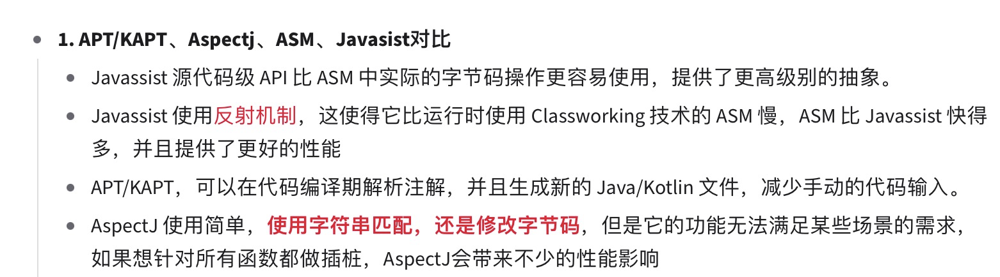

- ## 一、什么是AOP
	- AOP：Aspect Oriented Programming的缩写，意为面向切面编程，通过预编译方式和运行期间动态代理实现程序功能的统一维护的一种技术。AOP是OOP思想的延续。利用AOP可以对业务逻辑的各个部分进行隔离，从而使得业务逻辑各部分之间的耦合度降低，提高程序的可重用性，同时提高了开发的效率
-
- {:height 198, :width 685}