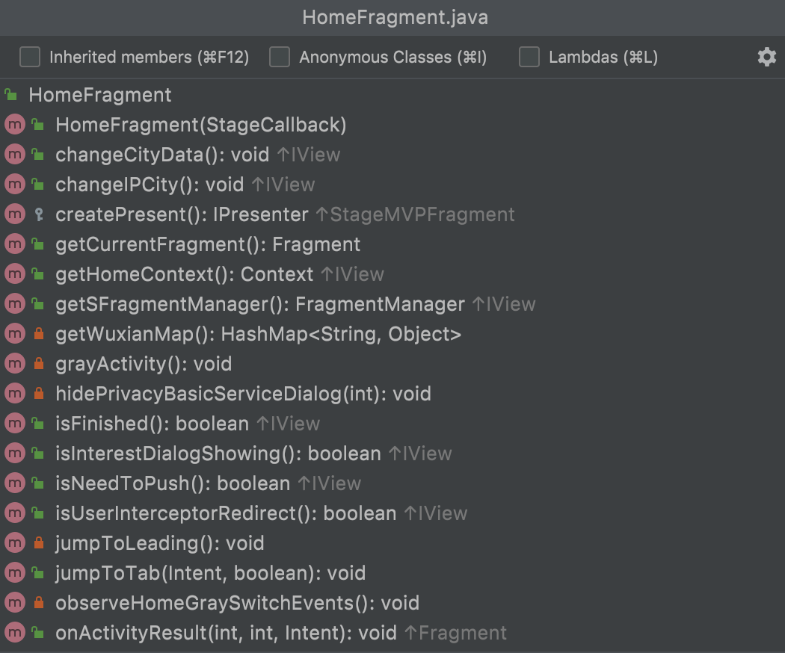
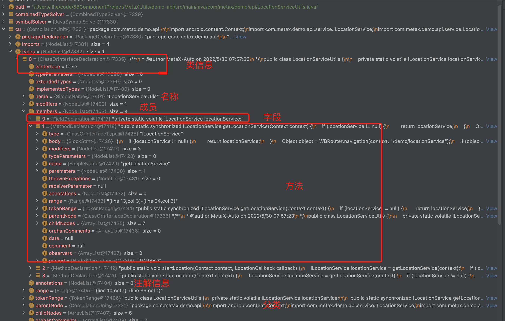
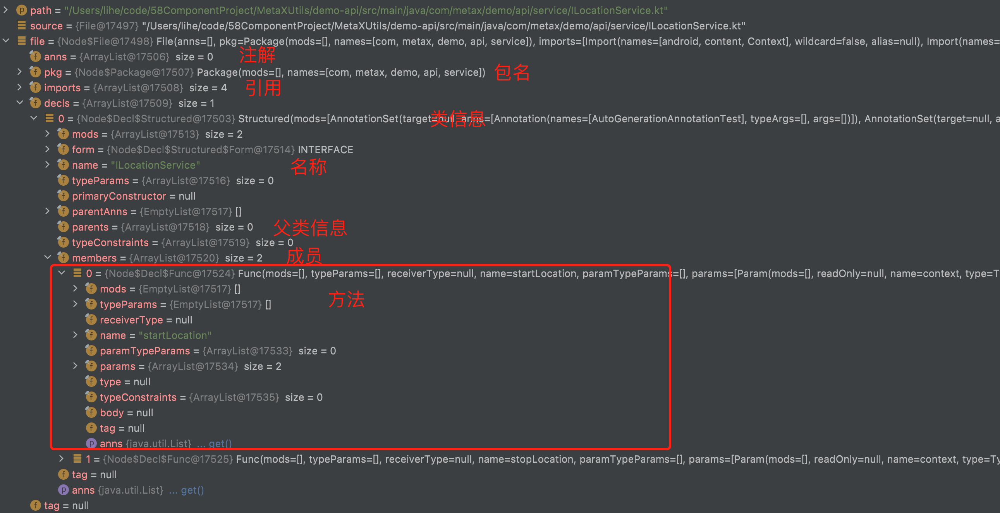

- # 一、背景
	- MetaX组件化中有一个很重要的特点，能够在编译期知道RD修改了哪些api方法，这样在修改或删除方法时会给出相应的提示并中断编译。通过在整个开发期间不修改api方法，能够保证aar接口向下兼容，从而达到了QA回归仅限新增api的模块，有效提升验证回归效率。
	- 本文中API变化是指aar库的接口或类向外暴露public 方法发生了名称、返回值、参数等变化，并不会检查方法内部实现的变化。
	- 如何在编译时简单准确的获取当前变更内容，是我们亟待解决的问题。
- # 二、实现
	- ## 定义数据
	  collapsed:: true
		- 提到API变化，一定是有一个固定参考对象做对比才能得出变化结果。因此我们将首次使用MetaX运行时生成的类大纲集合文件是否存在做为参考点。
		- 类大纲文件记录了当前类或接口的public方法信息，以及当前文件的相对路径、语言方式是java或kotlin、class还是接口枚举之类的
		- ```json
		  //kotlin 单例object的类大纲信息
		  {
		    "path": "demo-api/src/main/java/com/metax/demo/api/utils/DeviceInfoUtils.kt",
		    "package": "com.metax.demo.api.utils",
		    "methods": [
		      {
		        "p": "Nullable(Context)",
		        "r": "Nullable(String)",
		        "name": "fun getImei(Nullable(Context)):Nullable(String)",
		        "n": "getImei"
		      }
		    ],
		    "name": "DeviceInfoUtils",
		    "language": "kotlin",
		    "type": "object"
		  }
		  ```
		- 如果本地未获取到对应的类大纲集合文件，则认为是首次生成，然后会遍历当前工程的sourceSet目录，生成工程的类大纲集合文件。在MetaX框架中这个文件被命名为[[#red]]==api-public-method.json==，放在工程的根目录中，会随着Git提交到[[#red]]==master主分支==。另外在RD每次合并当前需求分支时，会伴随的api变更检测Task自动重新生成当前类大纲集合文件，重新覆盖旧文件。这样就能解决数据源参考唯一性的问题。
		- [[#red]]==所以每次是需求分支的类大纲和master分支的类大纲做对比，得出api变更范围==
	- ## 如何生成类大纲
	  collapsed:: true
		- 确定好了类大纲的格式后，下一步就是如何简单快速的生成这些类大纲数据。调研有3种方式：1. Python读取代码文件逐行分析 2. hook编译的Transform使用ASM来收集类信息 3.使用AST（抽象语法树）用java解释java
		- 使用Python读取源码文件分析是第一个被排除的，这个方案工程量大，对java和kotlin语言需要有高深的理解和运用才能自如处理各种case。下面主要分析ASM和AST两种方式
		- 
		- ### ASM读取
		  collapsed:: true
			- 在编译期hook Transform完全没有必要，且不可行，因为MetaX工程在编译时就需要知道当前api变化了哪些类以及变化类的细节。查询ASM使用方法可以得出只用传入源码文件就可以，内部会调用javac命令来生成class，然后进行遍历各种方法和字段。
			- 一个简单的ASM使用包括ClassReader ClassWriter ClassVisitor，由于我们不用对class处理插桩，只需要定义个ClassVisitor就可以了，主要处理方法就是visitMethod，通过不断的回调来记录当前传入类的方法，过滤后生成一个类大纲信息。
			- ```kotlin
			  class SourceFileASMHandler(classVisitor: ClassVisitor?) :
			      ClassVisitor(Opcodes.ASM5, classVisitor) {
			      override fun visitMethod(
			          access: Int,
			          name: String?,
			          desc: String?,
			          signature: String?,
			          exceptions: Array<out String>?
			      ): MethodVisitor {
			        //主要处理方法，获取参数、返回值等信息
			          println("$access name:${name} desc:${desc} signature:${signature}")
			  
			          return super.visitMethod(access, name, desc, signature, exceptions)
			      }
			  }
			  ```
			- 使用也比较简单，如下
			- ```kotlin
			  private fun handleClass(file: String) {
			      println(file)
			      val cr = ClassReader(FileInputStream(file))
			      val cw = ClassWriter(cr, ClassWriter.COMPUTE_FRAMES)
			      cr.accept(SourceFileASMHandler(cw), ClassReader.SKIP_CODE)
			  }
			  ```
			- 但ASM分析也有一些难以接受的缺点：
			- 1、分析方式耗时大
				- 由于内部需要使用javac编译成class文件，因此对于整个编译时间来说成倍数增长。由于时机问题我们不能将该任务放到Transform中处理减少生成class次数。
			- 2、分析处理不够全面
				- ClassVisitor不能很好的处理内部类的方法，这样可能会出现方法遗漏的问题
			- 对于我们MetaX框架来说，编译时间不能增长太多，对于一个经常使用的编译框架来说是无法接受的。
		- ### AST读取
		  collapsed:: true
			- AST，即抽象语法树，是对源代码语法结构的一种树状抽象表示，每个节点对应源代码中的一段代码语句，是一种平台无关的数据描述。（通俗一点说就是使用java来解释java源码）
			- 我们平常所写的代码本质上是一种结构化的指令文本，是高级程序设计语言，是出于人们理解阅读而设计的。但处理器只能识别一连串的二进制机器代码，对于文本代码是无法直接识别运行的。而编译器作为桥梁打通了两者，他的作用是将源代码翻译成语义等价的目标代码，机器码和AST是常见的编译结果。
			- 抽象语法树它以树状的形式表现代码的结构。实际上Android Studio已经提供了源码的AST表示，以帮助开发者更加完整、清晰的分析代码的结构和关系。
			  collapsed:: true
				- 
			- 在将源码转换成AST过程中，一般会经过三步：词法分析、语法分析、语义分析。本文不会深入探究java AST是如何实现的，仅从使用的角度做流程梳理。
			- 使用抽象语法树处理源码，不像ASM仅处理一种class字节码格式就好了。AST需要对于Java语言和Kotlin语言分别做处理。因此我们寻找了目前使用较多的AST框架：[JavaParser](https://github.com/javaparser/javaparser)处理java文件，[Kastree](https://github.com/cretz/kastree)处理kotlin文件。
			- java类调试信息：
				- 
			- kotlin类调试信息
				- 
			-
	- 确定变更文件