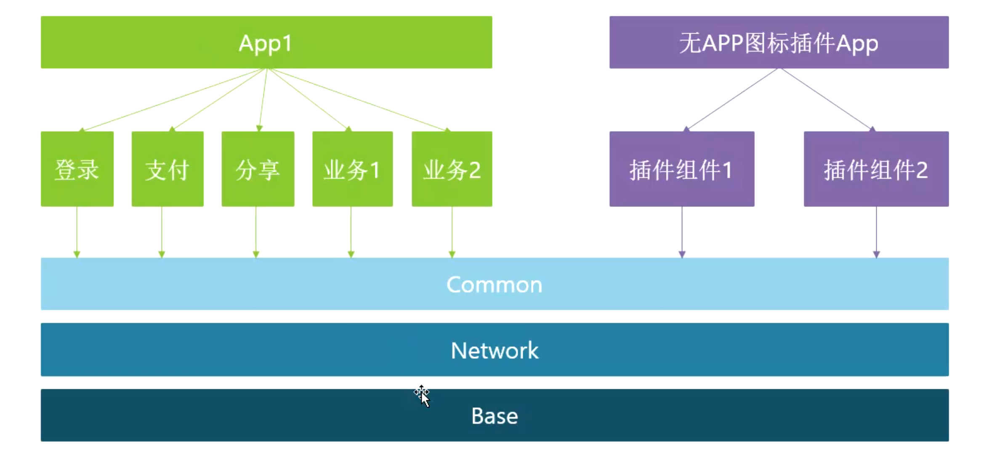

## 1、插件化，组件化，模块化区别
	- 
	- ## [[ 模块化]]
		- 按照业务逻辑，将功能属于同一业务的代码整合到一起，划分成一个一个模块，[[#red]]==**网络模板，base模块，Common模块**==
	- ## [[组件化]]原包
		- 有些组件或基础库在多个模块中都有调用，把这些耦合度高的提炼出来，造成可复用组件，
		- 组件间互相不依赖，抽离接口下沉到Common层，组件可复用，独立开发与调试，类似SDK类型
	- ## [[插件化]]以一个app模式存在
		- **==将应用程序的功能模块或插件从主应用程序中解耦==**，[[#red]]==**打成一个无图标的插件APP，可以安装但是桌面看不到，需要哪个功能下载哪个插件**==。[[#red]]==**运行时动态加载和卸载插件**==
- 
- 