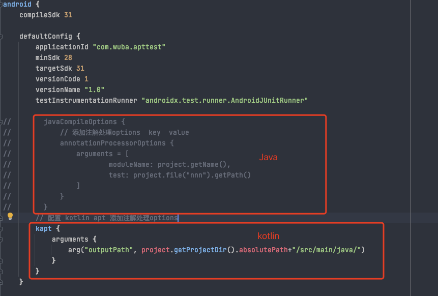

- # 一、简介
	- APT(Annotation Processing Tool) 是一个编译期的注解处理工具, 它对源代码文件进行检测找出其中的 Annotation，使用 Annotation 进行额外的处理。
	  Annotation 处理器在处理 Annotation 时可以根据源文件中的 Annotation 生成额外的源文件和其它的文件 (文件具体内容由 Annotation 处理器的编写者决定),APT 还会编译生成的源文件和原来的源文件，将它们一起生成 class 文件。一些主流的三方库，如 ButterKnife、EventBus 等都用到了这个技术来生成代码。
- # 二、使用
	- 借助  [AutoService](https://www.jianshu.com/p/14669ded4b8b) 自动处理Processor + javapoet 自动生成java源文件
	- [javapoet api](https://square.github.io/javapoet/1.x/javapoet/)
	- [kotlinpoet 中文api](https://enzowyf.github.io/kotlinpoet.html)
	- [kotlinpoet 源api](https://square.github.io/kotlinpoet/)
	- [APT api具体详解，包括获取方法的入参](https://blog.csdn.net/u014454538/article/details/122531293)
- # 三、配置kotlin gradle 插件
	- ## 1、要使用kotlin写的 注解处理器，则需要在依赖processer的 app moudle中添加kotlin插件支持
	  collapsed:: true
		- 1.在根目录的 build.gralde添加 kotlin 插件配置
		  collapsed:: true
			- 
		- 2.在app build.gradle 中 添加 插件
		  collapsed:: true
			- plugins {
			      id 'kotlin-android'
			      id 'kotlin-kapt'
			      id 'com.android.application'
			  }
		- 3.使用
			- 
	- ## 2、kotlin 写的processor怎么被AutoService 识别
	  collapsed:: true
		- 1、在processor 注解处理lib的 build.gradle 中添加 kotlin-kapt的支持
		  collapsed:: true
			- ```
			  plugins {
			      id 'java-library'
			      id 'kotlin'
			      id 'kotlin-kapt'
			  }
			  ```
		- 2、添加auto-service 的依赖时 使用 kapt 代替 annotationProcessor
		  collapsed:: true
			- ```
			  dependencies {
			      implementation project(path: ':annotation-lib')
			      //auto-service是Google开源的一个库，可以方便快捷的帮助我们进行组件化开发
			      implementation 'com.google.auto.service:auto-service:1.0-rc6'
			      // kotlin写的 注解处理器 用 kapt
			      kapt'com.google.auto.service:auto-service:1.0-rc6'
			  //    java 写的用
			  //    annotationProcessor 'com.google.auto.service:auto-service:1.0-rc6'
			      //引入javapoet
			      implementation "com.squareup:javapoet:1.11.1"
			      // 引入 kotlinpoet
			      implementation "com.squareup:kotlinpoet:1.11.0"
			  }
			  ```
	- ## 3、
- # 四、apt通过javapoet 和 kotlinpoet编写代码
	- ## 1、process方法中获取指定带有指定注解的元素(如果注解作用在class即class，如果是method则获取的是method的元素)
		- ```
		   // 处理指定注解类的地方
		   val setElement = it.getElementsAnnotatedWith(AutoGenerationAnnotation::class.java)
		   if (setElement.isEmpty()) {
		        return false
		   }
		  ```
	- ## 2、从注解类中获取方法
		- ```
		   
		   val setElement = it.getElementsAnnotatedWith(AutoGenerationAnnotation::class.java)
		   // 遍历取到的类
		   for (ele: Element in setElement) {
		   	 val packageStr: String = ele.enclosingElement.toString()
		       val classStr: String = ele.simpleName.toString()
		       
		   }
		  ```
	- ## 3、拿到方法 取方法参数，包括入参的class
-