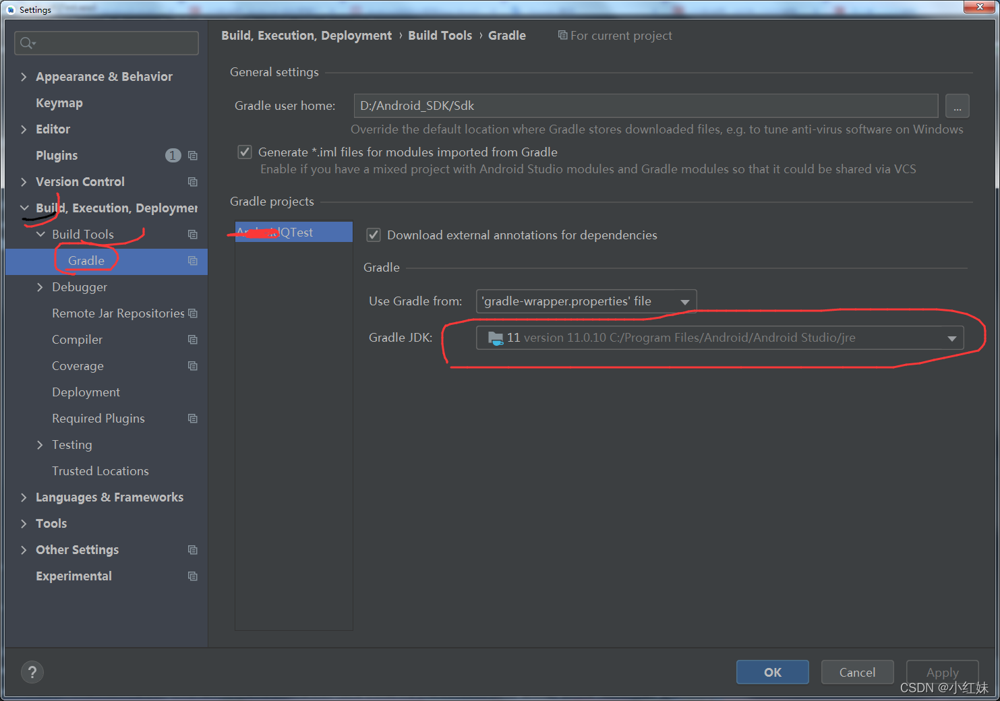

- # 一、简介
	- APT(Annotation Processing Tool) 是一个编译期的注解处理工具, 它对源代码文件进行检测找出其中的 Annotation，使用 Annotation 进行额外的处理。
	  Annotation 处理器在处理 Annotation 时可以根据源文件中的 Annotation 生成额外的源文件和其它的文件 (文件具体内容由 Annotation 处理器的编写者决定),APT 还会编译生成的源文件和原来的源文件，将它们一起生成 class 文件。一些主流的三方库，如 ButterKnife、EventBus 等都用到了这个技术来生成代码。
- # 二、使用
	- ## javapoet 生成java类
		- 借助  [AutoService](https://www.jianshu.com/p/14669ded4b8b) 自动处理Processor + javapoet 自动生成java源文件
		- [javapoet api](https://square.github.io/javapoet/1.x/javapoet/)
		- [javapoetgithub](https://github.com/square/javapoet)
		- [自定义注解生成代码（一） —— javaPoetAPI详解](https://blog.csdn.net/bencheng06/article/details/103220774)
		- [（译）JavaPoet 官方教程](https://juejin.cn/post/6844904022600597517)
		- [JavaPoet的使用指南](https://juejin.cn/post/6844903695621029895)
		- [方法体的构建](https://blog.csdn.net/io_field/article/details/89355941)
		- [JavaPoet使用详解](https://blog.csdn.net/io_field/article/details/89355941)
		- [[javaPeot踩坑]]
	- ## kotlinpoet生成kotlin类
	  collapsed:: true
		- [使用kotlinpoet生成kotlin代码数据类型不正确的问题](https://www.jianshu.com/p/f41d21850cb4)
			- ```
			  package com.wuba.compiler
			  
			  import com.squareup.kotlinpoet.ClassName
			  import com.squareup.kotlinpoet.asTypeName
			  import org.jetbrains.kotlin.builtins.jvm.JavaToKotlinClassMap
			  import org.jetbrains.kotlin.name.FqName
			  import java.util.HashMap
			  import javax.lang.model.element.Element
			  
			  /**
			   * @author:xuwenbin
			   * @time:2022/5/24 10:36 上午
			   * @description: java.util.HashMap<java.lang.String,java.lang.Object>
			   */
			  object KtUtils {
			      fun Element.javaToKotlinType(): ClassName? {
			          JavaToKotlinClassMap
			          val className = JavaToKotlinClassMap.mapJavaToKotlin(FqName(this.asType().asTypeName().toString()))?.asSingleFqName()?.asString()
			          return if (className == null) {
			              null
			          } else {
			              ClassName.bestGuess(className)
			          }
			      }
			  
			      /**
			       * 获取需要把java类型映射成kotlin类型的ClassName  如：java.lang.String 在kotlin中的类型为kotlin.String 如果是空则表示该类型无需进行映射
			       */
			      fun javaToKotlinType(typeName: String): ClassName? {
			          //由于java中的装拆箱机制，所以会出现int等类型无法识别的问题，javatoKotlin可以识别装箱后的类型，无法识别int,short,double这些类型，所以手动做一个装箱
			          var name = javaPacking(typeName)
			          val className = JavaToKotlinClassMap.mapJavaToKotlin(FqName(name))?.asSingleFqName()?.asString()
			          return if (className == null) {
			              null
			          } else {
			              ClassName.bestGuess(className)
			          }
			      }
			  
			      /**
			       * 对java的基本类型进行装箱操作
			       */
			      private fun javaPacking(typeName: String): String {
			          return when (typeName) {
			              "int" -> "java.lang.Integer"
			              "byte" -> "java.lang.Byte"
			              "short" -> "java.lang.Short"
			              "long" -> "java.lang.Long"
			              "double" -> "java.lang.Double"
			              "float" -> "java.lang.Float"
			              "boolean" -> "java.lang.Boolean"
			              "char" -> "java.lang.Character"
			              else -> typeName
			          }
			      }
			  }
			  ```
		- [kotlinpoet 中文api](https://enzowyf.github.io/kotlinpoet.html)
		- [kotlinpoet 源api](https://square.github.io/kotlinpoet/)
		- [APT api具体详解，包括获取方法的入参](https://blog.csdn.net/u014454538/article/details/122531293)
	- ## 其他基础
		- [自定义APT基础之：Element](https://blog.csdn.net/wengliuhu/article/details/113917457)
		- [[Annotation Processor中判断Java或kotlin类]]
		- [[Element]]
		- [[javapoet中占位符]]
	- ## [[APT工程接入]]
- # 三、配置kotlin gradle 插件
  collapsed:: true
	- ## 1、要使用kotlin写的 注解处理器，则需要在依赖processer的 app moudle中添加kotlin插件支持
		- 1.在根目录的 build.gralde添加 kotlin 插件配置
		  collapsed:: true
			- 
		- 2.在app build.gradle 中 添加 插件
		  collapsed:: true
			- plugins {
			      id 'kotlin-android'
			      id 'kotlin-kapt'
			      id 'com.android.application'
			  }
		- 3.使用
			- 
	- ## 2、kotlin 写的processor怎么被AutoService 识别
		- 1、在processor 注解处理lib的 build.gradle 中添加 kotlin-kapt的支持
			- ```
			  plugins {
			      id 'java-library'
			      id 'kotlin'
			      id 'kotlin-kapt'
			  }
			  ```
		- 2、添加auto-service 的依赖时 使用 kapt 代替 annotationProcessor
			- ```
			  dependencies {
			      implementation project(path: ':annotation-lib')
			      //auto-service是Google开源的一个库，可以方便快捷的帮助我们进行组件化开发
			      implementation 'com.google.auto.service:auto-service:1.0-rc6'
			      // kotlin写的 注解处理器 用 kapt
			      kapt'com.google.auto.service:auto-service:1.0-rc6'
			  //    java 写的用
			  //    annotationProcessor 'com.google.auto.service:auto-service:1.0-rc6'
			      //引入javapoet
			      implementation "com.squareup:javapoet:1.11.1"
			      // 引入 kotlinpoet
			      implementation "com.squareup:kotlinpoet:1.11.0"
			  }
			  ```
	- ## 3、
- # 四、apt通过javapoet 和 kotlinpoet编写代码
	- ## 1、process方法中获取指定带有指定注解的元素(如果注解作用在class即class，如果是method则获取的是method的元素)
	  collapsed:: true
		- ```
		   // 处理指定注解类的地方
		   val setElement = it.getElementsAnnotatedWith(AutoGenerationAnnotation::class.java)
		   if (setElement.isEmpty()) {
		        return false
		   }
		  ```
	- ## 2、从注解类中获取方法
	  collapsed:: true
		- ```
		   
		   val setElement = it.getElementsAnnotatedWith(AutoGenerationAnnotation::class.java)
		   // 遍历取到的类
		   for (ele: Element in setElement) {
		   	 val packageStr: String = ele.enclosingElement.toString()
		       val classStr: String = ele.simpleName.toString()
		        // ele 为类节点的子元素 可能是成员变量 可能是方法等
		       for (enclosedElement: Element in ele.enclosedElements) {
		           if(enclosedElement.kind == ElementKind.METHOD){
		                var method: ExecutableElement = enclosedElement as ExecutableElement
		                println("enclosedElement 拿到的方法：" + method.simpleName)
		           }
		       }
		   }
		  ```
	- ## 3、拿到方法 取方法参数，包括入参的class
	  collapsed:: true
		- ```
		  var method: ExecutableElement = enclosedElement as ExecutableElement
		  println("enclosedElement 拿到的方法：" + method.simpleName)
		  for (param: VariableElement in method.parameters) {
		     // 获取参数名和参数类型
		     var typeMirror: TypeMirror = param.asType()
		     var typeName = typeMirror.asTypeName() // 入参的class全包名
		     param.getSimpleName() // 参数的名字
		  }
		  ```
	- ## 4、根据注解作用的类名，拿到对应的class作为返回值
	  collapsed:: true
		- ```
		   /**
		     *  定义获取实例的方法 通用 getXXXService
		     */
		  val getInstanceFunSpec = FunSpec.builder("get" + classStr.replace("I", ""))
		  	// 方法参数：contextParameterSpec
		  	.addParameter(contextParameterSpec)
		  	// 方法体
		  	.addStatement("return \"haha\"")
		  	// 方法返回值：ele.asType().asTypeName() 获取 注解 对应的类名
		  	.returns(ele.asType().asTypeName().copy(nullable = true)).build()
		      
		      
		      ele 为上述的类节点
		  ```
	- ## 5、通过javaPeot 添加的类注释格式问题addJavadoc
	  collapsed:: true
		- 实例一：
			- ```
			  val javaClassBuilder = TypeSpec.classBuilder(finalClassOrFileName)
			                      .addModifiers(Modifier.PUBLIC)
			                      .addJavadoc("@author MetaX-Auto on "+SimpleDateFormat("yyyy/M/dd hh:mm:ss").format(Date()))
			                      .addField(FieldSpec.builder(TypeName.get(ele.asType()),strLowercaseClassName).addModifiers(Modifier.PRIVATE,Modifier.STATIC).build())
			                      .addMethod(getInstanceJavaMethodSpec)
			  ```
			- 生成的注释
				- ```
				  /**
				   * @author MetaX-Auto on 2022/5/26 07:54:32*/
				  ```
			- 解决：加上“\n”换行即可
				- ```
				   val javaClassBuilder = TypeSpec.classBuilder(finalClassOrFileName)
				                      .addModifiers(Modifier.PUBLIC)
				                      .addJavadoc("@author MetaX-Auto on "+SimpleDateFormat("yyyy/M/dd hh:mm:ss").format(Date())+"\n")
				                      .addField(FieldSpec.builder(TypeName.get(ele.asType()),strLowercaseClassName).addModifiers(Modifier.PRIVATE,Modifier.STATIC).build())
				                      .addMethod(getInstanceJavaMethodSpec)
				  ```
	- ## 6、构建注解参数AnnotationSpec.builder.addMember
	  collapsed:: true
		- ```
		  val deprecatedTypeName = ClassName.get("java.lang","Deprecated")
		  val annn = AnnotationSpec.builder(deprecatedTypeName).addMember("message","").build()
		  ```
	- ## 7、Javapeot自定义泛型类型ParameterizedTypeName
		- ```
		  示例：public static List<PublicApi> stopLocation(Context context) 
		  val publicApi = ClassName.get("com.metax.test", "PublicApi")
		  val list = ClassName.get("java.util", "List")
		  val mainTypeName = ParameterizedTypeName.get(list, string)
		  ```
	- ## 8、process返回值类型含义
	  collapsed:: true
		- 处理来自上一轮的类型元素上的一组注释类型，并返回这些注释类型是否由此处理器声明。如果返回true，则声明注释类型，并且不会要求后续处理器处理它们；如果返回false，则注释类型是无人认领的，可能会要求后续处理器对其进行处理。处理器可能总是返回相同的布尔值，也可能会根据所选标准改变结果。
	- ## 9、方法获取注解与添加注解类
	  collapsed:: true
		- ```
		      private fun addDeprecatedAnnotation(method: ExecutableElement,otherJavaMethodBuilder:MethodSpec.Builder){
		          for(annotationMirror:AnnotationMirror in method.annotationMirrors){
		              val className = ClassName.get(annotationMirror.annotationType.asElement() as TypeElement)
		              otherJavaMethodBuilder.addAnnotation(AnnotationSpec.builder(className).build())
		          }
		      }
		  ```
	- ## 10、AbstractProcessor注解处理器build时会执行多次，Task :demo-api:kaptDebugKotlin  和:demo-api:kaptReleaseKotlin
		- 如果手动生成追加的代码 无法再次过滤，则 取巧方法：只处理debug task的追加
		- ```
		  isKaptDebugKotlinTask = options["kapt.kotlin.generated"]?.endsWith("debug") == true
		  ```
		-
	- ## 11、匿名内部类anonymousClassBuilder 配合 $L引用到代码中
	  collapsed:: true
		- ```kotlin
		  ```
-
	- ## 12、javapoet生成可变参数，
- # 五、常见问题
	- A failure occurred while executing org.jetbrains.kotlin.gradle.internal.KaptExecution
	  collapsed:: true
		- 从jdk1.8改成11
		- 
	-
- # 六、调试process
	- ## 6-1、方案一借助buildSrc
	  collapsed:: true
		- 新建buildSrc文件夹->
		- task中 右键选择debug这个task,即可
			- 
		-
	- ## 6-2、[[gradle/apt调试]]
- # 七、示例
	- kotlin写的processor生成Kotlin文件
	  collapsed:: true
		-
		- ```
		  package com.wuba.compiler
		  
		  
		  import com.google.auto.service.AutoService
		  import com.wuba.annotation.AutoGenerationAnnotation
		  import com.squareup.kotlinpoet.*
		  import com.squareup.kotlinpoet.jvm.throws
		  import java.io.File
		  import java.lang.RuntimeException
		  import java.text.SimpleDateFormat
		  import java.util.*
		  import javax.annotation.processing.*
		  import javax.lang.model.element.*
		  import javax.lang.model.type.TypeMirror
		  import javax.tools.Diagnostic
		  import kotlin.collections.HashMap
		  
		  /**
		   * @author:xuwenbin
		   * @time:2022/4/24 3:56 下午
		   * @description:
		   */
		  @AutoService(Processor::class)
		  @SupportedOptions("OUTPUTPATH")
		  class AutoGenerationProcessor : AbstractProcessor() {
		      var outputPath = ""
		      var messager :Messager?=null
		  
		      override fun process(
		          annotations: MutableSet<out TypeElement>?,
		          roundEnv: RoundEnvironment?
		      ): Boolean {
		          // 检测输出路径
		          if (outputPath.isEmpty() || outputPath == "null") {
		              messager?.printMessage(Diagnostic.Kind.ERROR,"请在gradle中进行配置\nkapt {\n\targuments {\n\t\t arg(\"OUTPUTPATH\", project.getProjectDir().absolutePath+\"/src/main/java/\")\n\t}\n}")
		              throw Exception(
		                  "请在gradle中进行配置\n\tkapt {\n\t arguments {\n\t\t arg(\"OUTPUTPATH\", project.getProjectDir().absolutePath+\"/src/main/java/\")\n\t}\n}"
		              )
		          }
		  
		          roundEnv?.let {
		              // 处理指定注解类的地方
		              val setElement = it.getElementsAnnotatedWith(AutoGenerationAnnotation::class.java)
		              if (setElement.isEmpty()) {
		                  return false
		              }
		  
		              /**
		               *  获取android Context.class
		               */
		              val androidContext = Class.forName("android.content.Context")
		              /**
		               *  定义 context 参数
		               */
		              val contextParameterSpec = ParameterSpec.builder("context", androidContext).build()
		  
		              /**
		               * 对每个注解类生成包装方法
		               */
		              val wrapperClassSet = mutableSetOf<String>()
		              for (ele: Element in setElement) {
		                  messager?.printMessage(Diagnostic.Kind.NOTE,"roundEnv")
		                  val packageStr: String = ele.enclosingElement.toString()
		                  val classStr: String = ele.simpleName.toString()
		                  val autoGenerationAnnotationImpl = ele.getAnnotation(AutoGenerationAnnotation::class.java)
		                  val wrapperClass = autoGenerationAnnotationImpl.wrapperClass
		                  if(wrapperClass.isNotEmpty()){
		                      if(!wrapperClassSet.add(wrapperClass)){
		                          messager?.printMessage(Diagnostic.Kind.ERROR,"指定生成包装类包名不能重复！当前重复的为：${wrapperClass}")
		                          throw RuntimeException("指定生成包装类包名不能重复！当前重复的为：${wrapperClass}")
		                      }
		                  }
		  
		  
		                  // 初始class名字 = wrapperClass 为空 才生成 指定类名
		                  // 获取 注解修饰的类名
		                  val className = if(classStr.startsWith("I")) classStr.replaceFirst("I","") else classStr
		  
		  
		                  messager?.printMessage(Diagnostic.Kind.NOTE,"注解处理器packageStr：$packageStr,接口名：$classStr,修正后的注解类名:$className")
		                  // 为了导包
		                  val WBRouterClassName: ClassName = ClassName("com.wuba.wbrouter", "core")
		                  /**
		                   *  定义获取实例的方法 通用 getXXXService
		                   */
		                  // 修正后 去掉第一个I的 接口类名首字母转小写
		                  val strLowercaseClassName = className.decapitalize(Locale.ROOT)
		                  // ktplugin 1.5 以上 { it.lowercase(Locale.getDefault()) }
		  //
		                  val getInstanceFunSpec = FunSpec
		                      .builder("get$className")
		                      .addAnnotation(AnnotationSpec.builder(JvmStatic::class).build())
		                      // 方法参数：contextParameterSpec
		                      .addParameter(contextParameterSpec)
		                      .addModifiers(KModifier.PUBLIC)
		                      // 方法体
		                      .addStatement("val $strLowercaseClassName = WBRouter.navigation(context, \"${autoGenerationAnnotationImpl.routerPath}\")")
		                      .addStatement("return if ($strLowercaseClassName != null) $strLowercaseClassName as ${ele.simpleName} else null")
		                      // 方法返回值：ele.asType().asTypeName() 获取 注解 对应的类名
		                      .returns(ele.asType().asTypeName().copy(nullable = true)).build()
		                  /**
		                   *  class builder  添加实例方法,类名就位初始类名 ILocationServiceUtils  / LocationHaHa
		                   */
		  
		                  // 最终的类名 或者文件名
		                  val finalClassOrFileName = if(wrapperClass.isNotEmpty()) wrapperClass.substring(wrapperClass.lastIndexOf(".")+1) else className+"Utils"
		                  val objectClassBuilder =
		                      TypeSpec.objectBuilder(finalClassOrFileName).addFunction(getInstanceFunSpec)
		                          .addKdoc("@author MetaX-Auto on "+SimpleDateFormat("yyyy/M/dd hh:mm:ss").format(Date()))
		  
		  
		                  // 针对 接口方法  生成对应的方法
		                  for (enclosedElement: Element in ele.enclosedElements) {
		                      if (enclosedElement.kind != ElementKind.METHOD) {
		                          continue
		                      }
		                      // 拿到方法节点
		                      val method: ExecutableElement = enclosedElement as ExecutableElement
		                      // 拿到 接口方法 作为 包装类的同名方法
		                      val otherFunSpec = FunSpec.builder(method.simpleName.toString())
		                      // 生成类的context 类型的参数名
		                      var paramOfContextName = ""
		                      // 生成包装类调用方法与传参
		                      val funBody : StringBuilder = java.lang.StringBuilder("${enclosedElement.simpleName}")
		                      funBody.append("(")
		                      // 方法里不包括context，第一位添加context
		                      if(!enclosedElement.toString().contains("android.content.Context")){
		                          paramOfContextName = contextParameterSpec.name
		                          // 方法
		                          otherFunSpec.addParameter(contextParameterSpec)
		                      }
		                      val analysisVarargMap: HashMap<Int,Boolean> = analysisVarargType(enclosedElement)
		  
		                      // 取接口入参 构建包装类入参
		                      for (index:Int in 0 until method.parameters.size) {
		                          val param: VariableElement = method.parameters[index]
		                          // 获取参数名和参数类型
		                          val typeMirror: TypeMirror = param.asType()
		  //                        println("！！！！！！！！！！！！！参数类型等级1:"+typeMirror.asTypeName().toString()+"--androidContext---"+androidContext.toString()+
		  //                                "--enclosedElement:"+enclosedElement.toString()+"param.simpleName:"+param.simpleName)
		  
		                          // 记录方法里包含的context类型的参数名，方法调用使用
		                          if(androidContext.toString().contains(typeMirror.asTypeName().toString())){
		                              paramOfContextName = param.simpleName.toString()
		                          }
		                          // 可变参数类型，调用时使用*
		                          funBody.append(if(analysisVarargMap[index] == true) "*" else "")
		                          // 存储待实现方法所有接收参数
		                          funBody.append(param.simpleName.toString()+ (if(index == method.parameters.size-1) "" else ","))
		  
		                          // 添加方法入参
		  
		                          if(typeMirror.asTypeName().toString().contains("String")){
		                              // 处理导包是java的 String
		                              val strBuilder = ParameterSpec.builder(param.simpleName.toString(),ClassName("kotlin", "String"))
		                              if(analysisVarargMap[index] == true) strBuilder.addModifiers(KModifier.VARARG)
		                              otherFunSpec.addParameter(strBuilder.build())
		                          } else if(typeMirror.asTypeName().toString().contains("Integer")){
		                              // 处理导包是java的 Integer
		                              val builder = ParameterSpec.builder(param.simpleName.toString(),Int::class.java)
		                              if(analysisVarargMap[index] == true) builder.addModifiers(KModifier.VARARG)
		                              otherFunSpec.addParameter(builder.build())
		                          } else {
		                              val builder = ParameterSpec.builder(param.simpleName.toString(), typeMirror.asTypeName())
		                              if(analysisVarargMap[index] == true) builder.addModifiers(KModifier.VARARG)
		                              otherFunSpec.addParameter(builder.build())
		                          }
		  
		                          messager?.printMessage(Diagnostic.Kind.NOTE,
		                              "VariableElement: 方法名字" + method.simpleName + "--参数类型：" + typeMirror.kind.name + " " + param.getSimpleName() + ", ElementKind: " + param.getKind() +
		                                   "---转换type:" + param.toString()+"---获取的方法异常:"+method.thrownTypes+"---:"+param.constantValue+"---:"+param.toString()+"--查找源方法enclosedElement:"+enclosedElement.toString()
		                          )
		                      }
		                      funBody.append(")")
		                      messager?.printMessage(Diagnostic.Kind.NOTE,"替换后：$funBody")
		  //                    println("替换前方法调用："+enclosedElement.toString()+"---返回类型："+method.returnType.asTypeName())
		                      // 添加注解
		                      otherFunSpec.addAnnotation(AnnotationSpec.builder(JvmStatic::class).build())
		  
		                      // 添加返回值
		                      var methodHasReturn = false
		                      val returnTypeName = method.returnType.asTypeName()
		                      if(!returnTypeName.toString().contains("kotlin.Unit")){
		                          methodHasReturn = true
		                          if(returnTypeName.toString().contains("String")){
		                              otherFunSpec.returns(ClassName("kotlin", "String").copy(nullable = true))
		                          } else {
		                              otherFunSpec.returns(returnTypeName.copy(nullable = true))
		                          }
		                      }
		                      // 抛出方法异常
		                      val listTypeMirror =  method.thrownTypes
		                      for (throwType:TypeMirror in listTypeMirror){
		                          otherFunSpec.throws(throwType.asTypeName())
		                      }
		                      // 添加方法体
		                      otherFunSpec.addStatement((if(methodHasReturn) "return " else "") + getInstanceFunSpec.name+"($paramOfContextName)?.$funBody")
		  //                    println("拿到的返回值value："+method.returnType.kind)
		  //                    otherFunSpec
		                      objectClassBuilder.addFunction(otherFunSpec.build())
		                  }
		                  try {
		                      // 处理类 及内部的方法
		                      // 生成 kotlin
		                      val finalPackage = if(wrapperClass.isNotEmpty()) wrapperClass.substring(0,wrapperClass.lastIndexOf(".")) else "$packageStr.utils"
		                      messager?.printMessage(Diagnostic.Kind.NOTE,"指定的完整包名：$wrapperClass,分割finalPackage：$finalPackage,finalFileName:$finalClassOrFileName")
		                      val fileSpec =
		                          // FileSpec.builder：针对文件： 构建 包名 和 文件名
		                          FileSpec.builder(finalPackage, finalClassOrFileName)
		                              // TypeSpec.objectBuilder() ： 针对类名  生成 object类
		                              .addType(objectClassBuilder.build())
		                              .addImport(WBRouterClassName,"WBRouter")
		                              // 生成接口实例 获取的方法
		                              .build();
		  
		                      // 将文档写入
		                      fileSpec.writeTo(File(outputPath));
		                  } catch (e: Exception) {
		                      e.printStackTrace();
		                      messager?.printMessage(Diagnostic.Kind.ERROR,"报错信息"+e.message)
		                  }
		              }
		  
		          }
		  
		  
		  
		          return false
		      }
		  
		      /**
		       * 解析方法的可变参数类型
		       *  stopLocation(android.content.Context,java.lang.String...)
		       */
		      fun analysisVarargType(enclosedElement: Element): HashMap<Int,Boolean>{
		          val methodStr = enclosedElement.toString()
		          val paramsStrArray = methodStr.substring(methodStr.indexOf("(") + 1,methodStr.indexOf(")")).split(",")
		          val analysisVarargMap: HashMap<Int,Boolean> = HashMap<Int,Boolean>()
		          for(index:Int in paramsStrArray.indices){
		              analysisVarargMap[index] = paramsStrArray[index].contains("...")
		          }
		          return analysisVarargMap
		      }
		  
		      override fun init(processingEnv: ProcessingEnvironment?) {
		          super.init(processingEnv)
		          val options = processingEnv?.options
		          messager = processingEnv?.messager
		          messager?.printMessage(Diagnostic.Kind.NOTE,"processer初始化")
		          options?.let {
		              if (it.isNotEmpty()) {
		                  outputPath = options["OUTPUTPATH"].toString()
		              }
		          }
		      }
		  
		      override fun getSupportedAnnotationTypes(): MutableSet<String> {
		          val supportTypes: MutableSet<String> = mutableSetOf()
		          AutoGenerationAnnotation::class.qualifiedName?.let {
		              supportTypes.add(it)
		          }
		          return supportTypes;
		      }
		  }
		  ```
		-
		-
		-
	- 生成java文件
-
- [[Contents]]