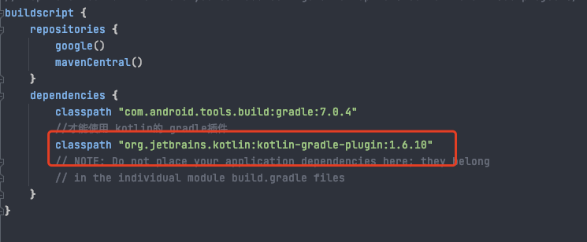

- # 一、简介
	- APT(Annotation Processing Tool) 是一个编译期的注解处理工具, 它对源代码文件进行检测找出其中的 Annotation，使用 Annotation 进行额外的处理。
	  Annotation 处理器在处理 Annotation 时可以根据源文件中的 Annotation 生成额外的源文件和其它的文件 (文件具体内容由 Annotation 处理器的编写者决定),APT 还会编译生成的源文件和原来的源文件，将它们一起生成 class 文件。一些主流的三方库，如 ButterKnife、EventBus 等都用到了这个技术来生成代码。
- # 二、使用
	- 借助  [AutoService](https://www.jianshu.com/p/14669ded4b8b) 自动处理Processor + javapoet 自动生成java源文件
	- [javapoet api](https://square.github.io/javapoet/1.x/javapoet/)
	- [kotlinpoet 中文api](https://enzowyf.github.io/kotlinpoet.html)
	- [kotlinpoet 源api](https://square.github.io/kotlinpoet/)
- # 三、配置kotlin gradle 插件
	- ## 要使用kotlin写的 注解处理器，则需要在依赖processer的 app moudle中添加kotlin插件支持
		- 1.在根目录的 build.gralde添加 kotlin 插件配置
		  collapsed:: true
			- 
		- 2.在app build.gradle 中 添加 插件
		  collapsed:: true
			- plugins {
			      id 'kotlin-android'
			      id 'kotlin-kapt'
			      id 'com.android.application'
			  }
		- 3.使用
			- 
	-
-