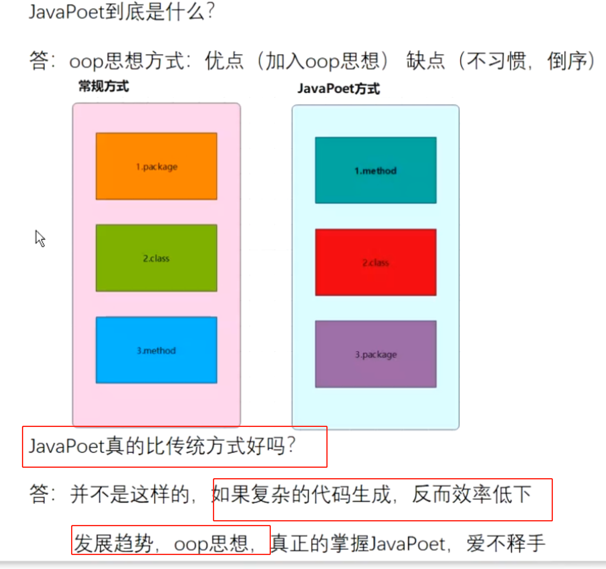

## 1、APT是什么？
	- APT(Annotation Processing Tool) 是一个[[#red]]==**编译期的注解处理工具**==, 它对源代码文件进行检测找出其中的 Annotation，使用 Annotation 进行额外的处理。
- ## 2、注解生命周期选择@Retention
	- SOURCE：注解[[#red]]==**只存在于源代码中，在编译后被丢弃**==，不会出现在运行时环境中。
	- [[#red]]==**CLASS：注解存在于源代码和编译后的字节码中**==，在运行时环境中不会被加载，是默认值。
	- [[#red]]==**RUNTIME：注解存在于源代码、编译后的字节码和运行时环境中，可以在运行时被加载和使用。**==
	  使用场景：当我们需要在运行时反射获取注解信息时，必须将注解的Retention设置为RUNTIME，否则无法获取。
	- > APT使用Source就行，有的也写成CLASS
- ## 3、APT处理在编译器的哪个阶段
	- 源码编译成Class之间
- ## 4、APT多轮处理机制？
	- 如果process的返回值配置true表明需要处理，那么第二轮的rootElements就会收到我们第一轮生成的类。
	- 返回false ,只执行一遍
- ## 5、调试APT,借助buildSrc
- ## 6、javaPoet和传统一行一行生成代码的优缺点？
	- ## javapoet
		- 优点：加入了面向对象的思想
		- 缺点：如果是复杂代码的生成，反而效率低下
	- ## 图
	  collapsed:: true
		- 
- ## 7、适用场景：生成模板代码，简单代码