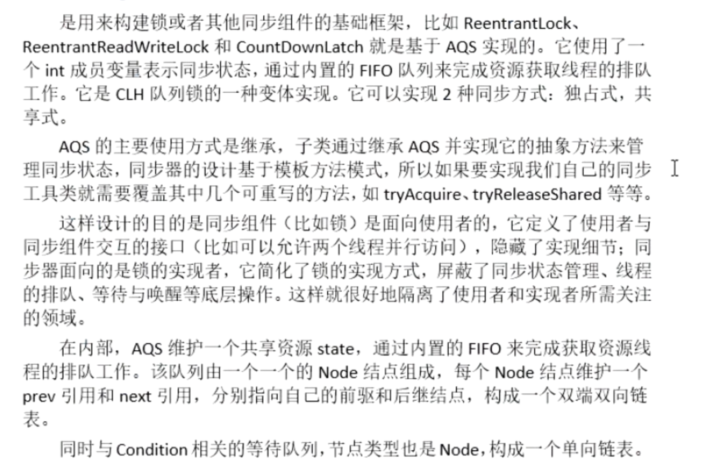
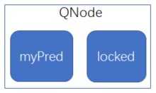
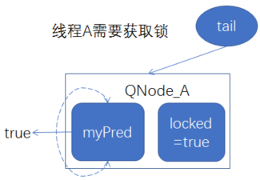
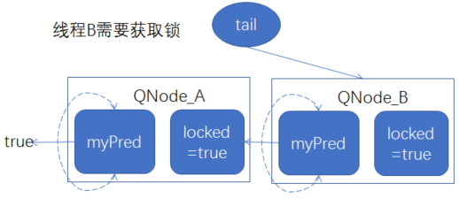
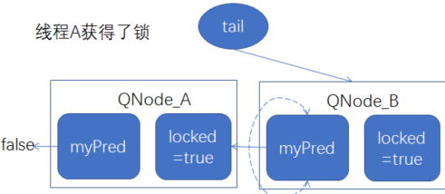

## 1、AQS是什么
	- 1、队列同步器AbstractQueuedSynchronizer（以下简称同步器或AQS），是用来[[#red]]==**构建锁或者其他同步组件**==的基础框架，比如ReentrantLock,ReentrantReadWriteLock
	- 
- ## 2、使用方式：继承它使用模板方法实现，AQS内部通过state成员变量来保存同步状态的
- ## 3、原理[[CLH队列锁思想]]
	- 1、内部使用int型成员变量表示同步状态
	- 2、通过内置的FIFO先进先出队列来完成资源获取线程的排队
	- 3、是CLH队列锁的变体实现。
	- ## 具体如下
	- 将申请锁的所有线程，都加入到一个链表中进行排队
	- 1、比如；当一个线程A需要获取锁时，创建一个链接节点，至少含有3个变量（1、线程A本身，2、前驱节点引用，3、locked代表当前锁的获取状态，true需要获取锁）
		- 
	- 2、线程通过CAS操作调用getAndSet方法，把自己加入队列的尾部，myPred指向其前驱结点的引用，locked改为true，表示需要获得锁
		- {:height 233, :width 325}
	- 3、线程B需要获得锁，也是新建节点，通过CAS操作把自己加入队列尾部，同样的流程再来一遍
		- 
	- 4、然后线程就在前驱结点的locked字段上旋转，直到前驱结点释放锁(前驱节点的锁值 locked == false)
	- 5.当一个线程需要释放锁时，将当前结点的locked域设置为false，同时回收前驱结点
		- 
	- 如上图所示，前驱结点释放锁，线程A的myPred所指向的前驱结点的locked字段变为false，线程A就可以获取到锁。
-