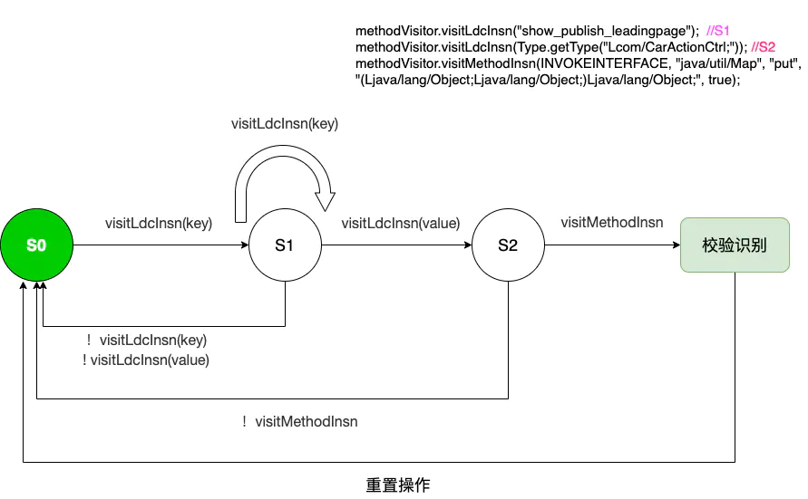
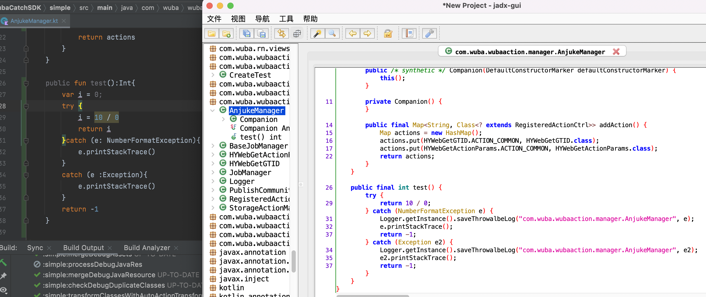

- ## 应用场景：获取Map<String , T>添加key集合
- ## 一、简介
	- The stateful transformation require memorizing some state about the instructions that have been visited before the current one. This requires storing state inside the method adapter 有状态转换需要记住一些在当前指令之前访问过的指令状态，这需要在方法适配器中存储状态
- ## 二、官方示例
	- 1、[删除指令](https://www.yuque.com/mikaelzero/asm/dtooxk)
	  collapsed:: true
		- 移除ICONST_0 IADD。例如，int d = c + 0;与int d = c;两者效果是一样的，所以+ 0的部分可以删除掉
	- 2、[删除指令: ](https://www.yuque.com/mikaelzero/asm/dtooxk)
	  collapsed:: true
		- 移除ALOAD_0 ALOAD_0 GETFIELD PUTFIELD。例如，this.val = this.val;，将字段的值赋值给字段本身，无实质意义
	- 为何说stateless transformation实现起来比较容易，而stateful transformation会实现起来比较困难呢？
	  collapsed:: true
		- stateless transformation不依赖于其他Instruction，只需关注自身，因此实现起来比较简单
		- stateful transformation 依赖其他一条或多条Instruction同时判断，多个指令是一个组合，不能轻易拆散。
	- 实现步骤一般分为三步：
		- 1、将问题转换成Instruciton指令，然后对多个指令组合的特征或遵循的模式进行总结；
		- 2、根据总结的特征或模式对指令进行识别，在识别的过程中，每一条Instruction的加入都会引起原有状态state的变化，这就是stateful的含义；
		- 3、识别成功之后，要对Class文件进行转换，这就对应transformation部分，无非就是对Instruction的内容进行增删改等操作；
		- 如何根据识别记录状态（state）变化呢，这里就要用到state machine(状态机)
- ## 三、状态机state machine
	- 介绍：
	  collapsed:: true
		- 有限状态机（Finite-state machine,FSM），又称有限状态自动机，简称状态机，是表示有限个状态以及在这些状态之间的转移和动作等行为的数学模型 , FSM是一种算法思想，简单而言，有限状态机由一组状态、一个初始状态、输入和根据输入及现有状态转换为下一个状态的转换函数组成，其作用主要是描述对象在它的生命周期内所经历的状态序列，以及如何响应来自外界的各种事件。
	- 对于ASM来说，一般设定一个统一原始的state machine，这里命名为MethodPatternAdapter类
	  collapsed:: true
		- class info：MethodPatternAdapter抽象类，继承自MethodVisitor
		- Fields: 其中定义两个字段，一个常量SEEN_NOTHING表示初始状态 ，一个state字段用于记录不断变化的状态
		- Methods：MethodPatternAdapter类中定义的visitXxxInsn()方法，都会去调用一个自定义的visitInsn()方法：该方法是一个抽象方法，作用就是让所有其他状态（state）都回归到初始状态:SEEN_NOTHING；
	- 操作：
		- 1、创建MethodPatternAdapter抽象类，visitXxxInsn方法中调用visitInsn
		  collapsed:: true
			- ```java
			  public abstract class MethodPatternAdapter extends MethodVisitor {
			      protected final static int SEEN_NOTHING = 0; //初始状态
			      protected int state; //记录状态变化
			  
			      public MethodPatternAdapter(int api, MethodVisitor methodVisitor) {
			          super(api, methodVisitor);
			      }
			  
			      @Override
			      public void visitLdcInsn(Object value) {
			          visitInsn();
			          super.visitLdcInsn(value);
			      }
			      
			      @Override
			      public void visitMethodInsn(int opcode, String owner, String name, String descriptor, boolean isInterface) {
			          visitInsn();
			          super.visitMethodInsn(opcode, owner, name, descriptor, isInterface);
			      }
			      ......
			      
			       protected abstract void visitInsn();
			  ```
		- 2、将问题转换成Instruciton指令，然后对多个指令组合的特征或遵循的模式进行总结：如下Hybrid添加action示例中如何获取action列表
		  collapsed:: true
			- ```java
			  Map<String, Class<? extends RegisteredActionCtrl>> actions = new HashMap<>();
			  actions.put(CarPublishBackParser.ACTION, CarPublishBackActionCtrl.class);
			  actions.put(CarPublishGuideParser.ACTION, CarPublishGuideActionCtrl.class);
			  Hybrid.add(actions);
			  
			  //转换为asm代码如下
			  methodVisitor.visitCode();
			  methodVisitor.visitTypeInsn(NEW, "java/util/HashMap");
			  methodVisitor.visitInsn(DUP);
			  methodVisitor.visitMethodInsn(INVOKESPECIAL, "java/util/HashMap", "<init>", "()V", false);
			  methodVisitor.visitVarInsn(ASTORE, 0);
			  methodVisitor.visitVarInsn(ALOAD, 0);
			  
			  //添加第一个
			  methodVisitor.visitLdcInsn("publish_car_go_back");
			  methodVisitor.visitLdcInsn(Type.getType("Lcom/wuba/carLib/manager/CarPublishBackActionCtrl;"));
			  methodVisitor.visitMethodInsn(INVOKEINTERFACE, "java/util/Map", "put", "(Ljava/lang/Object;Ljava/lang/Object;)Ljava/lang/Object;", true);
			  
			  methodVisitor.visitInsn(POP);
			  methodVisitor.visitVarInsn(ALOAD, 0);
			  
			  //添加第二个
			  methodVisitor.visitLdcInsn("show_publish_leadingpage");
			  methodVisitor.visitLdcInsn(Type.getType("Lcom/wuba/carLib/manager/CarPublishGuideActionCtrl;"));
			  methodVisitor.visitMethodInsn(INVOKEINTERFACE, "java/util/Map", "put", "(Ljava/lang/Object;Ljava/lang/Object;)Ljava/lang/Object;", true);
			  
			  methodVisitor.visitInsn(POP);
			  ```
			-
		- 说明
		  collapsed:: true
			- a.通过以上观察，对于actions.put方法调用实际上是三个instruction：visitLdcInsn(key), visitLdcInsn(value),visitMethodInsn
			- b. 总共调用三个方法，我们只需要在添加两个状态即可满足，状态转换如下图所示
				- 代码
				  collapsed:: true
					- ```java
					  //调用visitLdcInsn(key)后的状态
					  private static final int SEEN_LDCTYPE = 1
					  //调用visitLdcInsn(value)后的状态
					  private static final int SEEN_LDC_METHOD = 2
					  ```
				- 图片
				  collapsed:: true
					- 
		- 3、状态转移清楚后，写代码就很轻松了
		  collapsed:: true
			- ```java
			  public class ReadActionMapMethod extends MethodPatternAdapter {
			  
			      /**
			       * 需要校验的字节码顺序：Map.put()/HashMap.put()
			       */
			      private static final int SEEN_LDCTYPE = 1
			  
			      private static final int SEEN_LDC_METHOD = 2
			      //当前存储业务线
			      private String businessLine
			      /**
			       * 当前第一步缓存数据
			       */
			      private String mMapKey
			      /**
			       * 当前第二步缓存数据
			       */
			      private Type mMapValue
			  
			      protected ReadActionMapMethod(int api, MethodVisitor methodVisitor, String businessLine) {
			          super(api, methodVisitor)
			          this.businessLine = businessLine
			      }
			  
			      @Override
			      void visitLdcInsn(Object value) {
			  
			          if (value instanceof String) {
			              state = SEEN_LDCTYPE
			              mMapKey = value
			              mv.visitLdcInsn(value)
			              return
			          }else if (value instanceof Type && state == SEEN_LDCTYPE){
			              state = SEEN_LDC_METHOD
			              mMapValue = value
			              mv.visitLdcInsn(value)
			              return
			          }
			          super.visitLdcInsn(value)
			      }
			  
			      @Override
			      protected void visitInsn() {
			  //        switch (state) {
			  //
			  //            case SEEN_LDCTYPE:
			  //                //将拦截的数据发送出去
			  //                mv.visitLdcInsn(mMapKey)
			  //                break
			  //
			  //            case SEEN_LDC_METHOD:
			  //                //将拦截的数据发送出去
			  //                mv.visitLdcInsn(mMapKey)
			  //                mv.visitLdcInsn(mMapValue)
			  //                break
			  //        }
			          state = SEEN_NOTHING
			  
			      }
			  
			      @Override
			      void visitMethodInsn(int opcode, String owner, String name, String descriptor, boolean isInterface) {
			          switch (state) {
			              case SEEN_LDC_METHOD:
			                  boolean flag = ((opcode == Opcodes.INVOKEVIRTUAL && owner == "java/util/HashMap" && name == "put")
			                          || (opcode == Opcodes.INVOKEINTERFACE && owner == "java/util/Map" && name == "put"))
			                  if (flag) { //需要存储数据啦
			                      HybridActionManager.install.addAction(businessLine, mMapKey)
			                  }
			                  break
			          }
			          super.visitMethodInsn(opcode, owner, name, descriptor, isInterface)
			  
			      }
			  ```
- ## 四、思考
	- 1、当前只是检查三个状态，如何提升准确性？
	  collapsed:: true
		- 背景：
		  collapsed:: true
			- 存储上方获取的String -> Type对应值，在此扫描获取Type class文件，解析其是否实现Action接口RegisteredActionCtrl，若实现该接口在添加，提高准确性；若想了解这部分内容，请参考WubaActionSDK项目中对RN module字段获取内容，先获取具体类型再根据是否添加类注解，重写getName方法等确定字段值；
			-
		- 代码：
		  collapsed:: true
			- ```java
			  @Override
			  protected List<ModuleSpec> createWubaNativeModules(final ReactApplicationContextWrapper reactApplicationContext) {
			         List<ModuleSpec> moduleSpecList = new ArrayList<ModuleSpec>();
			         moduleSpecList.add(new ModuleSpec(new Provider<NativeModule>() {
			             @Override
			             public NativeModule get() {
			                 return new WBSingleSelector(reactApplicationContext);
			             }
			         },WBSingleSelector.class.getName()));
			  return moduleSpecList;
			  
			  //解析字节码指令：校验状态共计四步
			  methodVisitor.visitLdcInsn(Type.getType("Lcom/wuba/wubaaction/rn/selector/WBMultiUnlinkSelector;"));
			  methodVisitor.visitMethodInsn(INVOKEVIRTUAL, "java/lang/Class", "getName", "()Ljava/lang/String;", false);
			  methodVisitor.visitMethodInsn(INVOKESPECIAL, "com/facebook/react/bridge/ModuleSpec", "<init>", "(Ljavax/inject/Provider;Ljava/lang/String;)V", false);
			  methodVisitor.visitMethodInsn(INVOKEINTERFACE, "java/util/List", "add", "(Ljava/lang/Object;)Z", true);
			  
			  //viewModule注入
			  @Override
			    protected List<WubaViewManager> createWubaViewManagers(ReactApplicationContextWrapper reactApplicationContext) {
			            List<WubaViewManager> list = new ArrayList<WubaViewManager>();
			            list.add(new WBPublishLoadingView());
			            list.add(new WBErrorView())；
			            return list;
			        }
			        
			    //解析字节码指令：校验状态共计四步
			    methodVisitor.visitTypeInsn(NEW, "com/wuba/wubaaction/rn/selector/view/WBPublishLoadingView");
			    methodVisitor.visitInsn(DUP);
			    methodVisitor.visitMethodInsn(INVOKESPECIAL, "com/wuba/wubaaction/rn/selector/view/WBPublishLoadingView", "<init>", "()V", false);
			    methodVisitor.visitMethodInsn(INVOKEINTERFACE, "java/util/List", "add", "(Ljava/lang/Object;)Z", true);
			  ```
	- 2、当引用一些业务库中对异常只简单捕获并未输出堆栈信息导致问题查找困难时，也可以尝试使用ASM对catch()函数校验后增加自定义逻辑：输出堆栈信息或调用自定义方法等；
	  collapsed:: true
		- 
	-