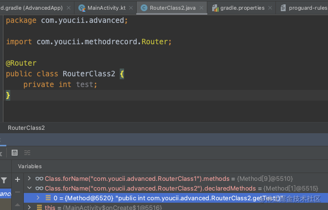

- AST(Abstract syntax tree)抽象语法树解析
	- AST（Abstract syntax tree）的核心就是把Code转化为一种描述（对象、方法、运算符、流程控制语句、声明/赋值、内部类等），让我们可以在运行时比较方便的查看、修改Code，其中转化过程可以认为一种运行时编译。
- 作用方式
	- 
- 身边的应用
	- IDE里面的Lombok插件、语法高亮、格式化代码、自动补全、代码混淆压缩都是利用了AST。
	- 线上体验AST：https://astexplorer.net/
- 利用AST扩展APT
	- 按照我们之前的了解，注解处理器APT只能用来生成代码，无法修改代码，但有了AST就不一样了。
	  IDE里面的Lombok插件的原理就是利用APT动态修改AST，给现有类增加了新的逻辑。
	- 原理我们现在都明白了，下面直接写个Hello World试试水。
	- 示例Demo
		- 1、javasdk/Contents/Home/lib/tools.jar中提供了AST相关的API，我们需要引用这个库
		- 2、 配置AST
		  collapsed:: true
			- ```
			  class ASTProcessor : AbstractProcessor() {
			  
			      // 生成的AST
			      private lateinit var trees: Trees
			      // 用于生成新代码
			      private lateinit var treeMaker: TreeMaker
			      // 用于构建命名
			      private lateinit var names: Names
			  
			      override fun init(processingEnv: ProcessingEnvironment?) {
			          super.init(processingEnv)
			          if (processingEnv is JavacProcessingEnvironment) {
			              trees = Trees.instance(processingEnv)
			              treeMaker = TreeMaker.instance(processingEnv.context)
			              names = Names.instance(processingEnv.context)
			          }
			      }
			  
			  }    
			  ```
		- 3、修改AST
		  collapsed:: true
			- ```
			  override fun process(typeElementSet: MutableSet, roundEnvironment: RoundEnvironment): Boolean {
			      for (typeElement in typeElementSet) {
			          val elements = roundEnvironment.getElementsAnnotatedWith(typeElement)
			          for (element in elements) {
			              // 找到Element对应的子树
			              val jcTree = trees.getTree(element) as JCTree
			              jcTree.accept(myVisitor)
			          }
			      }
			      return false
			  }
			  
			  private val myVisitor = object : TreeTranslator() {
			      /**
			       * 访问者模式里的类定义visit
			       */
			      override fun visitClassDef(tree: JCClassDecl) {
			          super.visitClassDef(tree)
			          // defs指定义的内容，包含方法、参数、内部类等
			          for (jcTree in tree.defs) {
			              // 如果是参数
			              if (jcTree is JCVariableDecl) {
			                  tree.defs.append(makeGetterMethod(jcTree))
			              }
			          }
			      }
			  }
			  
			  /**
			   * 构建get方法
			   */
			  private fun makeGetterMethod(variable: JCVariableDecl): JCMethodDecl? {
			      // this
			      val ident = treeMaker.Ident(names.fromString("this"))
			      // this.xx
			      val select = treeMaker.Select(ident, variable.name)
			      // return this.xxx
			      val jcStatement: JCStatement = treeMaker.Return(select)
			      // 把整个表达式塞到代码块里
			      val jcBlock = treeMaker.Block(0, List.nil<JCStatement?>().append(jcStatement))
			  
			      return treeMaker.MethodDef(
			          treeMaker.Modifiers(Flags.PUBLIC.toLong()), //public
			          getterMethodName(variable),   // getXxx
			          variable.vartype,             // return 类型
			          List.nil<JCTypeParameter>(),  // 泛型参数列表
			          List.nil<JCVariableDecl>(),   // 参数列表
			          List.nil<JCExpression>(),     // 异常抛出列表
			          jcBlock,                      // 代码块
			          null
			      )
			      }
			  ```
			-
		- 效果图
		  collapsed:: true
			- 
- AST+APT实现AOP的限制
  经过测试发现，AST操作只可以应用在annotationProcessor，kapt不支持：修改AST后不能生效。
  所以在当前我们大规模使用kotlin的现状下，使用AST做AOP的处理还是不可行的。
- 思考：虽然AST当前不能结合APT做AOP的处理，不过这种修改语法树的方式提供了新的思路，也许可以在其他领域应用。