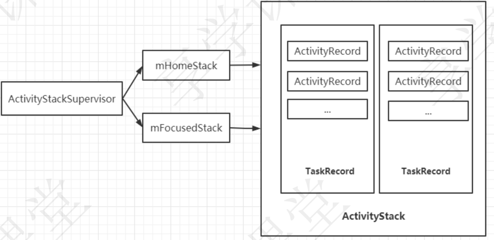

- # 一、作用
	- ActivityStackSupervisor，顾名思义，就是用来**管理ActivityStack的**
- # 二、代码
  collapsed:: true
	- frameworks/base/services/core/java/com/android/server/am/ActivityStackSupervisor.java
	- ```java
	  public class ActivityStackSupervisor extends ConfigurationContainer implements
	  																	DisplayListener {
	        ActivityStack mHomeStack;//管理的是Launcher相关的任务
	        ActivityStack mFocusedStack;//管理非Launcher相关的任务
	        //创建ActivityStack
	        ActivityStack createStack(int stackId,
	        ActivityStackSupervisor.ActivityDisplay display, boolean onTop) {
	            switch (stackId) {
	            case PINNED_STACK_ID:
	                //PinnedActivityStack是ActivityStack的子类
	                return new PinnedActivityStack(display, stackId, this,mRecentTasks, onTop);
	            default:
	            //创建一个ActivityStack
	                return new ActivityStack(display, stackId, this,mRecentTasks, onTop);
	            }
	        }
	  }
	  ```
- ActivityStackSupervisor内部有两个不同的ActivityStack对象：用来管理不同的任务。
	- mHomeStack：管理Launcher相关的任务
	- mFocusedStack：管理非Launcher相关的任务
	-
-
- ActivityStackSupervisor内部包含了创建ActivityStack对象的方法。 AMS初始化时会创建一个ActivityStackSupervisor对象
	- 