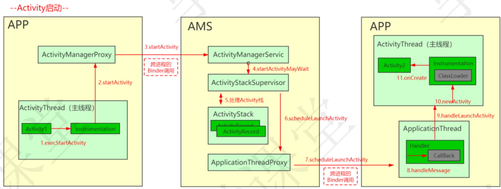
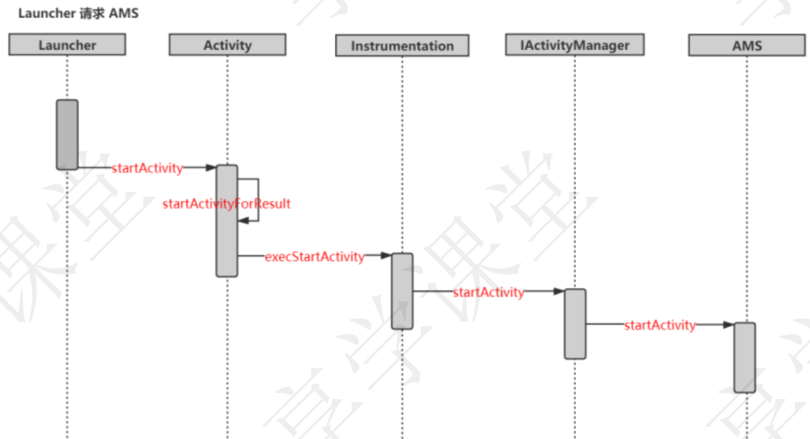
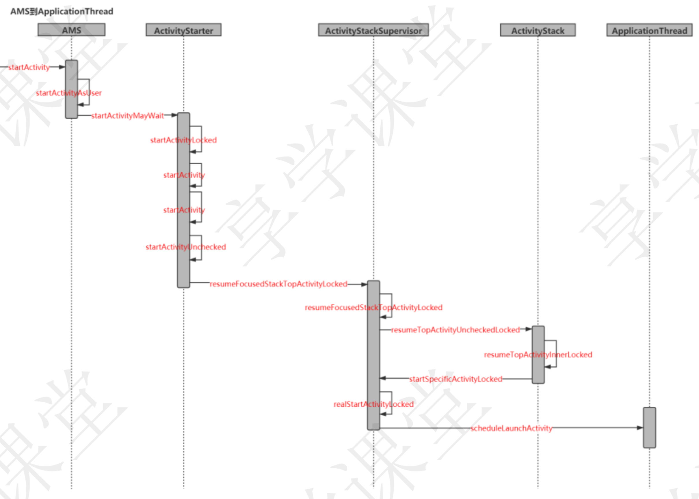
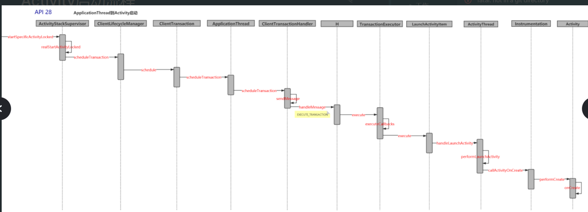

# [[Android应用程序启动流程源码剖析]]
- 
- # 第一阶段：Launcher请求AMS阶段
	- {:height 432, :width 780}
	- 
	- ## 1、启动入口Launcher.StartActivity
		- [[#red]]==**桌面Launcher也是一个Activity，也是通过startActivity打开我们的应用的**==
	- ## 2、startActivity会调用到Activity.startActivityForResult方法
	- ## 3、调用Instrumentation.execStartActivity()启动新的Activity。
		- > mMainThread类型为ActivityThread, 在attach()函数被回调时被赋值
	- ## 4、内部通过ServiceManager.getService（"activity"）获取AMS继续执行startActivity
	- ## 5、AMS的startActivity经历系列调用 startActivityAsUser()->ActivityStarter.execute()
	- ## 6、ActivityStarter.execute()
		- 经过一系列调用，最终回到ActivityStackSupervisor（Activity管理者）的startSpecificActivityLocked方法
	- ## 7、在startSpecificActivityLocked方法中判断目标进程是否存在
		- 进程存在则继续启动Activity
		- 否则执行AMS的startProcessLocked方法启动目标app进程
- # 第二阶段：AMS请求Zygote进程创建应用程序进程阶段
  collapsed:: true
	- 
	- ## 1、AMS调用startProcessLocked方法最终都会调用startProcess方法,然后通过Process调用start方法，开始创建进程
	- ## 2、Process.start()中会通过zygoteProcess.利用socket通信告知Zygote创建fork子进程
	- ## 3、fork出应用进程后，RuntimeInit通过findStaticMain方法通过反射加载ActivityThread类并执行其静态main方法
		- ActivityThread是应用程序的主入口
	- ## 4、ActivityThread.main()创建app主线程ActivityThread，并调用attach方法
	- ## 5、经过和AMS进程通信和系列调用，会执行到ApplicationThread.bindApplication。来绑定应用程序进程
	- ## 6、最终在ActivityThread.handleBindApplication()最终创建Instrumentacion，Instrumentacion再利用反射创建Application，执行其attach方法
	- ## 7、最终执行到Application 的 attachBaseContext。应用程序进程启动完成
- # 第三阶段：ApplicationThread到Activity阶段
  collapsed:: true
	- ## API28重构之后
		- {:height 271, :width 727}
	- ## 1、ActivityStackSupervisor调用realStartActivityLocked去执行创建Activity的流程
	- ## 2、在该方法中AMS通过ClientTransaction（启动Activity并进行Resume的事务）借助binder驱动统一发送到客户端进程由ActivityThread的TransactionExecutor处理。
	  collapsed:: true
		- 这个过程类似于AMS发送事务让Launcher进入后台执行pause操作
	- ## 3、[[#red]]==TransactionExecutor先后处理ClientTransaction的mActivityCallbacks==和mLifecycleStateRequest，其中mActivityCallbacks便[[#red]]==是LaunchActivityItem.execute方法==
	- ## 4、LaunchActivityItem.execute（）
		- 构造ActivityClientRecord，调用ActivityThread.handleLaunchActivity()。
	- ## 5、ActivityThread.handleLaunchActivity
	- ## 6、ActivityThread.performLaunchActivity
		- 1、Instrumentation.newActivity()：AppComponentFactory.instantiateActivity()反射构造Activity；
		- 2、mInstrumentation.callActivityOnCreate()：先调用activity.performCreate()，再回调Activity.onCreate()
- # 参考
	- [Activity启动流程](http://gityuan.com/2016/03/12/start-activity/)
	- assets:///I%3A/MyLogseq11/assets/image_1688714403714_0.png