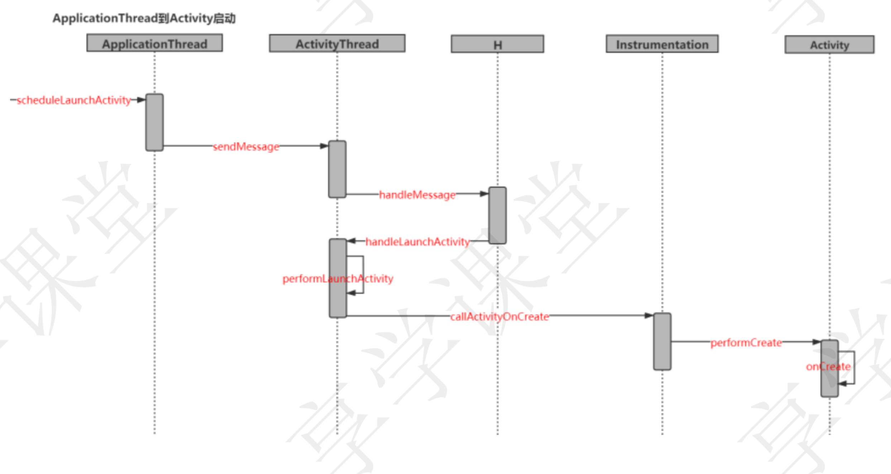

- 
- ## Launcher请求AMS阶段
  collapsed:: true
	- {:height 432, :width 780}
- ## AMS到ApplicationThread阶段
  collapsed:: true
	- 
- ## ApplicationThread到Activity阶段
  collapsed:: true
	- 
- ## API28重构之后
	- {:height 279, :width 749}