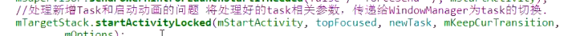

- 是在启动Activity时启动的
- ## 1、Activity启动时第九步ActivityStarter.startActivityUnchecked
  collapsed:: true
	- 调用到
	- 
- ## 2、ActivityStack.startActivityLocked
	- ## 2-1、ActivityStack.insertTaskAtTop 把TaskRecord插入到mTaskHistory中
	- ## 2-2、ActivityRecord.createWindowContainer
	  collapsed:: true
		- 作用：[[#red]]==**创建一个AppWindowToken。并且添加到DisplayContent的mTokenMap中**==
			- 相当于把Activity名字和window绑定
		- > AppWindowToken 对应WindowToken,父类windowContainer<WindowState> AppWIndowToken里还有个mAppToken(AMS里ActivityRecord创建的，类型为IApplicaionToken)
		- ## 调用链
		  collapsed:: true
			- 
			- new AppWindowContainerController
				- 
				- createAppWindow
					- new AppWindowToken 创建了一个AppWindowToken
					  id:: 64ad6b36-8388-4637-af16-04599d6a5fc4
						- AppWindowToken 父类WindowToken，父类windowContainer
						- 
						- 传入了appToken(就是AMS里创建的那个)
	- ## 2-3、ActivityRecord.showStartingWindow
		- 作用：ActivityRecord.showStartingWindow 添加第一个启动的启动Window
		- code
		  collapsed:: true
			- 
		- ## 调用到AppWindowContainerController.addStartingWindow
			- 1、如果之前启动了WMS里有快照就使用快照展示
				- 
			- 2、没有的话
				- 读取配置页面
		- ## scheduleAddStartingWindow
		- ## [[#red]]==**PhoneWindowManager.addSplashScreen**==
			- PhoneWindow win = new PhoneWindow(context) 创建一个PhoneWindow，设置启动页面参数
			- PhoneWindowManager.addSplashscreenContent 填充内容
				- win.setContentView
			- WM.addView  添加到WMS
- # 面试
	- 1、Activity启动流程执行到 ActivityStarter.startActivityUnchecked
	- 2、调用 ActivityStack.startActivityLocked
		- 2-1、把TaskRecord插入到mTaskHistory中
		- 2-2、通过ActivityRecord.createWindowContainer创建一个AppWindowToken。并且添加到DisplayContent的mTokenMap中
		- 2-3、ActivityRecord.showStartingWindow 添加第一个启动的启动Window
			- 通过PhoneWindowManager.addSplashScreen 创建一个PhoneWindow 填充内容
			- 通过WindowManager.addView 添加到WMS中