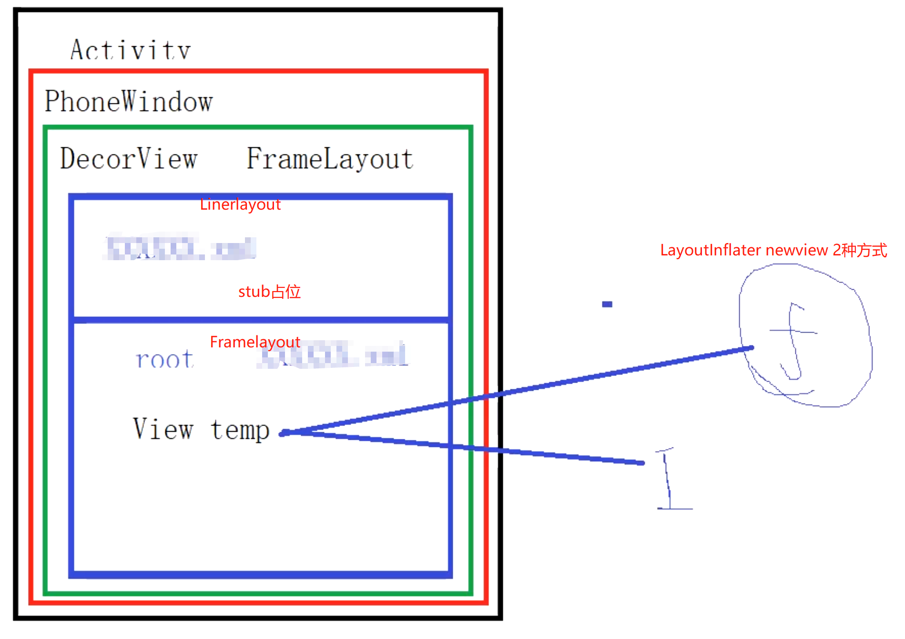

- [[#red]]==**Activity 整体布局结构**==
  collapsed:: true
	- 
-
- # 1、ActivityThread-performLaunchActivity创建Activity对象执行onCreate生命周期
	- 1、==**mInstrumentation.newActivity创建 Activity**==
	- 2、activity.attach方法，创建PhoneWindow，设置windowManager.建立activity与window的关联
	- 3、mInstrumentation.callActivityOnCreated，Activity.performCreate，最终回调onCreate生命周期
- # 2、onCreate-setContentView实际调用的是PhoneWindow的setContentView
	- ## 1、先判断mContentParentid为Content的容器是否初始化
	- ## 2、未初始化，则执行installDecor初始化DecorView和视图容器mContentParent
	  collapsed:: true
		- 2、视图容器未初始化，则执行installDecor，初始化DecorView,添加默认布局LinerLayout
		- 3、由上默认布局，根据[[#red]]==**id = content 初始化mContentParent变量**==
	- ## 2、mContentParent视图容器加载完后LayoutInflater.inflate(layoutResID, mContentParent)，将传入的布局xml 填充到布局容器中
- >[[#red]]==**下边就是解析xml布局文件，反射创建布局里的view[插件化换肤使用]**==
- # 3、LayoutInflater.inflate
	- 1、[[createViewFromTag]]方法中 根据createView(...) 在这里使用[[#red]]==**反射**==调用2个参数的构造方法实例化view对象
	- > 所以自定义view一定重写双参构造
	- > [[#red]]==**app里所有的view 创建 都需要走LayoutInflater 的createView方法创建实例**==
	     1、createView方法
	     2、通过mFactory.onCreateView    【插件化换肤入口】
	- > [[#red]]==**由createViewFromTag方法内可知，根据xml创建的对象还没有布局参数，即LayoutParams**==
	- 2、root不为空即mContentParent：[[#red]]==**根据root生成布局参数**==params = root.generateLayoutParams(attrs);，==**并设置给xml的根布局view对象**==
	- 3、attachToRoot=true，那么就会将xml创建的view 通过addView 添加到传入的mContentParent内。
		- ## [[LayoutInflater.inflate 第三个参数作用]]
- ## [[插件化换肤]]