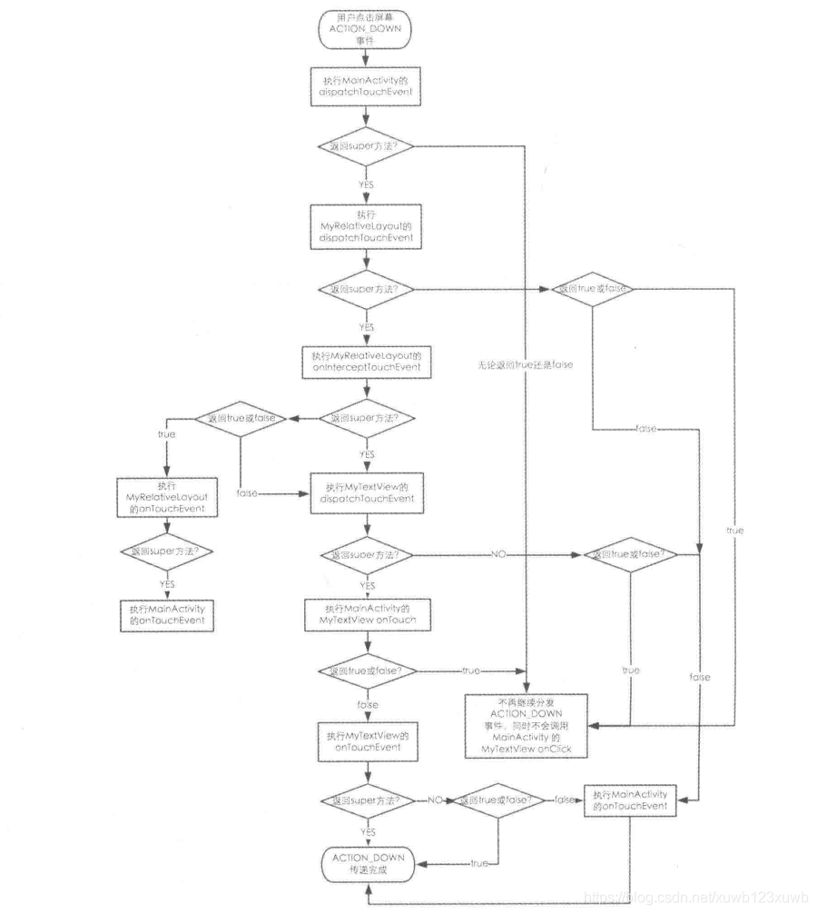

## 1、首先看 MainActivity里有没有 重写 dispatchTouchEvent()
	- 如果重写了返回值不是super.dispatchTouchEvent(ev) ,
		- 那么不会继续分发down事件   因为 super.dispatchTouchEvent(ev) 也就是Activity.dispatchTouchEvent()
			- ```java
			      public boolean dispatchTouchEvent(MotionEvent ev) {
			          if (ev.getAction() == MotionEvent.ACTION_DOWN) {
			              onUserInteraction();
			          }
			          if (getWindow().superDispatchTouchEvent(ev)) {
			              return true;
			          }
			          return onTouchEvent(ev);
			      }
			  ```
		- 如下图 在这个方法里，
- ## 2、MainActivity. dispatchTouchEvent()返回值为 super.dispatchTouchEvent  则 可以开始分发流程：
	- 图解
	  collapsed:: true
		- {:height 846, :width 749}