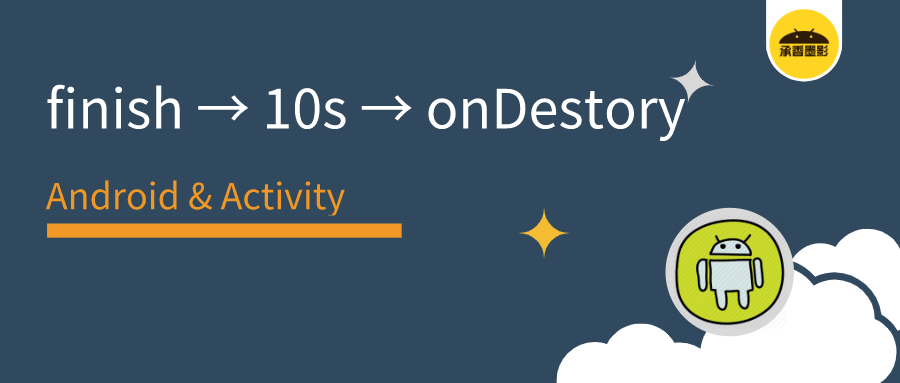

- {:height 340, :width 780}
- # [原文](https://mp.weixin.qq.com/s?__biz=MzIxNjc0ODExMA%3D%3D&chksm=97850ad3a0f283c506226c36f8ee8b6d613a262dd5307d40b792749a2c073e17af2935d8069b&idx=1&lang=zh_CN&mid=2247488498&scene=21&sn=b045fb16934eb2c8ff10bfabdfbef729&token=303432174#wechat_redirect)
- 1、Activity 的 `onStop/onDestroy` 是依赖 IdleHandler 来回调的，正常情况下当主线程空闲时会调用。
- 2、但是由于某些特殊场景下的问题，导致主线程迟迟无法空闲，`onStop/onDestroy` 也会迟迟得不到调用。但这并不意味着 Activity 永远得不到回收，系统提供了一个兜底机制，当 `onResume()` 回调 10s 之后，如果仍然没有得到调用，会主动触发。
-