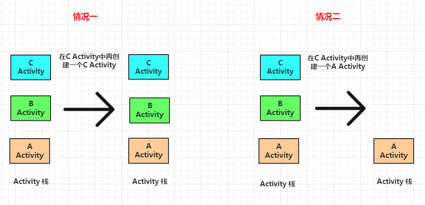

# 生命周期相关面试题
	- # 1、Activity的生命周期
	  collapsed:: true
		- # 图
		  collapsed:: true
			- 
		- ## 1、==**onCreate**==-表示Activity 正在被创建
		  collapsed:: true
			- 这是生命周期的第一个方法。在这个方法中我们可以做一些初始化工作,比如调用setContentView 去加载界面布局资源、初始化Activity所需数据等。
		- ## 2、**[[#blue]]==onRestart==**-表示Activity 正在重新启动。
			- 一般情况下，当当前 Activity 从不可见重新变为可见状态时，onRestart 就会被调用。
			- ### 首先
				- 用户按Home键切换到桌面、用户打开了一个新的Activity、切换其他应用，这时当前的Activity 就会暂停也就是onPause 和onStop 被执行了
			- ### 接着
				- 用户又回到了这个Activity，就会走onRestart  onStart onResume
		- ## 3、[[#red]]==**onStart**==:表示Activity 正在被启动，Activity可见但还没有出现在前台，还无法和用户交互。
		  collapsed:: true
			- 这个时候其实可以理解为 Activity 已经显示出来了，但是我们还看不到。
		- ## 4、[[#green]]==**onResume**==-Activity 已经可见了，并且出现在前台并开始活动。
		  collapsed:: true
			- 要注意这个和onStart的对比,onStart和onResume 都表示Activity 已经可见,但是oStart 的时候Activity还在后台，onResume 的时候 Activity 才显示到前台。
		- ## 5、[[#green]]==**onPause**==-表示Activity 正在停止，正常情况下，紧接着 onStop 就会被调用。
		  collapsed:: true
			- 在特殊情况下，如果这个时候快速地再回到当前 Activity，那么onResume 会被调用。笔者的理解是，这种情况属于极端情况，用户操作很难重现这一场景。此时可以做一些存储数据、停止动画等工作，但是注意不能太耗时，因为这会影响到新 Activity 的显示，onPause必须先执行完，新Activity 的onResume 才会执行。
		- ## 6、[[#red]]==**onStop**==-表示Activity 即将停止，
		  collapsed:: true
			- 可以做一些稍微重量级的回收工作，同样不能太耗时。
		- ## 7、==**onDestroy**==-表示Activity 即将被销毁，
		  collapsed:: true
			- 这是Activity 生命周期中的最后一个回调在这里，我们可以做一些回收工作和最终的资源释放。
	- # 2、成对划分
	  collapsed:: true
		- ==**Activity 的创建和销毁：onCreate 和onDestroy，并且只可能有一次调用。**==
		- [[#red]]==**Activity 是否可见，onStart 和onStop 是配对的**==
		  collapsed:: true
			- 随着用户的操作或者设备屏幕的点亮和熄灭，这两个方法可能被调用多次;
		- [[#green]]==**Activity 是否在前台来说，onResume和onPause**==
		  collapsed:: true
			- 随着用户操作或者设备屏幕的点亮和熄灭这两个方法可能被调用多次。
		- [[#blue]]==**onRestart->从不可见到可见，**==例如Home到桌面和打开新Activity（打开透明Activity除外）再回来
	- # 3、生命周期回调时机
	  collapsed:: true
		- ## 1、第一次启动
			- onCreate -> onStart->onResume
		- ## 2、打开新的Activity、切换到桌面、切换到其他应用的时候
		  collapsed:: true
			- onPause ->onStop。
			- ### 2-1、新Activity 采用了透明主题 或者 启动Dialog
				- onPause
				- 那么当前Activity 不会回调onStop。
			- ### 2-2、透明Activity、Dialog消失
				- 只走onResume
		- ## 3、当用户再次回到原Activity 时，回调如下:
			- onRestart-> onStart->onResume
		- ## 4、当用户按 back 键回退结束Activity时，回调如下:
		  collapsed:: true
			- onPause -> onStop-> onDestroy。
		- ## 5、A启动B结合启动模式,说明生命周期
		  collapsed:: true
			- 
			- case1、B为标准  和 单例 生命周期应该一样只是任务栈不同
				- 启动时：
					- A：onPause -> onStop
					- B：onCreate  onStart onResume
				- 回退时：
					- A：onRestart  onStart onResume
					- B：onPause  onStop  onDestory
			- case2、B为栈顶复用SingleTop
				- B在栈顶时
					- A：onPause -> onStop
					- B：onNewIntent   onResume
				- B不在栈顶时
					- A：onPause -> onStop
					- B：onCreate  onStart onResume
			- case3、SingleTask 栈内复用
				- B在栈内
					- A：onPause -> onStop
					- B：onNewIntent   onResume
				- B不在栈内
					- A：onPause -> onStop
					- B：onCreate  onStart onResume
		- ## 6、系统配置发生改变比如横竖屏切换：
		  collapsed:: true
			- 1、Activity会被杀死重建生命周期
				- 杀死：onPause -> onStop-> onDestroy，
				- 重建：onCreate -> onStart->onResume
			- 2、杀死时回调onSaveInstanceState
				- 在onStop之前调用
				- 和onPause没有既定的前后，谁先都可能。
				- 只有在异常终止才会回调
			- 3、Activity 被重新创建后，系统会调用 onRestoreInstanceState
				- 并且把 Activity 销毁时onSaveInstanceState 方法所保存的 [[#red]]==**Bundle 对象作为参数同时传递给 onRestorelnstanceState和onCreate方法**==。因此,我们可以通过onRestoreInstanceState和onCreate 方法来判断Activity是否被重建了，如果被重建了，那么我们就可以取出之前保存的数据并恢复
				- [[#red]]==**onRestoreInstanceState一旦被调用，其参数Bundle savedInstanceState一定有值，而onCreate需要额外判空。**==
				- [[#red]]==**onRestoreInstanceState 的调用时机在onStart之后**==。
			- 4、如果不希望横竖屏切换时Activity被销毁重建，可以在AndroidManifest.xml文件设置Activity的android:configChanges=“orientation|keyboardHidden|screenSize”，当设置了该属性之后，系统会调用Activity的onConfigurationChanged方法。
		-
		- # 参考
		  collapsed:: true
			- ## [透明主题activity和dialog对其他activity生命周期的影响](https://blog.csdn.net/u010126792/article/details/85006497)
			- ## [activity透明主题引起生命周期的变化](https://blog.csdn.net/Lchannel/article/details/56480186)
- ## 面试题1、OnConfigurationChanged 的作用?
  collapsed:: true
	- 背景：
		- [[#red]]==**在一些情况下，我们希望当一种或者多种配置改变时避免重新启动你的activity**==。可以通过在manifest清单文件中设置 android:configChanges属性来实现
	- 一、android:configChanges   activity里声名这个属性各种值代表activity可以处理这些声明配置的改变，
		- 当这些改变时不会重启activity 而会调用activity里onConfigurationChanged(Resources.Configuration)方法
		- 如果配置的改变没有被声明则仍然会执行onCreate()方法
	- 二、常用值
		- mcc  mnc  locale  touchscreen  keyboard  keboardHidden   navigation
		- orientation  screenLayout   fontScale  uiMode
	- 三、使用
		- Android:configChanges=”orientation|keyboard|keyboardHidden”
		- 表示：改变屏幕方向，弹出软键盘，隐藏软键盘时不会调用onCreate()方法
		- 而执行activity中的onConfigurationChanged()方法
	- 四、应用场景：
		- 在搜索的界面用到了  弹出隐藏软键盘
		- 折叠屏适配：主要设置ui尺寸
- ## [[Activity的创建和生命周期函数调用]]
- ## [[Activity布局流程/创建流程ActivityThread+PhoneWindow]]
- ## [[AndroidResource资源加载流程]]
- ## [[LayoutInflater.inflate 第三个参数作用]]
- # Activity启动模式面试题
  collapsed:: true
	- ## 1、**Standard 标准模式**
	  collapsed:: true
		- **说明：** Android创建Activity时的默认模式，
		- [[#red]]==**每次启动一个Activity都会又一次创建一个新的实例入栈，无论这个实例是否存在**==。
		- **生命周期：**如上所看到的，每次被创建的实例Activity 的生命周期符合典型情况，它的onCreate、onStart、onResume都会被调用。
		- 
	- ## 2、**SingleTop 栈顶复用模式**-适用启动同类型的Activity
	  collapsed:: true
		- ## 特点
			- 1、[[#red]]==**须要创建的Activity已经处于栈顶时，此时会直接复用栈顶的Activity。不会再创建新的Activity**==；
			- 2、==**若须要创建的Activity不处于栈顶，此时会又一次创建一个新的Activity入栈，同Standard模式一样。**==
		- **生命周期：**若情况一中栈顶的Activity被直接复用时，它的onCreate、onStart不会被系统调用，由于它并没有发生改变。可是一个新的方法 **onNewIntent**会被回调（Activity被正常创建时不会回调此方法）。
		- **举例：**此时Activity 栈中以此有A、B、C三个Activity，此时C处于栈顶，启动模式为**SingleTop 模式**。情况一：在C Activity中加入点击事件，须要跳转到还有一个同类型的C Activity。结果是直接复用栈顶的C Activity。
		- 情况二：在C Activity中加入点击事件，须要跳转到还有一个A Activity。结果是创建一个新的Activity入栈。成为栈顶。
		- 
	- ## 3、**SingleTask 栈内复用模式**-适用Home
		- **说明：**若须要创建的Activity已经处于栈中时，此时不会创建新的Activity，而是将存在栈中的Activity上面的其他Activity所有销毁，使它成为栈顶。
		- **生命周期：**同SingleTop 模式中的情况一同样。仅仅会又一次回调Activity中的 **onNewIntent**方法
		- **举例：**此时Activity 栈中以此有A、B、C三个Activity。此时C处于栈顶，启动模式为**SingleTask 模式**。
		- 情况一：在C Activity中加入点击事件，须要跳转到还有一个同类型的C Activity。结果是直接用栈顶的C Activity。情况二：在C Activity中加入点击事件，须要跳转到还有一个A Activity。
		- 结果是将A Activity上面的B、C所有销毁，使A Activity成为栈顶。
		- 
	- ## 4、**SingleInstance 单实例模式**
	  collapsed:: true
		- **说明：** SingleInstance比較特殊，是全局单例模式，是一种加强的SingleTask模式。它除了具有它所有特性外，还加强了一点：具有此模式的Activity仅仅能单独位于一个任务栈中。
		- 这个经常使用于系统中的应用，比如Launch、锁屏键的应用等等，整个系统中仅仅有一个！所以在我们的应用中一般不会用到。了解就可以。
		- **举例：**比方 A Activity是该模式，启动A后。系统会为它创建一个单独的任务栈，由于栈内复用的特性。兴许的请求均不会创建新的Activity，除非这个独特的任务栈被系统销毁。
- ## [[Activity调用finish后会立刻执行onDestory吗，若不会最长延时多久]]
- ## [[onDestory延迟10s调用，怎么排查问题？]]
- ## [[Activity的onCreate到setContentVIew中间做了啥]]
- ## [[使用Intent有什么问题]]