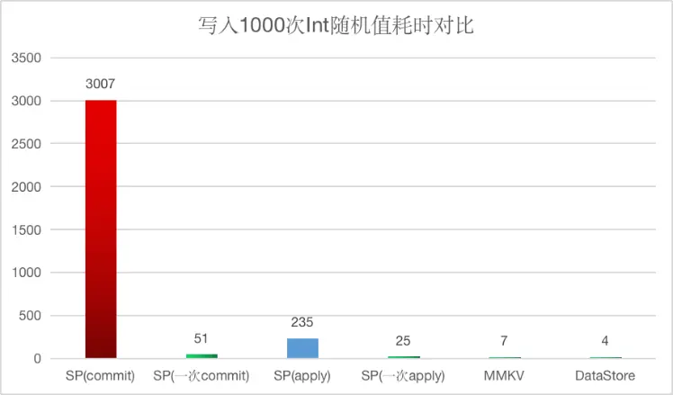

# 概述
	- 在我们日常开发的项目中，存在大量的KV（Key-Value）数据读写，这些数据都会以某种文件格式保存来实现数据的持久化。读写文件是一种耗时的操作，特别是非常频繁地写入或者要写入的数据非常大时容易发生IO阻塞，从而引起App的卡顿甚至ANR异常。
	- Android SDK 从最初的版本就提供了 SharedPreferences API （通常简称为SP）来保存键值对数据，在大量开发者的应用实践中发现 SP 容易产生 ANR 问题；微信团队为了解决微信中特定的数据保存问题开发并在 2018 年开源了 MMKV，很多应用也接入了 MMKV 并提升了 KV 数据存储的效率；Android 官方在 2020 年又推出了一个 Jetpack 组件 DataStore，是改进版本的数据存储解决方案，它的目标是取代 SharedPreferences。
	- 那么 KV 存储库从 SP 到 MMKV 再到 DataStore，他们分别有什么特点和价值？这些存储方案一路升级有什么收益？
- # SharedPreferences
	- SharedPreferences 是 Android 平台上轻量级的存储类，用来保存 App 的各种配置信息，其本质是一个以键值对（key-value）的方式保存数据的 xml 文件，被保存在 /data/data/shared_prefs 目录下。将数据以xml文件的键值对形式保存，每次读取数据的时候，解析xml文件得到指定 key 对应的 value，每次更新数据也通过文件中的 key 更新对应的 value。
	- 每次读写数据都是操作文件，其性能势必有很大的问题，在SharedPreferences的实现上对读写操作也有一些优化。
	- 当调用Context.getSharedPreferences()对SP进行初始化时对xml文件进行一次读取，并将文件中的所有内容缓存到内存中，接下来的所有读操作只需要从这个缓存Map中取就可以了。这其实是一种空间换时间的策略，当xml文件很大时，这种内存缓存机制就会产生内存占用过高的问题。
	- 所以SP不适合在一个文件中存储过多内容，在实际开发中可以根据业务范围定义一些轻量的SP文件。
	- 通常我们对SP进行更新是通过 mSharedPreferences.edit().putString().commit() 进行操作的。为什么首先需要通过SP对象获取edit，然后再更新键值对，最后提交更新呢？SP设计者希望，在复杂业务中将多次更新文件合并到一次写操作中，以达到性能的优化。
	- 对SP的写操作抽象了一个Editor类，在一次写操作中不管调用多少次putXXX()方法，更新了xml文件中的多少键值对，只有调用了commit方法后才会真正写入xml文件。
		- ```
		  // 简单的业务，一次更新一个键值对
		  sharedPreferences.edit().putString().commit();
		  
		  // 复杂的业务，一次更新多个键值对，仍然只进行一次IO操作（文件的写入）
		  Editor editor = sharedPreferences.edit();
		  editor.putString();
		  editor.putBoolean().putInt();
		  editor.commit(); // commit()才会更新文件
		  
		  ```
	- 直接在主线程中执行的commit()方法当要更新的数据量过大时会导致ANR，因此考虑将数据更新放在子线程执行，SP在Editor中提供了一个apply()方法，用于异步执行文件数据的同步。
- # MMKV
	- MMKV 是基于 mmap 内存映射的 key-value 组件，底层采用 protobuf 格式实现数据序列化/反序列化，具有性能高、稳定性强并且支持跨平台的特点，据说在微信上从 2015 年开始使用至今。MMKV 最初开发出来是为了解决微信客户端中遇到特殊文字引起系统的 crash 的问题，现在已经成为了提供高性能的 KV 数据持久化的解决方案。
	- MMKV 库对外公开的接口类 MMKV 实现了接口 SharedPreferencs 和 Editor，所以在接入了 MMKV 的应用中可以像使用 SP API 那样进行数据的写入和读取，只是在调用 put 方法后不需要再调用 commit() 或者 apply() 方法；也可以使用 encode 系列重载方法写数据，然后用对应的 decode 方法读数据。MMKV 的使用非常简单，所有变更立马生效，无需调用 sync、apply。
	- ```
	  MMKV.initialize(context)
	  
	  val mmkv = MMKV.defaultMMKV()
	  mmkv.putInt("key_my_mmkv_1", 10)
	  val putVal = mmkv.getInt("key_my_mmkv_1", 0)
	  
	  mmkv.encode("key_mmkv_encode", "abcd")
	  val encodeVal = mmkv.decodeString("key_mmkv_encode")
	  ```
- # Jetpack DataStore
	- DataStore 是 Android 团队在2020年9月份发布的一个提供数据存储解决方案的 Jetpack 组件，它使用 Kotlin 协程和 Flow 通过异步、保持一致性和事务方式实现数据存储。DataStore 提供了两种不同的实现：Preferences DataStore 和 Proto DataStore，前者使用键值对的方式存储数据，后者将数据作为自定义数据类型的实例进行存储。
	- 这里只介绍 KV 数据的存储，即 Preferences DataStore 的使用。首先需要通过 preferencesDataStore 创建的属性委托来创建 Datastore<Preferences> 实例，在 Kotlin 文件顶层调用一次该实例，然后就可以在其他地方轻松访问该 DataStore 的单例。使用 Preferences DataStore 存储数据需要使用与存储值的类型对应的键类型函数定义一个 key，比如 int 值对应的 key 通过 intPreferencesKey() 创建，String 类型对应的 key 由 stringPreferencesKey() 创建。写入数据通过 DataStore 实例的 edit() 函数以事务方式更新其中的数据，读取数据使用 DataStore.data 属性，通过 Flow 提供相应的存储值。
	- ```
	  // 在Kotlin文件顶层定义dataStore实例
	  val Context.dataStore: DataStore<Preferences> by preferencesDataStore(name = "settings")
	  
	  // 写入数据
	  suspend fun editDataStore() {
	      dataStore.edit { settings ->
	          settings[intPreferencesKey("key_datastore_int")] = 256
	          settings[stringPreferencesKey("key_datastore_str")] = "data"
	      }
	  }
	  
	  // 读取数据
	  val dataInt: Flow<Int> = context.dataStore.data.map { value ->
	      value[intPreferencesKey("key_datastore_int")] ?: 0
	  }
	  
	  val dataStr: Flow<String> = context.dataStore.data.map { value ->
	      value[stringPreferencesKey("key_datastore_str")] ?: ""
	  }
	  ```
- # 性能和稳定性比较
	- 网上有一份如下图所示的 Android 键值对存储方案的性能测试对比，大概的结论是使用 DataStore 读写数据的性能比 SP 和 MMKV 都要差很多，MMKV 的性能远胜于 DataStore 和 SP。
	- {:height 317, :width 749}
	- 得出这个测试结果可能是对 DataStore 的设计原理没有理解从而进行了错误的耗时统计。首先，dataStore.edit() 函数运行在 Kotlin 协程中，所以在 edit 内容执行数据写入的操作不会阻塞主线程的其他任务执行；其次，edit 的 Lambda 函数块是以事务方式执行的，所以统计执行 1000 次写入的耗时应该在 Lambda 函数内部，即从 Lambda 函数内 for 循环之前开始到 for 之后结束。上面错误的统计可能是从 edit 方法执行前开始到 edit 执行之后，设计的 for 循环可能是在 Lambda 函数内或者将 edit 放在 for 循环之内执行了。
	- ```
	  GlobalScope.launch {
	      dataStore.edit { settings ->
	          val startDS1 = System.currentTimeMillis()
	          for (i in 0..1000) {
	              settings[stringPreferencesKey("key_datastore_$i")] = data
	          }
	          Log.d(
	              "TimeCost",
	              "DataStore put 1000 times cost: ${System.currentTimeMillis() - startDS1}"
	          )
	      }
	  }
	  ```
	- 如果采用上面代码的计时方式统计DataStore 的耗时，对比 MMKV 和 SP，分别写入1000次 Int 类型的随机值，耗时对比如下
	  collapsed:: true
		- 
	- 可以发现，通过 SP 写入每次调用 commit 的方式耗时非常严重，而执行1000次 put 后调用一次 commit 的耗时也远高于 MMKV 和 DataStore。从测试数据的性能对比可以说明，我们在实际项目中应改放弃使用 SP，若使用 SP 则应使用 apply 方式提交，并且最好多次写入一次提交。
	- DataStore 的耗时从上面图中可以看出比 MMKV 要少，但并没有太大的差距，而它的推出时间比 MMKV 至少晚两年，而且是官方出品，那么它究竟有什么优势呢？
	- 我们客户端开发接触 MMKV 已经很久了，对它的直观映象就是它的性能很强。因为内部实现采用 mmap 内存映射文件，在一段可供随时写入的内存块上，App 只管写数据，由操作系统负责将内存回写到文件，这样也不必担心应用 crash 导致数据丢失；另外 MMKV 采用 protobuf 协议进行数据序列化，并实现增量更新，所以 MMKV 具有很强的高频同步写入性能。
	- 但是，如果将写入 Int 值改为写入长字符串，仍用上面的测试逻辑进行性能比较，DataStore 相对于 MMKV 就有了明显的优势，测试数据如下：
		- 
		- 其实，在我们的实际项目中像这样连续写入1000次及以上的应用场景不多，对于低频少量的写入场景，使用 SP、MMKV 和 DataStore 的性能差别不太大。当然 SP 需要使用 apply 方法异步提交，对于像微信聊天消息那样需要高频同步写入数据的场景，仍然只有 MMKV 方式更适合，这也是 MMKV 出现的特殊背景。
		- 不过，MMKV 有一个致命的问题：会丢失数据。这是由于 MMKV 没有对文件自动备份和恢复的机制，当操作系统往磁盘写数据的过程中发生了中断异常时，文件会被损坏。MMKV 的实现机制可以保证在应用程序崩溃的时候不影响数据写入磁盘，但发生断电关机之类的操作系统级别的崩溃时，MMKV 就没办法了。对于这种文件损坏，SP 和 DataStore 的应对方式是在每次写入新数据之前都对现有文件做一次自动备份，这样在发生意外出现了文件损坏之后，它们就会把备份的数据恢复过来。
- # 线程/进程安全比较
	- SP/MMKV/DataStore 都是线程安全的 KV 存储框架，只是他们保证线程安全的实现方式各不一样。
	- SP 的读写过程分别通过 synchronized 加锁保证线程安全，读取数据时通过一把锁 mLock 实现，写数据采用了两把锁：mEdtitorLock 和 mWrittingToDiskLock。SP 读数据首先会在首次获取 SP 实例的时候从 xml 文件中加载数据到内存，然后调用 getXXX() 方法从内存中取数据，执行 get 方法时会加锁 mLock 来阻塞，等待 xml 文件加载完毕，没加载完成之前会 wait()。SP 写数据是先写入到内存中的 Map 对象中，调用 putXXX() 方法时会加锁 mEdtitorLock；当调用 commit() 或 apply() 方法将内存数据同步到文件中时会加另一把锁 mWrittingToDiskLock。
	- MMKV 的线程安全是在C++层实现的，使用C++类初始化和析构的特性定义了ScopedLock（作用域锁），对于每个 MMKV 实例都会放入一个全局的 m_dic（一个 MMKVMap 对象）保存，避免每次都要走 MMKV 初始化，并且为该对象添加了强引用防止被释放，另外添加了g_instanceLock 锁来保障，每次 m_dic 进行写操作时加锁保护，保证初始化行为线程安全。
	- DataStore 保证线程安全主要是借助 Kotlin 协程以及事务机制，同时通过 Flow 实现数据读取，避免阻塞主线程。
	- SP 和 DataStore 都不支持多进程，SP 在早期版本（API < 11）以及支持 MODE_MULTI_PROCESS 的版本可以支持多进程。MODE_MULTI_PROCESS 已经被废弃，早期版本的 SP 支持多进程也是有条件的，只有当调用 getSharedPreferences() 并满足相应条件才会重新加载 sp 文件，而 SharedPreferences 在一个进程内是单独实例，数据的备份全部在单个进程内完成，所以在进行多进程读写时，将会大概率发生错误。
	- MMKV 最初是为 iOS平台开发的，并不支持多进程，迁移到 Android 平台后提供了多进程支持。MMKV 本质上是将文件 mmap 到内存空间，将新增的 key-value 统统 append 到内存块中，到达边界后进行重整回写，以腾出空间，空间还不够就进行扩容。MMKV 内部采用封装后的文件锁处理多进程的互斥。
- # 总结
	- 由于开发者的滥用（使用不规范）和它本身的设计缺陷，在实际开发项目中 SP 已经越来越不受欢迎了，加上开源的 MMKV 有优异的性能和支持多进程，更多团队选择接入 MMKV，官方推出的旨在替换 SP 的 DataStore 也逐渐成熟稳定，我们在项目中可以根据需要选择合适的 KV 存储方案。