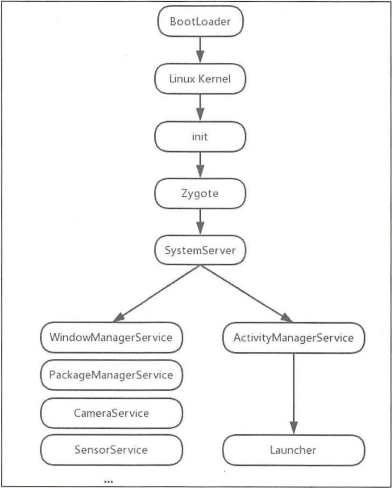
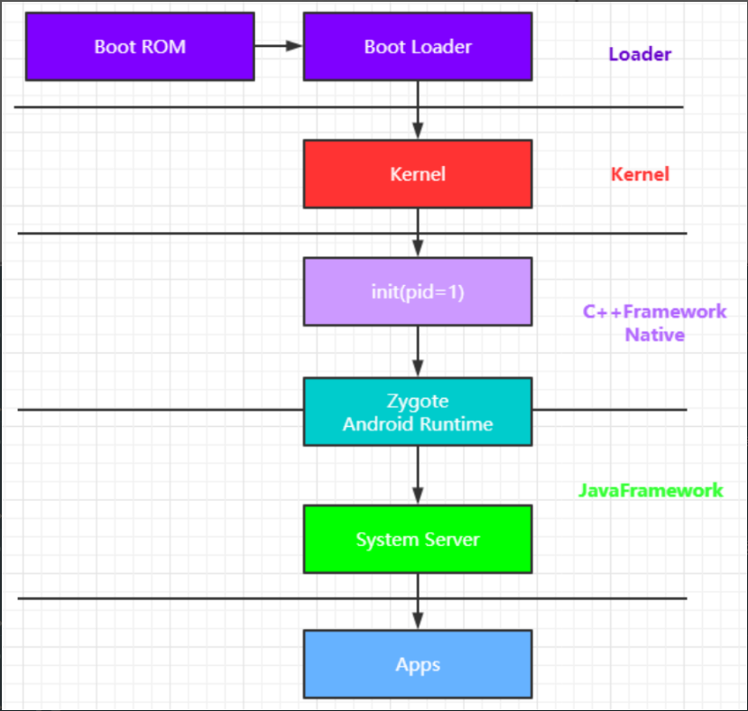

- {:height 975, :width 776}
- 
- ## 1、启动电源以及系统启动
	- 当电源按下时，引导芯片代码从预定义的地方（固化在ROM中）开始执行。加载引导程序BootLoader到RAM，然后执行。
- ## 2、引导程序BootLoader（loader层）
	- 引导程序BootLoader是在android操作系统开始运行前的一个小程序，引导程序是运行的第一个程序，他的主要作用是把系统OS拉起来并运行。
- ## 3、Linux内核启动（内核层）
	- 当内核启动时，设置缓存、被保护存储器、计划列表、加载驱动。当内核完成系统设置时，它首先在系统文件中寻找init.rc文件，并启动init进程。
- ## 4、init进程启动（C++native层）
	- init进程是Linux系统中用户空间的第一个进程，进程号固定为1
	- 初始化和启动属性服务，并且启动Zygote进程。
- ## 5、Zygote进程启动
	- 创建Java虚拟机并为Java虚拟机注册JNI方法，创建服务器端Socket，启动SystemServer进程。
	- {Launcher——> app -> 从zygote fork子进程}
	- ==Runtime中创建的jvm虚拟机==
- ## 6、SystemServer进程启动（java层）
	- System Server 是Zygote fork 的第一个Java 进程， 这个进程非常重要，因为他们有很多的系统线程，提供所有核心的系统服务
	- 启动Binder线程池和SystemServiceManager，并且启动各种系统服务。
- ## 7、Launcher启动
	- 被SystemServer进程启动的AMS会启动Launcher，Launcher启动后会将已安装应用的快捷图标显示到界面上。