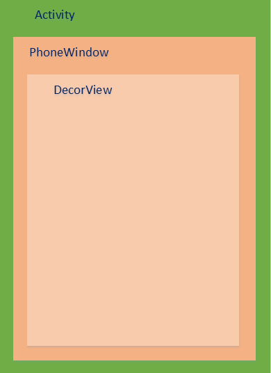
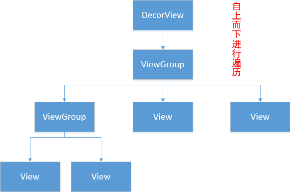

- 1. PhoneWindow是Android系统中最基本的窗口系统，继承自Windows类，负责管理界面显示以及事件响应。它是Activity与View系统交互的接口
- 2. DecorView是PhoneWindow中的起始节点View，继承于View类，作为整个视图容器来使用。用于设置窗口属
  性。它本质上是一个FrameLayout
- 3. ViewRoot在Activtiy启动时创建，负责管理、布局、渲染窗口UI等等
	- 
- 对于多view的视图，结构是树形结构：最顶层是ViewGroup，ViewGroup下可能有多个ViewGroup或View，如下图：
	- 
- 一定要记住：无论是measure过程、layout过程还是draw过程，永远都是从View树的根节点开始测量或计算（即从树的顶端开始），一层一层、一个分支一个分支地进行（即树形递归），最终计算整个View树中各个View，最终确定整个View树的相关属性