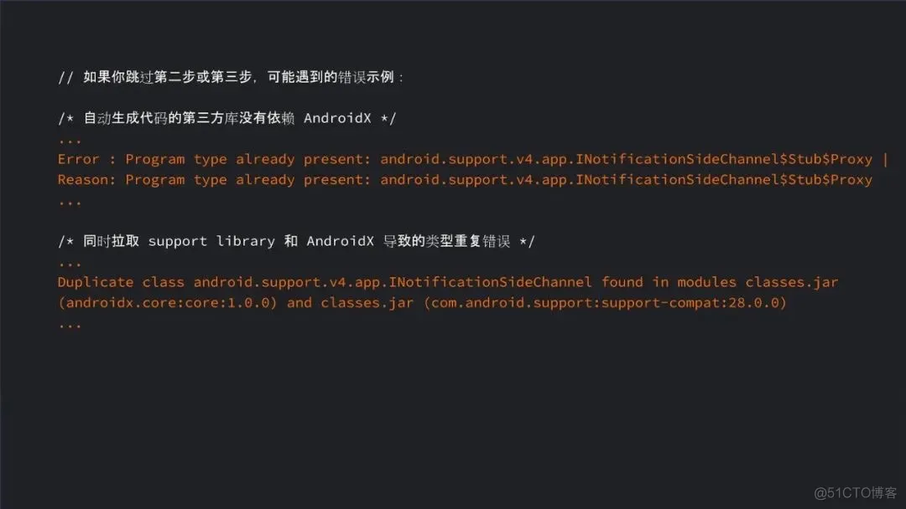
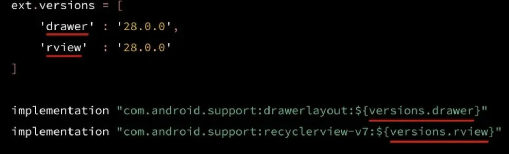

- # 一、前言
  collapsed:: true
	- AndroidX是谷歌在2018年IO大会上推出的，是对support库的整理后的产物，用于取代support库，解决使用support库必须保持统一的版本及命名混乱等问题。在2018年9月发布了support库的最后一个版本28.0.0，之后support库将不再维护。AndroidX 1.0.0版本对应于support库28.0.0版本。为了确保迁移过程顺畅，迁移前请先将support库升级28.0.0版本。
- # 二、为什么迁移Androidx
  collapsed:: true
	- 您可能会想: 既然 AndroidX 只是 Support Library 28 的重构，那为什么要迁移呢? 关于这个问题，我们有下面几个理由:
	  Support Library 已经完成了它的历史使命，28 将会是它的最后发布版。我们接下来将不会继续在 Support Library 中修复 bug 或发布新功能;
	  更好的包管理: 独立版本、独立命名以及更高频率的更新。以上优点，AndroidX 开箱既得;
	  目前已经有许多我们耳熟能详的工具库已经迁移至 AndroidX，例如 Google Play 服务、Firebase、Butterknife、Mockito 2、SQL Delight，我们后面会提到如何迁移它们的依赖;
	  我们正在努力推广 AndroidX 命名空间，未来所有新推出的组件库，例如 Jetpack Compose 和 CameraX，都将成为 AndroidX 的一员。
- # 三、开始迁移
  collapsed:: true
	- {:height 283, :width 746}
	- ## 第一步: 将 Support Library 升级至 28
	  collapsed:: true
		- 首先，我们希望您把当前的 Support Library 依赖升级至版本 28。如果您从早期版本的 Support Library 进行迁移，可能会在需要修改命名空间的同时遭遇 API 不兼容的问题; 而 Support Library 28 的 API 与 AndroidX 之间只有命名空间上的不同。所以我们建议，先尝试将 Support Library 升级至版本 28，处理过所有 API 变更，并且确保编译通过后，再进行下一步，这样所做的修改是最少的。
	- ## 第二步: 开启 Jetifier
	  collapsed:: true
		- 接下来需要做的是开启 Jetifier。Jetifier 可以帮助您迁移第三方依赖库的依赖至 AndroidX。正如字面意思所说，Jetifier 会修改这些第三方依赖库的代码，从而使其与使用 AndroidX 的工程兼容。不过 Jetifier 不会修改您的源码和自动生成的代码，因此不用担心它会造成额外的不良影响。
		  开启 Jetifier 十分的简单，您只需要在 gradle.properties 文件中加入 "android.useAndroidX = true" 和 "android.enableJetifier = true" 即可。"useAndroidX" 设置用于开启 AndroidX 库的自动导入，当您自动补全或导入依赖库时，会自动导入 AndroidX 库。
		- ```
		   # "useAndroidX" 设置用于开启 AndroidX 库的自动导入，
		   # 当您自动补全或导入依赖库时，会自动导入 AndroidX 库
		   "android.useAndroidX = true"
		   # Jetifier 可以帮助您迁移第三方依赖库的依赖至 AndroidX
		   "android.enableJetifier = true" 
		  ```
	- ## 第三步: 检查第三方库版本的兼容性
	  collapsed:: true
		- 当您开启 Jetifier 之后，就要着手升级第三方依赖库到兼容的版本。在您真的开始迁移之前，最好把所有依赖升级到最新。
		- 为什么要这么做? 其实我们自己就在这方面 "栽过跟头"，我们有一个演示应用: Plaid，它依赖了图片加载库 Glide，我们本来打算使用 ​ ​Plaid 来演示如何迁移应用至 AndroidX​​，但当我们在没有检查 Glide 依赖库版本就开始迁移时，我们遭遇了一堆编译错误。检查后才发现，当时依赖的那个版本的 Glide 无法兼容 AndroidX。
		- 而当我们把 Glide 和其他依赖库版本都升级后，再做迁移工作，就没有再出现相同的错误。所以，建议在开始迁移前，先检查和升级应用的第三方依赖，新版本的第三方库可能已经兼容 AndroidX。由于Jetifier 不会帮您迁移自动生成代码的依赖库，所以您还是需要自己检查这类依赖是否兼容 AndroidX。
		- 如果跳过了前面两步，您可能会遇到一些问题:
		  如果您当前使用的第三方库不兼容 AndroidX，您将会看到它依然在尝试拉取旧版本的 Support Library;
		  而如果您的工程被部分迁移，可能还会遇到类型重复的错误，这是因为工程正在尝试从 Support Library 和 AndroidX 拉取相同的代码。
			- 
	- ## 第四步：[[将 Support 库依赖转换为 AndroidX]]
- # 四、需要手动处理的情况
	- ## 1、版本是变量设置的
		- 
		- 自动迁移不会理会您之前的变量配置，它会直接把这些库替换成一个确定的 AndroidX 版
		-
- # 参考资料
	- [是时候迁移至 AndroidX 了！](https://blog.51cto.com/phyger/5276344)
-