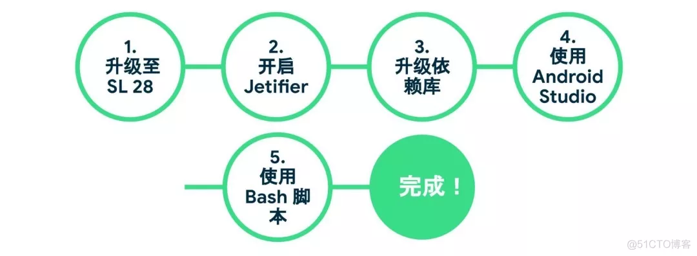

- # 一、前言
  collapsed:: true
	- AndroidX是谷歌在2018年IO大会上推出的，是对support库的整理后的产物，用于取代support库，解决使用support库必须保持统一的版本及命名混乱等问题。在2018年9月发布了support库的最后一个版本28.0.0，之后support库将不再维护。AndroidX 1.0.0版本对应于support库28.0.0版本。为了确保迁移过程顺畅，迁移前请先将support库升级28.0.0版本。
- # 二、为什么迁移Androidx
  collapsed:: true
	- 您可能会想: 既然 AndroidX 只是 Support Library 28 的重构，那为什么要迁移呢? 关于这个问题，我们有下面几个理由:
	  Support Library 已经完成了它的历史使命，28 将会是它的最后发布版。我们接下来将不会继续在 Support Library 中修复 bug 或发布新功能;
	  更好的包管理: 独立版本、独立命名以及更高频率的更新。以上优点，AndroidX 开箱既得;
	  目前已经有许多我们耳熟能详的工具库已经迁移至 AndroidX，例如 Google Play 服务、Firebase、Butterknife、Mockito 2、SQL Delight，我们后面会提到如何迁移它们的依赖;
	  我们正在努力推广 AndroidX 命名空间，未来所有新推出的组件库，例如 Jetpack Compose 和 CameraX，都将成为 AndroidX 的一员。
- # 三、开始迁移
	- {:height 283, :width 746}
	- ## 第一步: 将 Support Library 升级至 28
		- 首先，我们希望您把当前的 Support Library 依赖升级至版本 28。如果您从早期版本的 Support Library 进行迁移，可能会在需要修改命名空间的同时遭遇 API 不兼容的问题; 而 Support Library 28 的 API 与 AndroidX 之间只有命名空间上的不同。所以我们建议，先尝试将 Support Library 升级至版本 28，处理过所有 API 变更，并且确保编译通过后，再进行下一步，这样所做的修改是最少的。
		  -----------------------------------
		  是时候迁移至 AndroidX 了！
		  https://blog.51cto.com/phyger/5276344