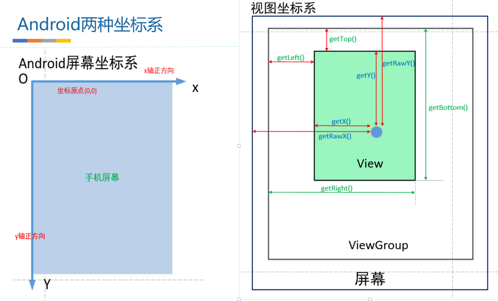

- {:height 461, :width 749}
- ## Android坐标系
  collapsed:: true
	- 1、Android坐标系，屏幕左上角为原点（0,0）
	- 2、x向右为正，y向下为正
- ## view坐标系
  collapsed:: true
	- getTop();       //获取**子View左上角距父View顶部**的距离
	- getLeft();      //获取**子View左上角距父View左侧**的距离
	- getBottom();    //获取**子View右下角距父View顶部的**距离
	- getRight();     //获取**子View右下角距父View左侧**的距离
- ## 触摸事件MotionEvent
  collapsed:: true
	- event.getX();       //触摸点相对于其所在view坐标系的坐标
	- event.getY();
	- event.getRawX();    //触摸点相对于屏幕默认坐标系的坐标
	- event.getRawY();