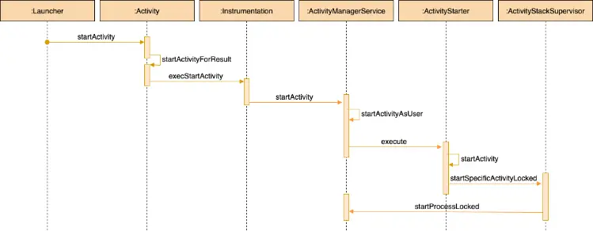
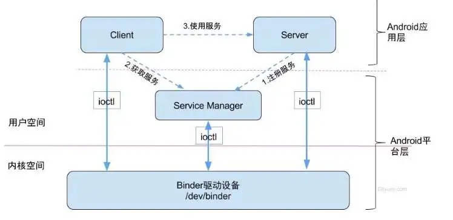
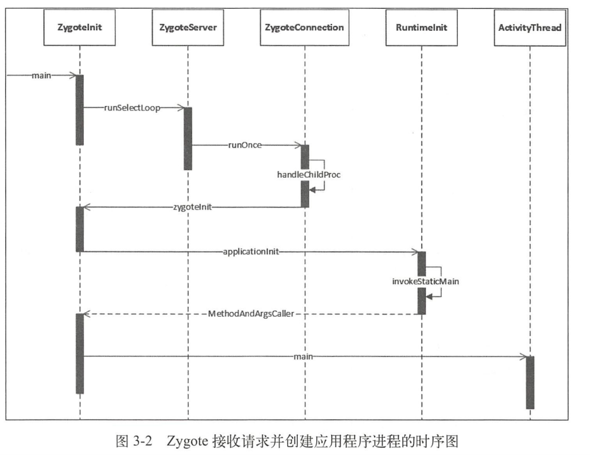
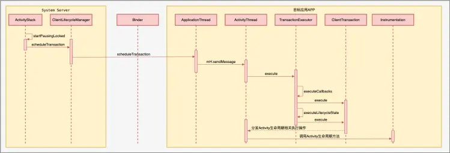

# 一、背景
collapsed:: true
	- 近期应工信部要求整改，其中一项是的整改要求是隐私弹窗之前不允许收集个人信息，个人信息包括设备和个人的敏感信息，这个条款按照需求理解就是隐私弹框之前不允许有任何业务逻辑有采集信息行为，代码层理解就是隐私弹窗弹出前不允许调用任何其他逻辑，包括我们程序的初始化操作。因为我们程序的初始化之前是放在隐私弹窗之前开始执行的，那为迎合本次整改，需要将我们的初始化延迟到隐私政策同意之后执行，如何能快速实现，这个改造呢？借鉴了同城hook Instrumentation 的方案（朝彬、曾老师开发），实现方案不是本次要讲的内容，大家可以自行下来查看代码实现（PrivacyInstrumentation类），本次要讲的是app应用的启动流程，当你理解了本次所讲的内容，你再看实现方案就能更好的理解，从源码逐步分析启动流程的每个环节，涉及到每个类的作用，带大家一一了解。
- # 二、问题
	- 1、应用的进程是什么时机创建的，进程如何和application绑定？
	- 2、app 应用启动过程中关键核心类的作用以及他们之间的关系？
	- 3、Application是什么时候创建的，谁管理他的生命周期？
		- Instrumentation
	- 4、Activity的创建和生命周期是由谁管理？
		- Instrumentation
	- 5、AMS的通信机制和作用？
	- 6、ContentProvider的onCreate()是有系统调用的，那什么时机执行呢？
	  若以上内容都已理解，那接下来的内容就当温习和探讨吧 ：）
- # 三、应用启动流程所涉及的核心类及作用
	- 先简述一下启动过程中关键类及作用，便于大家理解下面的内容：
	- ## ActivityManagerService：
		- Framework层，Android核心服务,简称AMS,负责调度各应用进程,管理四大组件.实现了IActivityManager接口,应用进程能通过Binder机制调用系统服务，以下简称AMS；
	- ## Instrumentation：
		- Instrumentation会在应用程序的任何代码运行之前被实例化,它能够允许你监视应用程序和系统的所有交互.它还会构造Application,构建Activity,以及生命周期都会经过这个对象去执行；
	- ## ActivityThread：
		- 应用的主线程.程序的入口.在main方法中开启loop循环,不断地接收消息,处理任务.
	- ## ApplicationThread：
		- 是ActivityThread的内部类，也是一个Binder对象,执行组件和Application 的调度任务。
	- ## ServiceManager：
		- 用于管理所有的系统服务，维护着系统服务和客户端的binder通信。
	- ## TaskRecord：
		- Activity的管理者，一个ActivityRecord对应一个Activity，保存了一个Activity的所有信息;但是一个Activity可能会有多个ActivityRecord,因为Activity可以被多次启动，这个主要取决于其启动模式。
	- ## ActivityStack：
		- Stack的管理者，用来管理TaskRecord的，包含了多个TaskRecord
	- ## ActivityStackSupervisor：
		- ActivityStack的管理者，早期的Android版本是没有这个类的，直到Android 6.0才出现。
- # 四、启动流程**[[#red]]==第一阶段Launcher->AMS请求创建进程==**
	- ## 本次分析的环境条件：
	  collapsed:: true
		- 1. 源码基于android 28
		  2. 本次启动分析是基于Launcher的桌面启动应用
		  3. AOSP源码阅读可使用的方式：
		      3.1 在线阅读 https://cs.android.com 、https://github.com/aosp-mirror（google已经把framework源码托管在了gitHub） 或http://androidxref.com/（快速搜索引擎） 在线搜索及浏览 。
		      3.2 离线阅读工具OpenGrok、Source Insight、AS或我们常用Sublime Text；
		      3.3 源码下载地址：
		          3.3.1 [国内GitHub地址](https://github.com/aosp-mirror/platform_frameworks_base)
		          3.3.2 [清华大学开源软件镜像站](https://mirrors.tuna.tsinghua.edu.cn/help/AOSP/)
		          3.3.3 [中国科学技术大学开源软件镜像站](http://mirrors.ustc.edu.cn/)
		          3.3.4 若只阅读Android platform 源码，可以从科大上clone：
		  git clone git://mirrors.ustc.edu.cn/aosp/platform/frameworks/base --depth=1
		  因为AOSP资源较大，本次采用在线方式阅读分析
	- 
	- ## 启动入口Launcher.StartActivity
	  collapsed:: true
		- Launcher,我们安卓桌面,他也是一个应用.只不过他有些特殊属性,特殊在于它是系统开机后第一个启动的应用,并且该应用常驻在系统中,不会被杀死,用户一按home键就会回到桌面(回到该应用).桌面上面放了很多很多我们自己安装的或者是系统自带的APP,我们通过点击这个应用的快捷方法可以打开我们的应用，[[#red]]==**桌面Launcher也是一个Activity，也是通过startActivity打开我们的应用的**==，可以认为我们的应用都是通过其他应用打开的。
	- ## Activity的startActivity方法
	  collapsed:: true
		- 代码
			- ```java
			  @Override
			  public void startActivity(Intent intent, @Nullable Bundle options) {
			      if (mIntent != null && mIntent.hasExtra(AutofillManager.EXTRA_RESTORE_SESSION_TOKEN)
			              && mIntent.hasExtra(AutofillManager.EXTRA_RESTORE_CROSS_ACTIVITY)) {
			          if (TextUtils.equals(getPackageName(),
			                  intent.resolveActivity(getPackageManager()).getPackageName())) {
			              ...
			          }
			      }
			      if (options != null) {
			          startActivityForResult(intent, -1, options);
			      } else {
			          // Note we want to go through this call for compatibility with
			          // applications that may have overridden the method.
			          startActivityForResult(intent, -1);
			      }
			  }
			  ```
		- startActivity会调用startActivityForResult方法。
			- ```java
			  public void startActivityForResult(@RequiresPermission Intent intent, int requestCode,
			          @Nullable Bundle options) {
			    // mParent是ActivityGroup，之前的组合模式，已经不推荐使用了，
			    // 现在被Fragment替代，一般情况为空  
			    if (mParent == null) {
			          options = transferSpringboardActivityOptions(options);
			          //调用Instrumentation.execStartActivity()启动新的Activity。
			          //mMainThread类型为ActivityThread, 在attach()函数被回调时被赋值
			          Instrumentation.ActivityResult ar =
			              mInstrumentation.execStartActivity(
			                  this, mMainThread.getApplicationThread(), mToken, this,
			                  intent, requestCode, options);
			          if (ar != null) {
			              // 如果activity之前已经启动，而且处于阻塞状态，execStartActivity函数直接返回要启动的activity的result或者null。
			              //如果结果不为空，发送结果
			              mMainThread.sendActivityResult(
			                  mToken, mEmbeddedID, requestCode, ar.getResultCode(),
			                  ar.getResultData());
			          }
			          if (requestCode >= 0) {
			              // 如果需要一个返回结果，那么赋值mStartedActivity为true，在结果返回来之前保持当前Activity不可见
			              mStartedActivity = true;
			          }
			  
			          cancelInputsAndStartExitTransition(options);
			          // TODO Consider clearing/flushing other event sources and events for child windows.
			      } else {
			          if (options != null) {
			              mParent.startActivityFromChild(this, intent, requestCode, options);
			          } else {
			              // Note we want to go through this method for compatibility with
			              // existing applications that may have overridden it.
			              mParent.startActivityFromChild(this, intent, requestCode);
			          }
			      }
			  }
			  ```
		- mParent是ActivityGroup，之前的组合模式，已经不推荐使用了，现在被Fragment替代，一般情况为空，所以都会进入为空判断分支，随后调用了Instrumentation的execStartActivity方法,其中mMainThread是ActivityThread(就是从这里开始启动一个应用的),mMainThread.getApplicationThread()是获取ApplicationThread，ApplicationThread是ActivityThread的内部类,下文介绍。
	- ## Instrumentation执行execStartActivity方法
	  collapsed:: true
		- Instrumentation.java代码
			- ```java
			  @UnsupportedAppUsage	
			  public ActivityResult execStartActivity(
			          Context who, IBinder contextThread, IBinder token, Activity target,
			          Intent intent, int requestCode, Bundle options) {
			      //1. 将ApplicationThread转为IApplicationThread
			      IApplicationThread whoThread = (IApplicationThread) contextThread;
			      Uri referrer = target != null ? target.onProvideReferrer() : null;
			      if (referrer != null) {
			          intent.putExtra(Intent.EXTRA_REFERRER, referrer);
			      }
			      ...
			      try {
			  
			          intent.migrateExtraStreamToClipData(who);
			          intent.prepareToLeaveProcess(who);
			          //2. 获取AMS实例,调用startActivity方法
			          int result = ActivityManager.getService().startActivity(whoThread,
			                  who.getBasePackageName(), who.getAttributionTag(), intent,
			                  intent.resolveTypeIfNeeded(who.getContentResolver()), token,
			                  target != null ? target.mEmbeddedID : null, requestCode, 0, null, options);
			          checkStartActivityResult(result, intent);
			      } catch (RemoteException e) {
			          throw new RuntimeException("Failure from system", e);
			      }
			      return null;
			  }
			  ```
		- IApplicationThread是一个Binder接口,继承自android.os.IInterface接口，IInterface接口是Binder的基础类。[[#red]]==**它相当于app进程的binder的代理类。传给ams后 ams可以通过这个代理类调用app进程的方法。**==
		- ApplicationThread是继承了IApplicationThread.Stub(由Android SDK工具会生成以IApplicationThread.aidl 文件命名的 .java 接口文件，生成的接口包含一个名为 Stub 的子类),实现了IApplicationThread的,所以可以转成IApplicationThread.由ApplicationThread和AMS通信进一步执行启动流程。
	- ## ServiceManager获取ActivityManagerService（AMS）并继续启动startActivity
	  collapsed:: true
		- 在Instrumentacion的execStartActivity方法中ActivityManager.getService()获取ActivityManagerService（AMS）实例,调用AMS的startActivity方法，看一下ActivityManagerService的获取方式，通过ServiceManager.getService(Context.ACTIVITY_SERVICE)
			- ```java
			  ActivityManager.java
			  
			  @UnsupportedAppUsage
			  public static IActivityManager getService() {
			      return IActivityManagerSingleton.get();
			  }
			  @UnsupportedAppUsage
			  private static final Singleton<IActivityManager> IActivityManagerSingleton =
			          new Singleton<IActivityManager>() {
			              @Override
			              protected IActivityManager create() {
			                  //System service 获取AMS 
			                  final IBinder b = ServiceManager.getService(Context.ACTIVITY_SERVICE);
			                  final IActivityManager am = IActivityManager.Stub.asInterface(b);
			                  return am;
			              }
			          };
			  ```
		- ServiceManager是安卓中一个重要的类，用于管理所有的系统服务，维护着系统服务和客户端的binder通信。返回的是Binder对象,用来进行应用与系统服务之间的通信的.
		- ServiceManager存在于System Server进程，是由Zygote进程fork而来，Zygote孵化的第一个进程，System Server负责启动和管理整个Java framework，包含ActivityManager，WindowManager，PackageManager，PowerManager等服务，AMS就是其中的一个重要服务
			- 
		- 对于用户空间，不同进程之间彼此是不能共享的，而内核空间却是可共享的。Client进程向Server进程通信，恰恰是利用进程间可共享的内核内存空间来完成底层通信工作的，Client端与Server端进程往往采用ioctl等方法跟内核空间的驱动进行交互。ioctl是设备驱动程序中对设备的I/O通道进行管理的函数，Linux设备控制接口采用的就是这个函数。用户空间和内核空间合起来就是操作系统的虚拟地址空间（线性地址空间），针对32位 Linux 操作系统而言，最高的 1G 字节(从虚拟地址 0xC0000000 到 0xFFFFFFFF)由内核使用，称为内核空间。而较低的 3G 字节(从虚拟地址 0x00000000 到 0xBFFFFFFF)由各个进程使用，称为用户空间。
		- 操作系统的核心是内核，它独立于普通的应用程序，可以访问受保护的内存空间，也有访问底层硬件设备的所有权限。为了保证内核的安全，现在的操作系统一般都强制用户进程不能直接操作内核。系统资源管理都是在内核空间中完成的。比如读写磁盘文件，分配回收内存，从网络接口读写数据等等。我们的应用程序是无法直接进行这样的操作的。但是我们可以通过内核提供的接口来完成这样的任务。比如应用程序要读取磁盘上的一个文件，它可以向内核发起一个 "系统调用" 告诉内核："我要读取磁盘上的某某文件"。
		- 接着讲解ServiceManager
			- ```java
			  public final class ServiceManager {
			      private static final String TAG = "ServiceManager";
			      private static final Object sLock = new Object();
			  
			      @UnsupportedAppUsage
			      private static IServiceManager sServiceManager;
			  
			      /**
			       * Cache for the "well known" services, such as WM and AM.
			       */
			      @UnsupportedAppUsage
			      private static Map<String, IBinder> sCache = new ArrayMap<String, IBinder>();
			      /**
			       * Returns a reference to a service with the given name.
			       *
			       * @param name the name of the service to get
			       * @return a reference to the service, or <code>null</code> if the service doesn\'t exist
			       */
			      @UnsupportedAppUsage
			      public static IBinder getService(String name) {
			          try {
			              IBinder service = sCache.get(name);
			              if (service != null) {
			                  return service;
			              } else {
			                  return Binder.allowBlocking(rawGetService(name));
			              }
			          } catch (RemoteException e) {
			              Log.e(TAG, "error in getService", e);
			          }
			          return null;
			      }    
			  }
			  ```
		- sCache中存放所有的IBinder系统服务。
	- ## AMS的startActivity方法解析
	  collapsed:: true
		- 通过ServiceManager获取到AMS，让AMS执行startActivity方法；
			- ```java
			  @Override
			      public final int startActivity(IApplicationThread caller, String callingPackage,
			              Intent intent, String resolvedType, IBinder resultTo, String resultWho, int requestCode,
			              int startFlags, ProfilerInfo profilerInfo, Bundle bOptions) {
			          return startActivityAsUser(caller, callingPackage, intent, resolvedType, resultTo,
			                  resultWho, requestCode, startFlags, profilerInfo, bOptions,
			                  UserHandle.getCallingUserId());
			      }
			  
			       public final int startActivityAsUser(IApplicationThread caller, String callingPackage,
			              Intent intent, String resolvedType, IBinder resultTo, String resultWho, int requestCode,
			              int startFlags, ProfilerInfo profilerInfo, Bundle bOptions, int userId,
			              boolean validateIncomingUser) {
			          enforceNotIsolatedCaller("startActivity");
			  
			          userId = mActivityStartController.checkTargetUser(userId, validateIncomingUser,
			                  Binder.getCallingPid(), Binder.getCallingUid(), "startActivityAsUser");
			  
			          // TODO: Switch to user app stacks here.
			          return mActivityStartController.obtainStarter(intent, "startActivityAsUser")
			                  .setCaller(caller)
			                  .setCallingPackage(callingPackage)
			                  .setResolvedType(resolvedType)
			                  .setResultTo(resultTo)
			                  .setResultWho(resultWho)
			                  .setRequestCode(requestCode)
			                  .setStartFlags(startFlags)
			                  .setProfilerInfo(profilerInfo)
			                  .setActivityOptions(bOptions)
			                  .setMayWait(userId)
			                  .execute();
			  
			      }
			  ```
		- 执行顺序：startActivity()->startActivityAsUser()->ActivityStarter.execute()
	- ## ActivityStarter的execute()方法
	  collapsed:: true
		- 代码
			- ```java
			  /**
			       * Starts an activity based on the request parameters provided earlier.
			       * @return The starter result.
			       */
			      int execute() {
			          try {
			              // TODO(b/64750076): Look into passing request directly to these methods to allow
			              // for transactional diffs and preprocessing.
			              if (mRequest.mayWait) {
			                  return startActivityMayWait(mRequest.caller, mRequest.callingUid,
			                          mRequest.callingPackage, mRequest.intent, mRequest.resolvedType,
			                          mRequest.voiceSession, mRequest.voiceInteractor, mRequest.resultTo,
			                          mRequest.resultWho, mRequest.requestCode, mRequest.startFlags,
			                          mRequest.profilerInfo, mRequest.waitResult, mRequest.globalConfig,
			                          mRequest.activityOptions, mRequest.ignoreTargetSecurity, mRequest.userId,
			                          mRequest.inTask, mRequest.reason,
			                          mRequest.allowPendingRemoteAnimationRegistryLookup);
			              } else {
			                  return startActivity(mRequest.caller, mRequest.intent, mRequest.ephemeralIntent,
			                          mRequest.resolvedType, mRequest.activityInfo, mRequest.resolveInfo,
			                          mRequest.voiceSession, mRequest.voiceInteractor, mRequest.resultTo,
			                          mRequest.resultWho, mRequest.requestCode, mRequest.callingPid,
			                          mRequest.callingUid, mRequest.callingPackage, mRequest.realCallingPid,
			                          mRequest.realCallingUid, mRequest.startFlags, mRequest.activityOptions,
			                          mRequest.ignoreTargetSecurity, mRequest.componentSpecified,
			                          mRequest.outActivity, mRequest.inTask, mRequest.reason,
			                          mRequest.allowPendingRemoteAnimationRegistryLookup);
			              }
			          } finally {
			              onExecutionComplete();
			          }
			      }
			  private int startActivity(final ActivityRecord r, ActivityRecord sourceRecord,
			              IVoiceInteractionSession voiceSession, IVoiceInteractor voiceInteractor,
			              int startFlags, boolean doResume, ActivityOptions options, TaskRecord inTask,
			              ActivityRecord[] outActivity) {
			      ......
			      result = startActivityUnchecked(r, sourceRecord, voiceSession, voiceInteractor,
			                  startFlags, doResume, options, inTask, outActivity);
			      ......
			  }
			  
			  // 1、根据启动的intent 识别启动模式，并处理
			  // 2、判断启动模式并在flags上追加对应的标记
			  private int startActivityUnchecked(final ActivityRecord r, ActivityRecord sourceRecord,
			          IVoiceInteractionSession voiceSession, IVoiceInteractor voiceInteractor,
			          int startFlags, boolean doResume, ActivityOptions options, TaskRecord inTask,
			          ActivityRecord[] outActivity) {
			      .......
			        // 从这里resume mainactivity
			      mSupervisor.resumeFocusedStackTopActivityLocked(mTargetStack, mStartActivity, mOptions);
			  
			      return START_SUCCESS;
			  }
			  
			  ```
		- ActivityStarter的execute方法会继续调用startActivityMayWait方法.startActivityMayWait会去调用startActivity方法,通过一系列回调后（这里不做过多赘述），会调用ActivityStackSupervisor（Activity管理者）的startSpecificActivityLocked方法。
			- ```java
			  void startSpecificActivityLocked(ActivityRecord r,
			              boolean andResume, boolean checkConfig) {
			      ....
			      //进程存在则启动，热启动，进程和主线程都存活
			      if (app != null && app.thread != null) {
			          realStartActivityLocked(r, app, andResume, checkConfig);
			          return;
			      }
			  
			      //进程不存在则创建,冷启动
			      mService.startProcessLocked(r.processName, r.info.applicationInfo, true, 0,
			              "activity", r.intent.getComponent(), false, false, true);
			  }
			  ```
		- 这里会判断一下进程是否存在,如果不存在则创建.这里的mService是AMS,会调用AMS的startProcessLocked方法.
		  以上流程是[[#red]]==**Launcher应用和System Server进程的通信交互过程，就是在目标应用进程启动之前的执行流程**==，可以用时序图总结一下，便于我们加深认识。
		- 
	-
	- ## 以上流程是==**Launcher应用和System Server进程的通信交互过程，就是在目标应用进程启动之前的执行流程**==
- # 五、启动流程**[[#red]]==第二阶段启动目标应用程序进程==**
  collapsed:: true
	- {:height 561, :width 716}
	- ## AMS中启动目标应用进程
	  collapsed:: true
		- ### 目标应用的进程具体是如何创建的呢？
		- 结合上面所讲继续从AMS调用startProcessLocked开始分析,startProcessLocked方法最终都会调用startProcess方法,然后通过Process调用start方法，开始创建进程。
		- ```java
		  private ProcessStartResult startProcess(String hostingType, String entryPoint,
		              ProcessRecord app, int uid, int[] gids, int runtimeFlags, int mountExternal,
		              String seInfo, String requiredAbi, String instructionSet, String invokeWith,
		              long startTime) {
		          try {
		              Trace.traceBegin(Trace.TRACE_TAG_ACTIVITY_MANAGER, "Start proc: " +
		                      app.processName);
		              checkTime(startTime, "startProcess: asking zygote to start proc");
		              final ProcessStartResult startResult;
		              // 是不是web进程
		              if (hostingType.equals("webview_service")) {
		                  startResult = startWebView(entryPoint,
		                          app.processName, uid, uid, gids, runtimeFlags, mountExternal,
		                          app.info.targetSdkVersion, seInfo, requiredAbi, instructionSet,
		                          app.info.dataDir, null,
		                          new String[] {PROC_START_SEQ_IDENT + app.startSeq});
		              } else {
		                  startResult = Process.start(entryPoint,
		                          app.processName, uid, uid, gids, runtimeFlags, mountExternal,
		                          app.info.targetSdkVersion, seInfo, requiredAbi, instructionSet,
		                          app.info.dataDir, invokeWith,
		                          new String[] {PROC_START_SEQ_IDENT + app.startSeq});
		              }
		              checkTime(startTime, "startProcess: returned from zygote!");
		              return startResult;
		          } finally {
		              Trace.traceEnd(Trace.TRACE_TAG_ACTIVITY_MANAGER);
		          }
		      }
		  ```
	- ## Process.start()创建目标应用进程
	  collapsed:: true
		- Process.start()创建进程。
			- ```java
			  public static final ProcessStartResult start(final String processClass,
			                                    final String niceName,
			                                    int uid, int gid, int[] gids,
			                                    int runtimeFlags, int mountExternal,
			                                    int targetSdkVersion,
			                                    String seInfo,
			                                    String abi,
			                                    String instructionSet,
			                                    String appDataDir,
			                                    String invokeWith,
			                                    String[] zygoteArgs) {
			          return zygoteProcess.start(processClass, niceName, uid, gid, gids,
			                      runtimeFlags, mountExternal, targetSdkVersion, seInfo,
			                      abi, instructionSet, appDataDir, invokeWith, zygoteArgs);
			      }
			  ```
		- zygoteProcess通过socket通信告知Zygote创建fork子进程，（该过程比较复杂，本节不做展开描述，如果大家感兴趣可以重点关注ZygoteInit、ZygoteConnection、RuntimeInit这几个类，便可找到详细答案）
			- 具体流程见进阶解密第三章
	- ## [[#red]]==**创建新进程后将 ActivityThread 类加载到新进程，并调用 ActivityThread.main() 方法：**==
	  collapsed:: true
		- ## fork(）函数fork()子进程后，会判断pid=0，在子进程（应用程序进程）执行handleChildProc处理应用程序进程
		  collapsed:: true
			- ```java
			  boolean runOnce(ZygoteServer zygoteServer) throws Zygote MethodA dArgsCaller { 
			          String args[] ; 
			          Arguments parsedArgs = null ; 
			          leDescriptor[] descriptors; 
			          try { 
			          ／／获取应用程序进程的启动参数
			          args = readArgumentList () ; //1 
			          descriptors = mSocket. getAncillaryFileDescriptors (); 
			          } catch (IOExceptio ex) { 
			          Log .w(TAG,”IOException on command socket ” + ex . getMessage () ) ; 
			          closeSocket(); 
			          return true ; 
			          try {
			            parsedArgs =new Arguments(args) ;//2 
			          ／**
			            创建应用程序进程
			          */ 
			          pid =Zygote.forkAndSpecialize(parsedArgs.uid, parsedArgs.gid, parsedArgs.gids，
			          parsedArgs. debugFlags, rlimi ts, parsedArgs .mountExternal, parsedArgs. seinfo, 
			          parsedArgs . niceName， fdsToClose, fdsToIgnore, parsedArgs.instructionSet, 
			          parsedArgs.appDataDir) ; 
			          } catch (ErrnoException ex) { 
			          try { 
			          ／／当前代码逻辑运行在子进程中
			          if (pid == 0) { 
			              zygoteServer.closeServerSocket() ; 
			              IoUtils.closeQuietly(serverPipeFd) ; 
			              serverPipeFd = null ; 
			              ／／处理应用程序进程
			              handleChildProc(parsedArgs, descriptors, childP peFd newStderr) ; 
			              return true ; 
			          } else { 
			              IoUtils closeQu etly(childPipeFd)
			              ch ldP peFd = null ; 
			              return handleParentProc(pid, descriptors, serverPipeFd, pa r sedArgs) ; 
			          } finally { 
			              IoUtils.closeQu etly (childPipeFd) ; 
			              IoUtils . closeQuietly(serverPipeFd) ;
			         }
			  }
			  ```
		- ## handleChildProc 执行Zygoteinit.zygotelnit方法
		  collapsed:: true
			- > frameworks/base/core/java/com/android/internal/os/ZygoteConnection.java
				- ```java
				  private vo handleChildProc(Arguments parsedArgs,FileDescriptor[] descriptors, FileDescr pt or peFd PrintStream 
				  newStderr)  throws Zygote .MethodAndArgsCaller { 
				      if parsedArgs invokeW th != null) { 
				                WrapperInit.execApplication(parsedArgs invokeWithparsedArgs . niceName ,
				                    parsedArgs . targetSdkVersion , 
				                VMRuntime . getCurrentinstructionSet () , 
				                pipeFd, parsedArgs . remainingArgs) ; 
				      } else { 
				            Zygoteinit . zygotelnit (parsedArgs . targetSdkVersi on , 
				            parsedArgs . remainingArgs, null/* classLoader */);
				            }
				  ```
		- ## zygoteinit执行到Runtimelnit.applicationlnit()
		- ## 看一下ActivityThread.main()是怎么被触发执行的？
		  collapsed:: true
			- RuntimeInit类applicationInit
			- ```java
			  protected static Runnable applicationInit(int targetSdkVersion, String[] argv,
			              ClassLoader classLoader) {
			          // If the application calls System.exit(), terminate the process
			          // immediately without running any shutdown hooks.  It is not possible to
			          // shutdown an Android application gracefully.  Among other things, the
			          // Android runtime shutdown hooks close the Binder driver, which can cause
			          // leftover running threads to crash before the process actually exits.
			          nativeSetExitWithoutCleanup(true);
			  
			          // We want to be fairly aggressive about heap utilization, to avoid
			          // holding on to a lot of memory that isn\'t needed.
			          VMRuntime.getRuntime().setTargetHeapUtilization(0.75f);
			          VMRuntime.getRuntime().setTargetSdkVersion(targetSdkVersion);
			  
			          final Arguments args = new Arguments(argv);
			  
			          // The end of of the RuntimeInit event (see #zygoteInit).
			          Trace.traceEnd(Trace.TRACE_TAG_ACTIVITY_MANAGER);
			  
			          // Remaining arguments are passed to the start class\'s static main
			          return findStaticMain(args.startClass, args.startArgs, classLoader);
			      }
			      protected static Runnable findStaticMain(String className, String[] argv,
			              ClassLoader classLoader) {
			          Class<?> cl;
			  
			          try {
			              cl = Class.forName(className, true, classLoader);
			          } catch (ClassNotFoundException ex) {
			              throw new RuntimeException(
			                      "Missing class when invoking static main " + className,
			                      ex);
			          }
			  
			          Method m;
			          try {
			              m = cl.getMethod("main", new Class[] { String[].class });
			          } catch (NoSuchMethodException ex) {
			              throw new RuntimeException(
			                      "Missing static main on " + className, ex);
			          } catch (SecurityException ex) {
			              throw new RuntimeException(
			                      "Problem getting static main on " + className, ex);
			          }
			  
			          int modifiers = m.getModifiers();
			          if (! (Modifier.isStatic(modifiers) && Modifier.isPublic(modifiers))) {
			              throw new RuntimeException(
			                      "Main method is not public and static on " + className);
			          }
			  
			          /*
			           * This throw gets caught in ZygoteInit.main(), which responds
			           * by invoking the exception\'s run() method. This arrangement
			           * clears up all the stack frames that were required in setting
			           * up the process.
			           */
			          return new MethodAndArgsCaller(m, argv);
			      }
			  ```
		- [[#red]]==**findStaticMain方法通过反射加载ActivityThread类并执行其静态main方法，是应用程序的主入口，**==并在其方法中执行相关操作。
	- ## ActivityThread.main() 应用启动入口，创建主线程执行main方法
	  collapsed:: true
		- 代码
			- ```java
			  public static void main(String[] args) {
			          Trace.traceBegin(Trace.TRACE_TAG_ACTIVITY_MANAGER, "ActivityThreadMain");
			  
			          // Install selective syscall interception
			          AndroidOs.install();
			  
			          // CloseGuard defaults to true and can be quite spammy.  We
			          // disable it here, but selectively enable it later (via
			          // StrictMode) on debug builds, but using DropBox, not logs.
			          CloseGuard.setEnabled(false);
			  
			          Environment.initForCurrentUser();
			  
			          // Make sure TrustedCertificateStore looks in the right place for CA certificates
			          final File configDir = Environment.getUserConfigDirectory(UserHandle.myUserId());
			          TrustedCertificateStore.setDefaultUserDirectory(configDir);
			  
			          // Call per-process mainline module initialization.
			          initializeMainlineModules();
			  
			          Process.setArgV0("<pre-initialized>");
			  
			          Looper.prepareMainLooper();
			  
			          // Find the value for {@link #PROC_START_SEQ_IDENT} if provided on the command line.
			          // It will be in the format "seq=114"
			          long startSeq = 0;
			          if (args != null) {
			              for (int i = args.length - 1; i >= 0; --i) {
			                  if (args[i] != null && args[i].startsWith(PROC_START_SEQ_IDENT)) {
			                      startSeq = Long.parseLong(
			                              args[i].substring(PROC_START_SEQ_IDENT.length()));
			                  }
			              }
			          }
			          ActivityThread thread = new ActivityThread();
			          thread.attach(false, startSeq);
			  
			          if (sMainThreadHandler == null) {
			              sMainThreadHandler = thread.getHandler();
			          }
			  
			          if (false) {
			              Looper.myLooper().setMessageLogging(new
			                      LogPrinter(Log.DEBUG, "ActivityThread"));
			          }
			  
			          // End of event ActivityThreadMain.
			          Trace.traceEnd(Trace.TRACE_TAG_ACTIVITY_MANAGER);
			          Looper.loop();
			  
			          throw new RuntimeException("Main thread loop unexpectedly exited");
			      }
			  ```
		- ActivityThread是主线程嘛？
		  ActivityThread在Android中它就代表了Android的主线程，但是并不是一个Thread类。
		  严格来说，UI主线程不是ActivityThread。ActivityThread类是Android APP进程的初始类，它的main函数是这个APP进程的入口。APP进程中UI事件的执行代码段都是由ActivityThread提供的。
	- ## **[[#red]]==由此进入了==**[[Instrumentation和Application创建流程]]
	- ## 延伸[[ContentProvider的onCreate执行时机]]
	- ## [[#red]]==到此看完了从Launcher启动到Instrumentation、Application的创建时机==
- # 六、启动流程[[#red]]==第三阶段Activity创建启动和生命周期管理==
  collapsed:: true
	- 
	- 我们熟悉了启动流程的上半部流程，从Launcher启动到Instrumentation、Application的创建时机，本篇为上篇的下半部分，重点讲解启动过程中Activity的创建和生命周期的回调，包括中间过程中涉及到的重要类作用的说明
	- ## AMS通知App创建Activity并回调相关生命周期（api 29未发现这块)
	  collapsed:: true
		- 回到AMS.attachApplicationLocked()（第二阶段有见application创建过程），AMS通知客户端进程创建完Application之后，调用mStackSupervisor.attachApplicationLocked()处理Activity：
	- ## ActivityStackSupervisor.attachApplicationLocked
	  collapsed:: true
		- ```java
		  boolean attachApplicationLocked(ProcessRecord app) throws RemoteException {
		      final String processName = app.processName;
		      boolean didSomething = false;
		      for (int displayNdx = mActivityDisplays.size() - 1; displayNdx >= 0; --displayNdx) {
		          final ActivityDisplay display = mActivityDisplays.valueAt(displayNdx);
		          for (int stackNdx = display.getChildCount() - 1; stackNdx >= 0; --stackNdx) {
		              final ActivityStack stack = display.getChildAt(stackNdx);
		              if (!isFocusedStack(stack)) {
		                  continue;
		              }
		              stack.getAllRunningVisibleActivitiesLocked(mTmpActivityList);
		              final ActivityRecord top = stack.topRunningActivityLocked();
		              final int size = mTmpActivityList.size();
		              for (int i = 0; i < size; i++) {
		                  final ActivityRecord activity = mTmpActivityList.get(i);
		                  if (activity.app == null && app.uid == activity.info.applicationInfo.uid
		                          && processName.equals(activity.processName)) {
		                      try {
		                          //真正启动Activity的方法
		                          if (realStartActivityLocked(activity, app,
		                                  top == activity /* andResume */, true /* checkConfig */)) {
		                              didSomething = true;
		                          }
		                      } catch (RemoteException e) {
		                          throw e;
		                      }
		                  }
		              }
		          }
		      }
		      if (!didSomething) {
		          ensureActivitiesVisibleLocked(null, 0, !PRESERVE_WINDOWS);
		      }
		      return didSomething;
		  }
		  ```
		- 从后向前遍历当前显示屏幕上的Activity栈，如果这个栈没有焦点则跳出循环；
		  遍历这个栈中所有的ActivityRecord，判断ActivityRecord是否绑定了ProcessRecord、uid是否相同、进程名是否相同；
		  如果这3个条件都满足，则取出这个栈的栈顶处于运行状态的ActivityRecord，调用realStartActivityLocked()方法启动Activity。
		- app：客户端进程中对应的ProcessRecord；
		  activity：客户端进程中待启动Activity对应的ActivityRecord。
		  andResume：true，启动后进行resume操作。
	- ## ActivityStackSupervisor.realStartActivityLocked
	  collapsed:: true
		- ```java
		  final boolean realStartActivityLocked(ActivityRecord r, ProcessRecord app,
		          boolean andResume, boolean checkConfig) throws RemoteException {
		      //有Activity的onPause未结束，不往下进行
		      if (!allPausedActivitiesComplete()) {
		          return false;
		      }
		  
		      final TaskRecord task = r.getTask();
		      final ActivityStack stack = task.getStack();
		  
		      try {
		          //设置ActivityRecord和ProcessRecord的一些参数等
		          r.startFreezingScreenLocked(app, 0);
		          r.startLaunchTickingLocked();
		          r.setProcess(app);
		          ...
		          app.waitingToKill = null;
		          r.launchCount++;
		          r.lastLaunchTime = SystemClock.uptimeMillis();
		  
		          int idx = app.activities.indexOf(r);
		          if (idx < 0) {
		              app.activities.add(r);
		          }
		          //更新进程列表，更新进程oom adj值
		          mService.updateLruProcessLocked(app, true, null);
		          mService.updateOomAdjLocked();
		  
		          try {
		              if (app.thread == null) {
		                  throw new RemoteException();
		              }
		              List<ResultInfo> results = null;
		              List<ReferrerIntent> newIntents = null;
		              if (andResume) {
		                  results = r.results;
		                  newIntents = r.newIntents;
		              }
		              if (r.isActivityTypeHome()) {
		                  mService.mHomeProcess = task.mActivities.get(0).app;
		              }
		              mService.notifyPackageUse(r.intent.getComponent().getPackageName(),
		                      PackageManager.NOTIFY_PACKAGE_USE_ACTIVITY);
		              r.sleeping = false;
		              r.forceNewConfig = false;
		              mService.getAppWarningsLocked().onStartActivity(r);
		              mService.showAskCompatModeDialogLocked(r);
		              r.compat = mService.compatibilityInfoForPackageLocked(r.info.applicationInfo);
		  
		              app.hasShownUi = true;
		              app.pendingUiClean = true;
		              app.forceProcessStateUpTo(mService.mTopProcessState);
		  
		              //创建启动Activity并进行Resume的事务。
		              final ClientTransaction clientTransaction = ClientTransaction.obtain(app.thread,
		                      r.appToken);
		              clientTransaction.addCallback(LaunchActivityItem.obtain(new Intent(r.intent),
		                      System.identityHashCode(r), r.info,
		                      mergedConfiguration.getGlobalConfiguration(),
		                      mergedConfiguration.getOverrideConfiguration(), r.compat,
		                      r.launchedFromPackage, task.voiceInteractor, app.repProcState, r.icicle,
		                      r.persistentState, results, newIntents, mService.isNextTransitionForward(),
		                      profilerInfo));
		              final ActivityLifecycleItem lifecycleItem;
		              //andResume为true，后续执行Resume流程。
		              if (andResume) {
		                  lifecycleItem = ResumeActivityItem.obtain(mService.isNextTransitionForward());
		              } else {
		                  lifecycleItem = PauseActivityItem.obtain();
		              }
		              clientTransaction.setLifecycleStateRequest(lifecycleItem);
		              mService.getLifecycleManager().scheduleTransaction(clientTransaction);
		  
		          } catch (RemoteException e) {
		              if (r.launchFailed) {
		                  //如果是第二次失败，则关闭Activity
		                  mService.appDiedLocked(app);
		                  stack.requestFinishActivityLocked(r.appToken, Activity.RESULT_CANCELED, null,
		                          "2nd-crash", false);
		                  return false;
		              }
		              // 第一次失败添加一个标记
		              r.launchFailed = true;
		              app.activities.remove(r);
		              throw e;
		          }
		      }
		      r.launchFailed = false;
		      if (andResume && readyToResume()) {
		          //更新Resume状态等
		          stack.minimalResumeActivityLocked(r);
		      } else {
		          r.setState(PAUSED, "realStartActivityLocked");
		      }
		      ...
		      //更新与Activity进行bind的Service的IServiceConnection
		      if (r.app != null) {
		          mService.mServices.updateServiceConnectionActivitiesLocked(r.app);
		      }
		      return true;
		  }
		  ```
		- Activity的启动和运行，AMS通过事务的统一发送到客户端进程。这个过程类似于AMS发送事务让Launcher进入后台执行pause操作，经过Binder驱动，最终来到客户端进程，由客户端进程中ActivityThread的TransactionExecutor来处理AMS发送的ClientTransaction。
		  TransactionExecutor先后处理ClientTransaction的mActivityCallbacks和mLifecycleStateRequest，其中mActivityCallbacks便是LaunchActivityItem，作用是创建Activity并回调onCreate()方法；
		  先看LaunchActivityItem：
	- ## LaunchActivityItem.execute
	  collapsed:: true
		- 代码：
			- ```java
			  // client：ActivityThread父类，定义了抽象方法由ActivityThread实现；
			  // token：AMS进程中，是代表Activity的ActivityRecord所保存的Token(Binder)
			  // 在客户端进程的本地代理，
			  public void execute(ClientTransactionHandler client, IBinder token,
			          PendingTransactionActions pendingActions) {
			      ActivityClientRecord r = new ActivityClientRecord(token, mIntent, mIdent, mInfo,
			              mOverrideConfig, mCompatInfo, mReferrer, mVoiceInteractor, mState, mPersistentState,
			              mPendingResults, mPendingNewIntents, mIsForward,
			              mProfilerInfo, client);
			      client.handleLaunchActivity(r, pendingActions, null /* customIntent */);
			  }
			  ```
		- 构造ActivityClientRecord，调用ActivityThread.handleLaunchActivity()。
	- ## ActivityThread.handleLaunchActivity
	  collapsed:: true
		- ```java
		  public Activity handleLaunchActivity(ActivityClientRecord r ,
		          PendingTransactionActions pendingActions, Intent customIntent) {
		      ...
		      //初始化WMS
		      WindowManagerGlobal.initialize();
		      //创建Activity
		      final Activity a = performLaunchActivity(r, customIntent);
		      if (a != null) {
		          ...
		      } else {
		          //出现异常，通知AMS停止自己
		          try {
		              ActivityManager.getService()
		                      .finishActivity(r.token, Activity.RESULT_CANCELED, null,
		                              Activity.DONT_FINISH_TASK_WITH_ACTIVITY);
		          } catch (RemoteException ex) {
		              throw ex.rethrowFromSystemServer();
		          }
		      }
		      return a;
		  }
		  ```
	- ## ActivityThread.performLaunchActivity
	  collapsed:: true
		- 代码
			- ```java
			  private Activity performLaunchActivity(ActivityClientRecord r, Intent customIntent) {
			      ActivityInfo aInfo = r.activityInfo;
			      if (r.packageInfo == null) {
			          r.packageInfo = getPackageInfo(aInfo.applicationInfo, r.compatInfo,
			                  Context.CONTEXT_INCLUDE_CODE);
			      }
			  
			      ComponentName component = r.intent.getComponent();
			      if (component == null) {
			          component = r.intent.resolveActivity(
			              mInitialApplication.getPackageManager());
			          r.intent.setComponent(component);
			      }
			  
			      if (r.activityInfo.targetActivity != null) {
			          component = new ComponentName(r.activityInfo.packageName,
			                  r.activityInfo.targetActivity);
			      }
			      //创建Activity持有的BaseContext
			      ContextImpl appContext = createBaseContextForActivity(r);
			      Activity activity = null;
			      try {
			          java.lang.ClassLoader cl = appContext.getClassLoader();
			          //由Instrumentation完成Activity的构造
			          activity = mInstrumentation.newActivity(
			                  cl, component.getClassName(), r.intent);
			          r.intent.setExtrasClassLoader(cl);
			          r.intent.prepareToEnterProcess();
			          if (r.state != null) {
			              r.state.setClassLoader(cl);
			          }
			      } catch (Exception e) {
			      }
			  
			      try {
			          //创建Application，如果已创建则直接返回
			          Application app = r.packageInfo.makeApplication(false, mInstrumentation);
			  
			          if (activity != null) {
			              CharSequence title = r.activityInfo.loadLabel(appContext.getPackageManager());
			              Configuration config = new Configuration(mCompatConfiguration);
			              if (r.overrideConfig != null) {
			                  config.updateFrom(r.overrideConfig);
			              }
			              Window window = null;
			              if (r.mPendingRemoveWindow != null && r.mPreserveWindow) {
			                  window = r.mPendingRemoveWindow;
			                  r.mPendingRemoveWindow = null;
			                  r.mPendingRemoveWindowManager = null;
			              }
			              appContext.setOuterContext(activity);
			              activity.attach(appContext, this, getInstrumentation(), r.token,
			                      r.ident, app, r.intent, r.activityInfo, title, r.parent,
			                      r.embeddedID, r.lastNonConfigurationInstances, config,
			                      r.referrer, r.voiceInteractor, window, r.configCallback);
			  
			              if (customIntent != null) {
			                  activity.mIntent = customIntent;
			              }
			              r.lastNonConfigurationInstances = null;
			              checkAndBlockForNetworkAccess();
			              activity.mStartedActivity = false;
			              int theme = r.activityInfo.getThemeResource();
			              if (theme != 0) {
			                  activity.setTheme(theme);
			              }
			  
			              activity.mCalled = false;
			              //回调Activity的onCreate方法
			              if (r.isPersistable()) {
			                  mInstrumentation.callActivityOnCreate(activity, r.state, r.persistentState);
			              } else {
			                  mInstrumentation.callActivityOnCreate(activity, r.state);
			              }
			              if (!activity.mCalled) {
			                  throw new SuperNotCalledException(
			                      "Activity " + r.intent.getComponent().toShortString() +
			                      " did not call through to super.onCreate()");
			              }
			              r.activity = activity;
			          }
			          r.setState(ON_CREATE);
			          //缓存token
			          mActivities.put(r.token, r);
			      } catch (SuperNotCalledException e) {
			          throw e;
			      } catch (Exception e) {
			      }
			      return activity;
			  }
			  ```
		- 1、Instrumentation.newActivity()：
			- 类似Application的创建，最终调用AppComponentFactory.instantiateActivity()反射构造Activity；
			- activity.attach()：Activity自己的初始化；
			- mInstrumentation.callActivityOnCreate()：先调用activity.performCreate()，再回调Activity.onCreate()。
		- 分析完了LaunchActivityItem如何创建Activity并回调onCreate()方法后，
	- ## 再看TransactionExecutor如何处理ClientTransaction的mLifecycleStateRequest。
	  collapsed:: true
		- 通过前面的文章分析知道，TransactionExecutor再处理ClientTransaction时，会通过cycleToPath()以及performLifecycleSequence()方法，处理当前声明周期状态到目标声明周期中间的声明周期，在LaunchActivityItem处理完毕后，当前状态是ON_CREATE，而目标状态是ON_RESUME，所以cycleToPath()会在处理ResumeActivityItem前先调用ActivityThread.handleStartActivity()完成Activity的onStart()方法的回调。处理完cycleToPath()以后，TransactionExecutor再处理ResumeActivityItem，ResumeActivityItem最终回调Activity的onResume()方法，具体的流程不在分析。
		-
		- AMS跨进程和客户端进程通信有关Activity的重要的生命周期，均由ClientLifecycleManager.scheduleTransaction()完成。
		- 把Activity准备执行的行为抽象到ActivityLifecycleItem中，根据不同的场景编写相应代码；把Activity准备执行必备参数和ActivityLifecycleItem封装到ClientTransaction中。
		  AMS跨进程传输ClientTransaction，客户端进程ApplicationThread接收，然后发送到主线程ActivityThread，最后由TransactionExecutor统一解析。
		- AMS封装并传输ClientTransaction，统一接口；客户端进程接收ClientTransaction并使用TransactionExecutor解析AMS的请求，再根据ActivityLifecycleItem执行不同的代码。
		  ActivityLifecycleItem的实现在“…/android-28/android/app/servertransaction/”目录下，
		- [[#red]]==**Activity生命周期相关的方法LaunchActivityItem、ResumeActivityItem、PauseActivityItem、StopActivityItem、DestroyActivityItem，Activity的Configuration变化的回调、ActivityResult、onNewIntent等等**==。基本上其他的ActivityLifecycleItem是一样的原理。均在execute()方法中调用ActivityThread相关方法的；
		  [[#red]]==**ActivityThread方法执行最终是调用Instrumentation的相应生命周期方法执行Activity的生命周期回调**==；
		  这个时候Activity便显示出来并执行相关生命周期回调。
	- ## 总结
	  collapsed:: true
		- Android的整个启动过程链路较长，在目标应用启动过程中涉及3个进程Launcher进程、System Service进程、目标应用进程，进程间通信使用Binder机制，由AMS负责调度，调度进程创建、绑定应用等核心逻辑，目标应用在接收到调度任务后执行相应操作，AMS通知App创建Activity并回调相关生命周期，整个链路虽然长，但类之间各司其职，还是比较容易理解的。熟悉了这个启动流程，对于我们对今后的启动优化和代码理解都是有益的。
	-
-
-