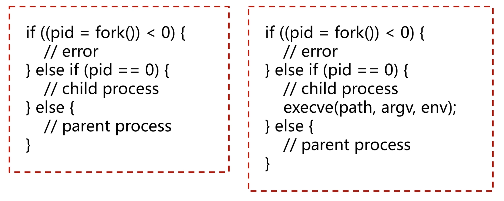
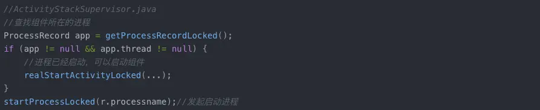

- # 一、应用进程启动
	- ## linux进程启动的方式
	  collapsed:: true
		- 启动进程有两种方式。调用fork函数启动子进程，pid为0时代表在子进程返回值，否则是父进程。左边启动方式，默认继承父进程的系统资源。右边execve方式传入启动参数，父进程资源全被清空掉。Android系统采用了Linux内核，因此，Android应用进程的创建与Linux如出一辙。
		  ps: path代表二进制程序的路径，argv代表需要设置的参数，env代表需要设置的环境变量。
		- {:height 306, :width 746}
	- ## Android应用进程启动的基本流程
		- 在这里要明白两个问题:
		- 1、什么时候才会触发进程启动？
		  2、进程是谁来启动？怎么启动？
		- Android系统里面没有接口可以调用去主动启动一个进程，全是被动的启动。启用组件的时候，发现组件发在的进程不存在，才会去启动进程。这些功能都是在Framework中去做的，AMS在此流程中扮演了很重要的的角色。
		- {:height 161, :width 746}
		- app.thread != null，这是判断IApplicationThread（AMS拿到的应用binder句柄),保证实现双向的binder调用。
	-