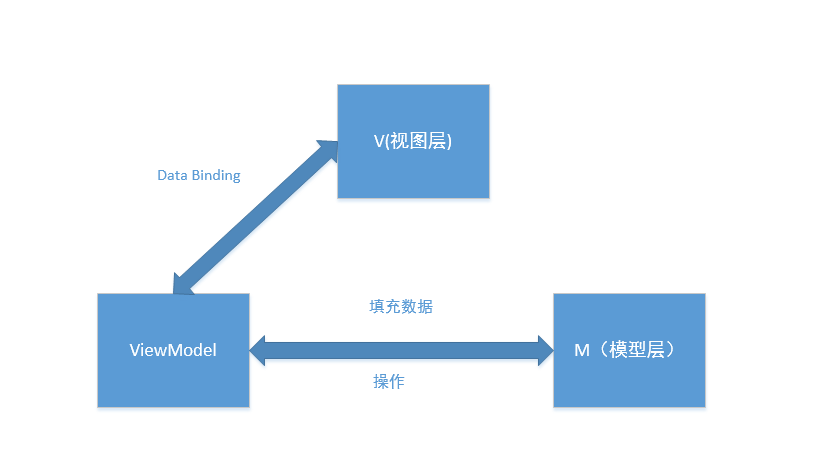

# 一、[[架构演变]]
- # 早期：一个文件打天下
- # 二、MVC
  collapsed:: true
	- 
	- ## 1、简介
		- MVC是模型(model)－视图(view)－控制器(controller)的缩写
		- 用一种业务逻辑、数据、界面显示分离的方法组织代码。
		- M层处理数据，业务逻辑等；
		- V层处理界面的显示结果；
		- C层起到桥梁的作用，来控制V层和M层通信以此来达到分离视图显示和业务逻辑层。
	- ## 2、Android中的MVC
		- 模型层（M）：[[#red]]==**各种bean,类**==
		- 视图层（V）：Android中的[[#red]]==**xml文件**==可以理解为视图层。
		- 控制层（C）：Android中的逻辑处理在[[#red]]==**Activity中体现**==。也包括网络请求等
		- ### 流程关系，单向流程关系
			- 1、View接收到用户的操作，调用Controller 处理
			- 2、Controller完成具体业务逻辑。
			- 3、得到结果封装Model，再进行View更新。
	- ## 3、MVC相比一个文件的优点：
		- 1：分工明确，各司所职。
		  2：[[#red]]==**抽离出了model 层**==，一定程度上降低了代码间的耦合性。
	- ## 4、MVC的缺点：
		- 1：随着界面及其逻辑的复杂度不断提升，[[#red]]==**Activity/Fragment的代码会变得臃肿。**==
		- 2：视图和控制器间过于紧密的联系，妨碍了各自的重用。
	- ## 5、适用场景
		- 适合功能较少，业务逻辑简单，不大修改的页面：比如[[#red]]==**设置页面**==
- # 三、MVP
  collapsed:: true
	- {:height 435, :width 746}
	- 
	- ## 1、MVP是模型(model)－视图(view)－协调者(presenter)的缩写。
		- [[模型层（M）]]：[[#red]]==**各种bean,类**==
		- 视图层（V）：负责绘制UI，与用户进行交互（在Android中体现为[[#red]]==**Activity，实现IView接口**==）
		- 协调者（P）：[[#red]]==**作为View与Model交互的中间纽带**==，处理与用户交互的[[#red]]==**负责逻辑**==校验等。
			- 持有module 和 view 层的 实例，
	- ## 2、优点
		- 1）[[#red]]==**减少了activity的臃肿**==，复杂的逻辑处理放在presenter进行处理，activity只剩下了view，presenter承担了view和model之间的交互。
		- 2）M层与V层完全分离，修改V层不会影响M层，降低了耦合性。
		- 3）可以将一个Presenter用于多个视图，而不需要改变Presenter的逻辑。
		- 4）P层与V层的交互是通过接口来进行的，[[#red]]==**便于单元测试**==。
	- ## 3、缺点
		- 引入了interface，方法增多，增加一个方法要改几个地方；
- # 四、MVVM
	- {:height 439, :width 746}
	- ## 产生背景
		- MVP中，将逻辑处理放入了P层，V层的Activity通过IView接口回调回来的数据，来setText等。所以Activity只剩下findVIewbyId 和 setText。
		- MVVM可以利用Databinding 自动绑定，将数据自动刷新到view
	- ## 必须使用的Jetpack
		- ## [[Databinding]]：实现双向绑定
	- ## 分层
		- ## view层：Activity
		- ## [[模型层（M）]]
		- ## ViewModel：
			- VM是ViewModel的缩写，VM可以理解为View的数据模型和Presenter的合体，ViewModel和View之间的交互通过data binding完成。
			- ViewModel（VM）：ViewModel就是包含View的一些数据属性和操作，关键点就是使用databinding，View的变化会直接影响ViewModel，ViewModel的变化或者内容也会直接体现在View上。
	- ## 优点：
		- Data Binding可以实现双向的交互，使得视图和控制层之间的耦合程度进一步降低，分离更为彻底，同时减轻了Activity的压力
		- 低耦合，视图(View)可以独立于Model变化和修改，一个ViewModel可以绑定到不同的”View”上，当View变化的时候Model可以不变，当Model变化的时候View也可以不变。
		- 可重用性，可以把一些视图逻辑放在一个ViewModel里面，让很多view重用这段视图逻辑。
		- 独立开发，开发人员可以专注于业务逻辑和数据的开发(ViewModel)，设计人员可以专注于页面设计，使用Expression Blend可以很容易设计界面并生成xml代码。
		- 可测试，界面向来是比较难于测试的，而现在测试可以针对ViewModel来写。
	- ## 适用场景
		- 复杂多变的页面场景
	- # [[MVVM实战]]
- # MVI
- [Android架构演进](https://handsomeliuyang.github.io/2021/04/26/%E7%BB%8F%E9%AA%8C%E6%80%BB%E7%BB%93/Android%E7%AB%AF%E7%9A%84%E6%9E%B6%E6%9E%84%E8%AE%BE%E8%AE%A1%E7%9A%84%E6%BC%94%E8%BF%9B%E5%92%8C%E6%80%9D%E8%80%83/)
- [[clean架构]]
- # [[开发架构Mvx面试题]]