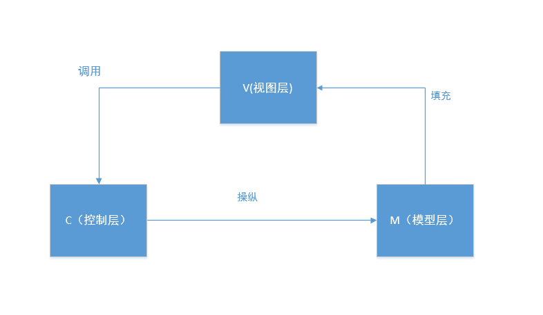
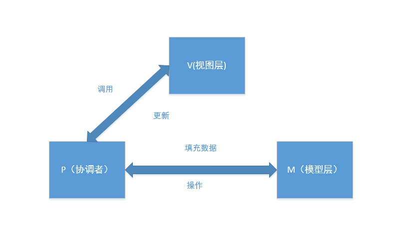

- # MVC
	- 
	- ## 1、简介
		- MVC是模型(model)－视图(view)－控制器(controller)的缩写
		- 用一种业务逻辑、数据、界面显示分离的方法组织代码。
		- M层处理数据，业务逻辑等；
		- V层处理界面的显示结果；
		- C层起到桥梁的作用，来控制V层和M层通信以此来达到分离视图显示和业务逻辑层。
	- ## 2、Android中的MVC
		- 模型层（M）：针对业务模型，建立的数据结构以及相关的类，例如对数据库的操作，对网络数据的操作以及业务中的计算等操作应该放在该层。
		  视图层（V）：Android中的xml文件可以理解为视图层。
		  控制层（C）：Android中的逻辑处理在Activity中体现。
	- ## 3、MVC的优点：
		- 1：分工明确，各司所职。
		  2：一定程度上降低了代码间的耦合性。
	- ## 4、MVC的缺点：
		- 1：随着界面及其逻辑的复杂度不断提升，Activity/Fragment的代码会变得臃肿。
		- 2：视图和控制器间过于紧密的联系，妨碍了各自的重用。
	- ## 5、适用场景
	  适合功能较少，业务逻辑简单，界面不复杂的小型项目
- # MVP
	- {:height 435, :width 746}
	- ## 1、MVP是模型(model)－视图(view)－协调者(presenter)的缩写。
		- 模型层（M）：负责存储，检索以及操纵数据。
		  视图层（V）：负责绘制UI，与用户进行交互（在Android中体现为Activity）
		  协调者（P）：作为View与Model交互的中间纽带，处理与用户交互的负责逻辑。
	- ## 2、优点
		- MVP的优点：
		  1）复杂的逻辑处理放在presenter进行处理，减少了activity的臃肿。
		  2）M层与V层完全分离，修改V层不会影响M层，降低了耦合性。
		  3）可以将一个Presenter用于多个视图，而不需要改变Presenter的逻辑。
		  3）P层与V层的交互是通过接口来进行的，便于单元测试。
	- ## 3、缺点
		- 由于对视图的渲染放在了Presenter中，所以视图和Presenter的交互会过于频繁，视图需要改变，一般presenter也需要跟着改变。
- # MVVM
	- {:height 439, :width 746}
	- ## 1、简介
		- MVP的升级版本，VM是ViewModel的缩写，VM可以理解为View的数据模型和Presenter的合体，ViewModel和View之间的交互通过data binding完成。
		- ViewModel（VM）：ViewModel就是包含View的一些数据属性和操作，关键点就是使用databinding，View的变化会直接影响ViewModel，ViewModel的变化或者内容也会直接体现在View上。
	- ## 2、优点：
		- Data Binding可以实现双向的交互，使得视图和控制层之间的耦合程度进一步降低，分离更为彻底，同时减轻了Activity的压力
		- 低耦合，视图(View)可以独立于Model变化和修改，一个ViewModel可以绑定到不同的”View”上，当View变化的时候Model可以不变，当Model变化的时候View也可以不变。
		- 可重用性，可以把一些视图逻辑放在一个ViewModel里面，让很多view重用这段视图逻辑。
		- 独立开发，开发人员可以专注于业务逻辑和数据的开发(ViewModel)，设计人员可以专注于页面设计，使用Expression Blend可以很容易设计界面并生成xml代码。
		- 可测试，界面向来是比较难于测试的，而现在测试可以针对ViewModel来写。
- # MVI
-