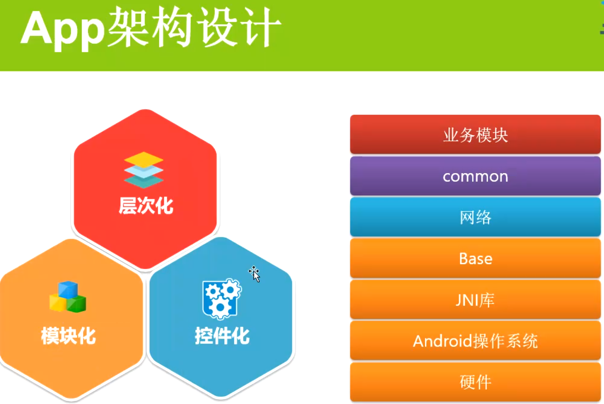
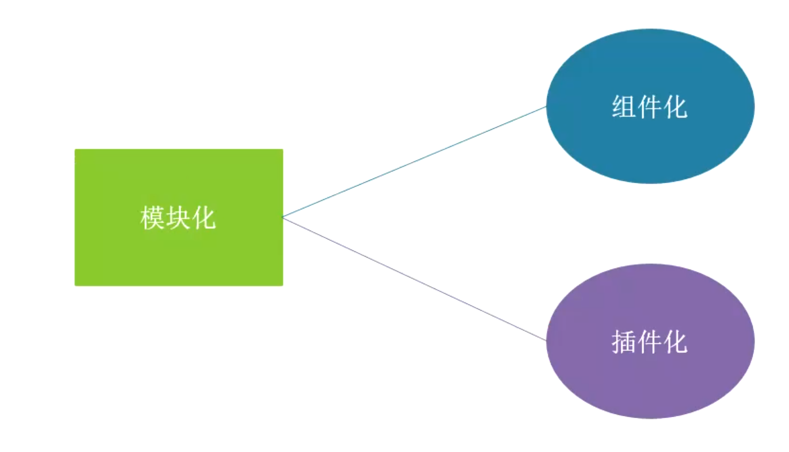
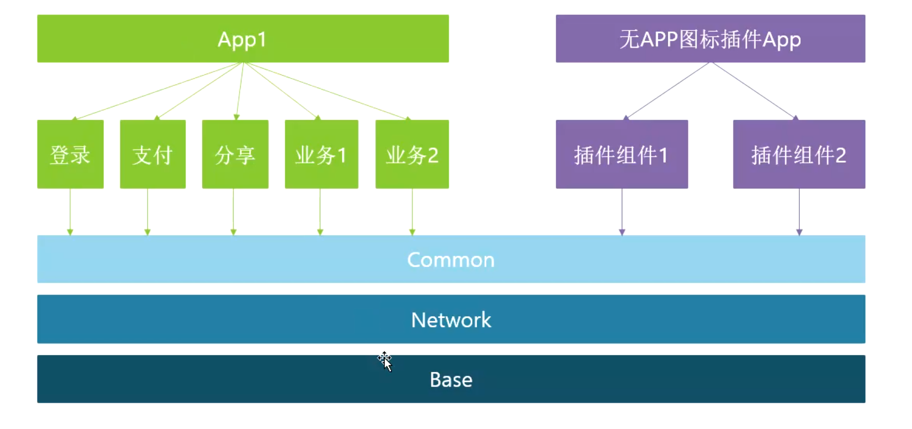

# 一、三者关系
collapsed:: true
	- ## App架构设计
	  collapsed:: true
		- 
	- 
- # 二、模块化-组件化-插件化区别
	- 
	- ## [[ 模块化]]
		- 按照业务逻辑，将功能属于同一业务的代码整合到一起，划分成一个一个模块，[[#red]]==**网络模板，base模块，Common模块**==
		- 架构定位横向分层，根据业务逻辑进行划分
	- ## [[组件化]]原包
		- 有些组件或基础库在多个模块中都有调用，把这些耦合度高的提炼出来，造成可复用组件，
		- 组件间互相不依赖，抽离接口下沉到Common层
		-
		- 组件化除了具备复用性的特点，还可以独立开发、调试、测试
	- ## [[插件化]]以一个app模式存在
		- **==将应用程序的功能模块或插件从主应用程序中解耦==**，[[#red]]==**打成一个无图标的插件APP，可以安装但是桌面看不到，需要哪个功能下载哪个插件**==
		-
		- [[#red]]==**使得这些功能模块可以独立开发、发布和更新，而不需要修改主应用程序的代码**==。
		- 这样的设计允许应用程序在[[#red]]==**运行时动态加载和卸载插件**==，从而实现动态扩展和灵活性。
- # [[APP架构设计-模块化-组件化-插件化-面试]]
-