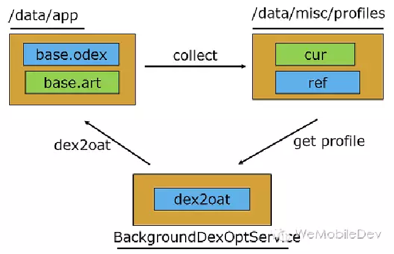

# 前言
	- [[#red]]==**Android应用程序**==运行在[[#red]]==**Dalvik/ART虚拟机**==，并且每一个应用程序对应有一个单独的Dalvik虚拟机实例。Dalvik虚拟机实则也算是一个Java虚拟机，只不过它执行的不是class文件，而是[[#red]]==**dex文件**==。
	- Dalvik虚拟机与Java虚拟机共享有差不多的特性，差别在于两者执行的指令集是不一样的，前者的指令集是基本寄存器的，而后者的指令集是基于堆栈的。
- # 一、[[Dalvik虚拟机和JVM虚拟机区别]]
- # 二、[[那什么是基于栈的虚拟机，什么又是基于寄存器的虚拟机？]]
- # 三、Android虚拟机
	- ## [[Dalvik]]
	- ## [[ART-Android Runtime]]
- # 四、[[ART和Dalvik区别]]
- # 五、Android N (7.0)ART的运行方式
  collapsed:: true
	- ART 使用预先 (AOT) 编译，并且从Android N混合使用AOT编译，解释和JIT。
	- 1、[[#red]]==**最初安装应用时不进行任何 AOT 编译**==（安装又快了），[[#red]]==**运行过程中解释执行**==，对[[#red]]==**经常执行的方法进行JIT**==，经过 JIT 编译的方法将会记录到Profile配置文件中。
	- 2、当设备闲置和充电时，编译守护进程会运行，根据Profile文件[[#red]]==**对常用代码进行 AOT 编译。待下次运行时直接使用。**==
	- 
- # 六、[[ClassLoader类加载机制]]
- # 七、[[热修复]]
- # 面试题
	- # [[Android虚拟机和ClassLoad面试题]]
-