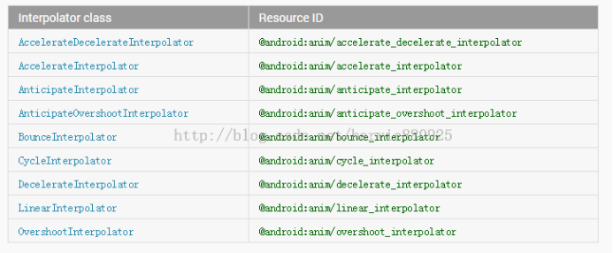

- # 一、属性动画对应animator的三个标签
	- <animator />:对应ValueAnimator
	- <objectAnimator />:对应ObjectAnimator
	- <set />:对应AnimatorSet
- # 二、<animator />:对应ValueAnimator每个方法详解
  collapsed:: true
	- ```xml
	  <animator
	      android:duration="int"
	      android:valueFrom="float | int | color"
	      android:valueTo="float | int | color"
	      android:startOffset="int"
	      android:repeatCount="int"
	      android:repeatMode=["repeat" | "reverse"]
	      android:valueType=["intType" | "floatType"]
	      android:interpolator=["@android:interpolator/XXX"]/>
	  ```
	- **字段详解：**
	  collapsed:: true
		- android:duration:每次动画播放的时长
		- android:valueFrom:初始动化值；取值范围为float,int和color，如果取值为float对应的值样式应该为89.0，取值为Int时，对应的值样式为：89;当取值为clolor时，对应的值样式为 #333333;
		- android:valueTo：动画结束值；取值范围同样是float,int和color这三种类型的值；
		- android:startOffset：动画激活延时；对应代码中的startDelay(long delay)函数；
		- android:repeatCount：动画重复次数
		- android:repeatMode：动画重复模式，取值为repeat和reverse；repeat表示正序重播，reverse表示倒序重播
		- android:valueType：表示参数值类型，取值为intType和floatType；与android:valueFrom、android:valueTo相对应。如果这里的取值为intType，那么android:valueFrom、android:valueTo的值也就要对应的是int类型的数值。如果这里的数值是floatType，那么android:valueFrom、android:valueTo的值也要对应的设置为float类型的值。非常注意的是，如果android:valueFrom、android:valueTo的值设置为color类型的值，那么不需要设置这个参数；
		- android:interpolator:设置加速器；有关系统加速器所对应的xml值对照表如下：
	- 
	- **使用详解**
		- ```java
		  ValueAnimator valueAnimator = (ValueAnimator) AnimatorInflater.loadAnimator(MyActivity.this,R.animator.animator);
		  valueAnimator.start();
		  得到ValueAnimator对象后可以对其添加监听动画过程addUpdateListener
		  ```
- # 三、objectAnimator对应的是ObjectAnimator
	- ```xml
	  <objectAnimator
	      android:propertyName="string"
	      android:duration="int"
	      android:valueFrom="float | int | color"
	      android:valueTo="float | int | color"
	      android:startOffset="int"
	      android:repeatCount="int"
	      android:repeatMode=["repeat" | "reverse"]
	      android:valueType=["intType" | "floatType"]
	  android:interpolator=["@android:interpolator/XXX"]/>
	  ```
	- 字段解析：
	  collapsed:: true
		- android:propertyName：对应属性名，即ObjectAnimator所需要操作的属性名。
		  其它字段的意义与animator的意义与取值是一样的，下面再重新列举一下。
		- android:duration:每次动画播放的时长
		- android:valueFrom:初始动化值；取值范围为float,int和color；
		- android:valueTo：动画结束值；取值范围同样是float,int和color这三种类型的值；
		- android:startOffset：动画激活延时；对应代码中的startDelay(long delay)函数；
		- android:repeatCount：动画重复次数
		- android:repeatMode：动画重复模式，取值为repeat和reverse；repeat表示正序重播，reverse表示倒序重播
		- android:valueType：表示参数值类型，取值为intType和floatType；与android:valueFrom、android:valueTo相对应。如果这里的取值为intType，那么android:valueFrom、android:valueTo的值也就要对应的是int类型的数值。如果这里的数值是floatType，那么android:valueFrom、android:valueTo的值也要对应的设置为float类型的值。非常注意的是，如果android:valueFrom、android:valueTo的值设置为color类型的值，那么不需要设置这个参数；
		- android:interpolator:设置加速器；
	- 使用方法：
		- ```java
		  ObjectAnimator animator = (ObjectAnimator) AnimatorInflater.loadAnimator(MyActivity.this,
		          R.animator.object_animator);
		  animator.setTarget(mTv1);
		  animator.start();
		  ```
- # 四、set标签的对应的是AnimatorSet类
	- ```xml
	  <set
	    android:ordering=["together" | "sequentially"]>
	  ```
	- 只有一个属性android:ordering：表示动画开始顺序。together表示同时开始动画，sequentially表示逐个开始动画；
	- 加载方式为：
		- ```java
		  AnimatorSet set = (AnimatorSet) AnimatorInflater.loadAnimator(MyActivity.this,
		          R.animator.set_animator);
		  set.setTarget(mTv1);
		  set.start();
		  ```
	- 使用示例：
		- xml
		  collapsed:: true
			- ```xml
			  <set xmlns:android="http://schemas.android.com/apk/res/android"
			       android:ordering="together">
			      <objectAnimator
			              android:propertyName="x"
			              android:duration="500"
			              android:valueFrom="0"
			              android:valueTo="400"
			              android:valueType="floatType"/>
			      <objectAnimator
			              android:propertyName="y"
			              android:duration="500"
			              android:valueFrom="0"
			              android:valueTo="300"
			              android:valueType="floatType"/>
			  </set>
			  ```
		- java
			- ```java
			  AnimatorSet set = (AnimatorSet) AnimatorInflater.loadAnimator(MyActivity.this,
			          R.animator.set_animator);
			  set.setTarget(mTv1);
			  set.start();
			  ```