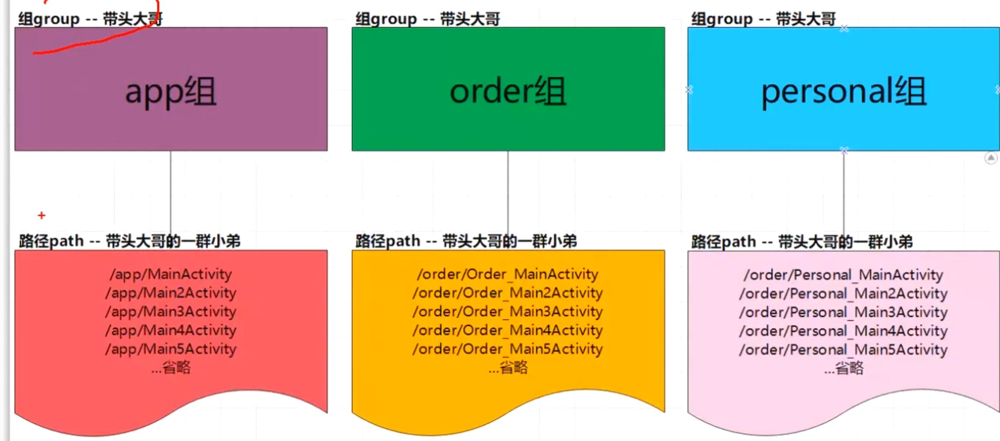
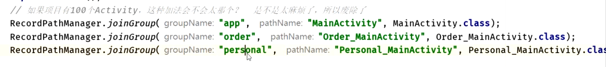

# 1、分组与映射
collapsed:: true
	- 一个模块moduleName，多个分组groupName
	- 每个分组，多个映射关系
	- 每个映射，对应一个注入关系
	- ## 分组关系
	  collapsed:: true
		- 
		-
- # 1、分组group目的：
  collapsed:: true
	- [[#red]]==**避免重复**==：因为一个模块一个组，每个模块都有可能叫mainActivity的，
	- [[#red]]==**查找快捷**==，分层更加清晰,按组加载
	- 添加注解path:groupName/pathName
		- ```java
		  /order/MainActivity
		  ```
	- [[#red]]==**延时加载，分摊首次加载时间**==
		- 启动应用，然后立马遍历所有com.alibaba.android.arouter.routes开头的文件，分析出是Root的文件，反射实例化，调用loadInto方法，将IRouteGroup.class载入。这几步里好多是耗时的方法，如果工程很庞大，像淘宝这样，如果一上来直接加载所有的IRouteGroup中的内容，恐怕要非常长的时间，会导致启动慢，或者ANR。
		- 这也是为什么ARouter需要IRouteRoot存在的原因，他可以延时加载所需要的分组，第一次使用的时候加载可以分摊加载时间。
- # 2、生成Root类名包含moduleName作用
  collapsed:: true
	- [[#red]]==**IRouteRoot**==生成的过程中和IRouteGroup类不同的地方是文件名最后用的是moduleName，[[#red]]==**用module名字的原因是能够避免工程庞大后命名冲突的可能。**==
	- ARouter$Root$$xxx(modulename) 把所有的组(ARouter$Group$xxx) put到Map集合里（routers）
	- 不加modulename拼接的话。每个模块生成一个ARouter$Root，类冲突
- # 3、ARouter`$`Root`$$`xxx和ARouter`$`Group`$$`xxx 注册时机
	- # [[寻址初始化时机]]
- # 4、不使用Arouter这种路由框架，使用全局Map注册可以不
  collapsed:: true
	- 可以实现，但是用户太繁琐，每个类都要手动注册到map
	- 
- # 5、不同模块怎么查找的Group表的？
	- APT生成的路由表都放入同一包名下  com.alibaba.android.arouter.routes，同时都实现了同一个接口
- # 5、[[Arouter简单使用流程]]
- # 6、[[Arouter的依赖注入]]
- # 7、[[Arouter工作流程]]
- # 8、[[分组与寻址原理]]
- # 9、[[自动注册Group表原理]]