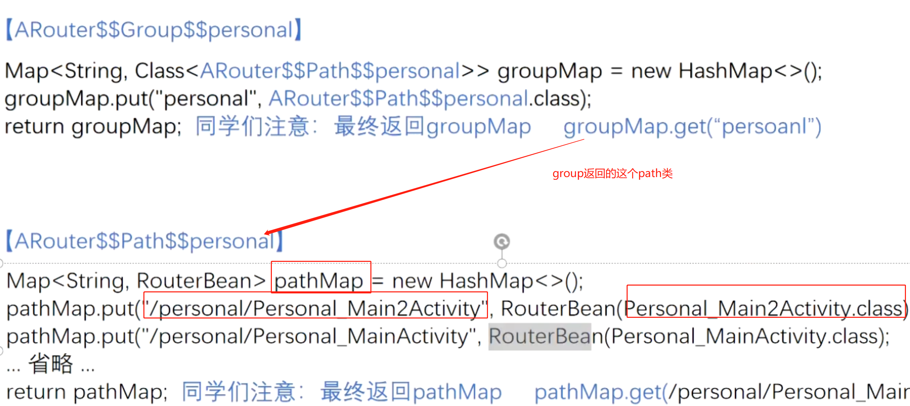
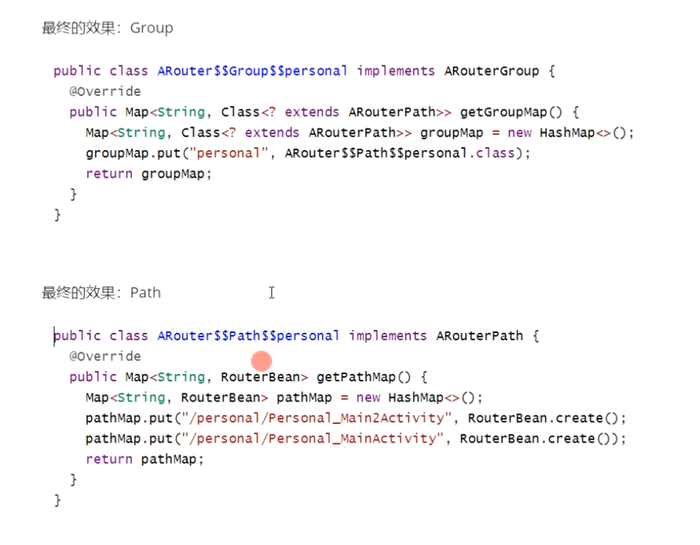
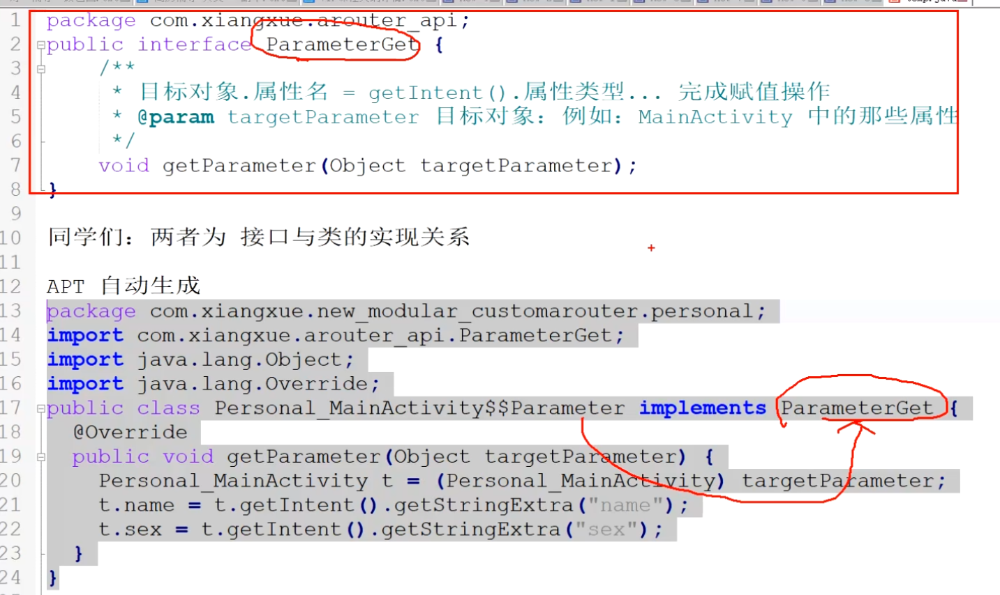

# 一、[[Arouter简单使用流程]]
- # 二、path与Group的映射关系
  collapsed:: true
	- group类的groupMap存的是
		- key 组名  value  path类
	- path类的pathMap 存的
		- key path路由  value 存的对应类
	- ## 图
	  collapsed:: true
		- 
		- 
	- ## 定义路由
	  collapsed:: true
		- ```java
		  @Route(path = "/test/activity")
		  public class YourActivity extend Activity {
		      ...
		  }
		  ```
	- ## APT生成的该模块下的路由表
		- root
		  collapsed:: true
			- {:height 232, :width 688}
		- group
		  collapsed:: true
			- 
- # 三、自动解析intent传过来值
  collapsed:: true
	- 
- # 五、[[Arouter的依赖注入]]
- # 六、[[分组与寻址原理]]
- # 七、[[自动注册Group表原理]]
- # 八、[[Arouter工作流程]]
- # 参考
	- ## [[arouter分组 寻址]]
	- ## [[Arouter自动注册解析]]
- # 面试
	- ## [[Arouter-面试]]