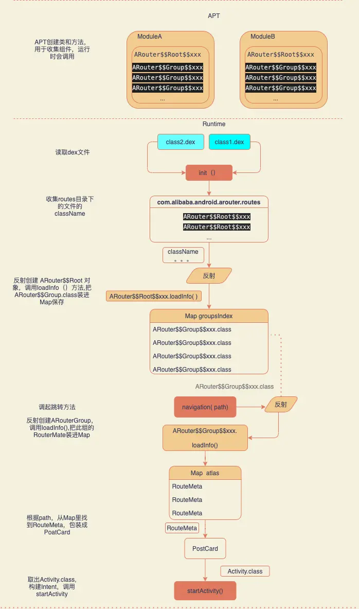

## 流程图
collapsed:: true
	- {:height 1174, :width 688}
- ## 代码阶段-**==使用注解==**
- 1、使用@Arouter标记待使用的Activity，或者依赖注入类
- ## 编译期-==**生成路由表 root 和 group**==
- 2、APT 编译期解析注解  在 com.alibaba.android.arouter.routes 目录下生成路由表
- ## 运行时-注册表和寻址
- 3、==**注册路由表**==
	- 3-1、使用自动注册gradle插件：编译器通过transform 找到所有ROOT类，通过ASM字节码插桩，在loadRouterMap方法中生成 注册Root类的代码
	- 3-2、不使用插件的话：运行时遍历所有Dex文件找到routes 目录下的Root类
	- 无论是编译器扫描class，还是运行时遍历Dex。找到root类后反射创建实例。调用LoadInto方法加载Group到全局map缓存中
- 4、当第一次调用Navigation时，会去==**路由表寻址**==。如果该分组没有被加载过。反射创建ArouterGroup类实例 调用LoadInto方法加载 RouteMeta方法 加载路由表到map中
- 5、根据路由path寻找对应的routeMeta。按类型 解析Activity等 执行startActivity[[#red]]==**跳转**==