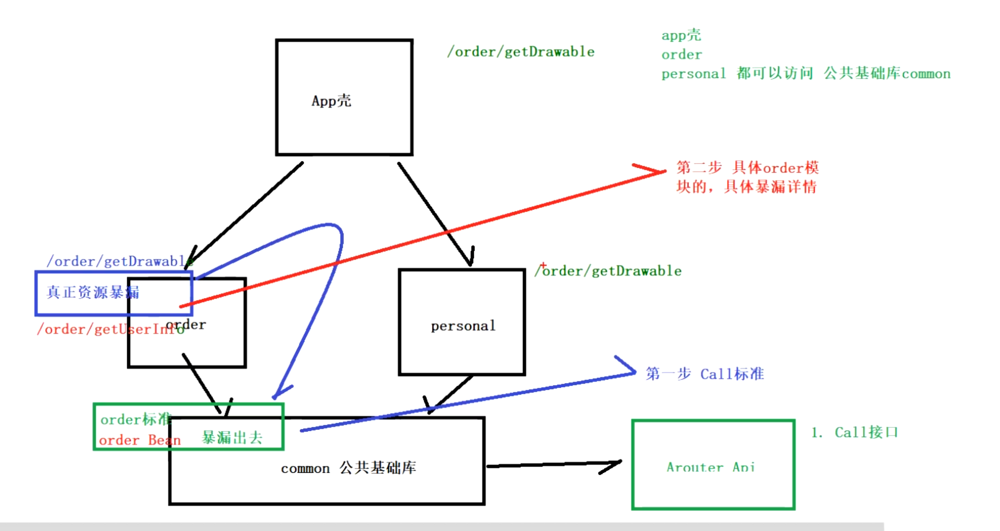
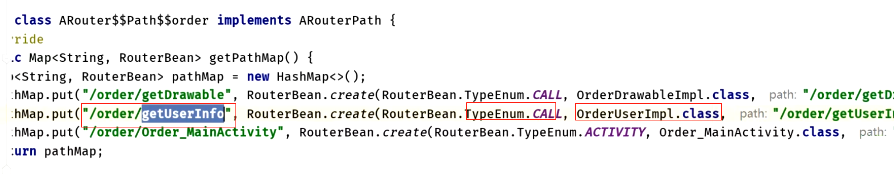
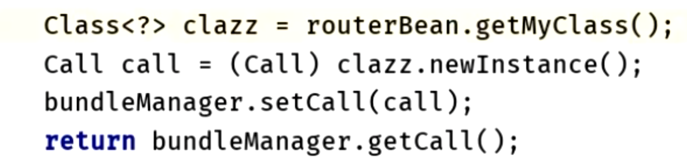

# 一、通过依赖注入解耦: 暴露服务
collapsed:: true
	- ## 1、定义暴露服务的接口[[#red]]==**（公共模块）**==
		- ```java
		  // 声明接口,其他组件通过接口来调用服务
		  public interface HelloService extends IProvider {
		      String sayHello(String name);
		  }
		  ```
	- ## 2、路由标记接口实现类[[#red]]==**（具体组件）**==
		- ```java
		  // 实现接口
		  @Route(path = "/yourservicegroupname/hello", name = "测试服务")
		  public class HelloServiceImpl implements HelloService {
		  
		      @Override
		      public String sayHello(String name) {
		      return "hello, " + name;
		      }
		  
		      @Override
		      public void init(Context context) {
		  
		      }
		  }
		  ```
- # 二、根据路由发现服务
	- 还是[[#green]]==**路由表映射，找到对应的类去反射实例化对象**==
	- ```JAVA
	    // 2. 使用依赖查找的方式发现服务，主动去发现服务并使用，下面两种方式分别是byName和byType
	      helloService3 = ARouter.getInstance().navigation(HelloService.class);
	      helloService4 = (HelloService) ARouter.getInstance().build("/yourservicegroupname/hello").navigation();
	      helloService3.sayHello("Vergil");
	      helloService4.sayHello("Vergil");
	  ```
- # 大致图
  collapsed:: true
	- 
- # 原理
	- 路由表
		- 
	- 通过路由表找到实现类class，去实例化，大致代码，
		- 
-