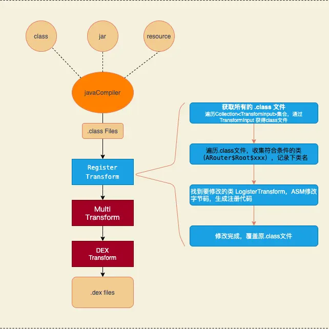

- # 一、 Arouter的组件注册
  collapsed:: true
	- ## 1. 自动注册插件
	  collapsed:: true
		- 在看ARouter源码的过程中看到，在初始化方法 init（），有个 boolean 变量 registerByPlugin, 表示是否用了插件注册组件。那么这个插件干了什么，为什么要用插件或者不用插件有啥问题吗？
		- LogisticsCenter
		  collapsed:: true
			- ```
			  init（）{
			           ...
			         //load by plugin first
			          loadRouterMap();
			          if (registerByPlugin) {
			              logger.info(TAG, "Load router map by arouter-auto-register plugin.");
			          } else {
			              ...
			              // These class was generated by arouter-compiler.
			              routerMap = ClassUtils.getFileNameByPackageName(mContext, 
			              ...
			          }
			      }
			  ```
		- build.gradle
			- ```
			  apply plugin: 'com.alibaba.arouter'
			  
			  buildscript {
			     ...
			      dependencies {
			          classpath "com.alibaba:arouter-register:1.0.2"
			      }
			  }
			  ```
	- ## 2. arouter的工作流程：
	  collapsed:: true
		- 流程
		  collapsed:: true
			- 
		- 回顾ARouter的流程，分三个步骤
		- （1）利用APT 编译期生成构建映射表的类和方法
		  collapsed:: true
			- ```
			  public class ARouter$$Root$$MainBusiness implements IRouteRoot {
			      @Override
			      public void loadInto(Map<String, Class<? extends IRouteGroup>> routes) {
			          routes.put("detail", ARouter$$Group$$detail.class);
			          routes.put("home", ARouter$$Group$$home.class);
			      }
			  } 
			  
			  public class ARouter$$Group$$detail implements IRouteGroup {
			      @Override
			      public void loadInto(Map<String, RouteMeta> atlas) {
			          atlas.put("/detail/first", RouteMeta.build(RouteType.ACTIVITY, DetailActivity.class, "/detail/first", "detail", null, -1, -2147483648));
			          ...
			      }
			  }
			  ```
			- ARouter$Root$xxx ： 收集当前模块所有的Group信息，loadInto（）方法 参数传入一个map，把所有ARouter$Group$xxx 放进这个map；
			- ARouter$Group$xxx：用于收集相同group的所有组件，loadInto（）方法参数传入一个map，把所有RouteMeta（保存注解的信息，class、group、path、参数等） 放进这个map；
		- (2)加载ARouter$Root$xxx类，收集一个module的所有的group映射表
		  collapsed:: true
			- 初始化ARout时读取每个dex文件，遍历com.alibaba.android.arouter.routes目录下的文件，收集所有的 ARouter$Root$xxx 类名
			- 反射创建 ARouter$Root$xxx 对象，调用loadInfo()，把 ARouter$Group&xxx.class 装进 Map groupsIndex 保存到内存里
			-
		- (3)跳转时，根据path加载对应的ARouter$Group$xxx.class类，构建一个group的映射表，然后根据path从映射表里找到目标组件，执行跳转
			- 调用 navigation( path)，根据 groupName 从 groupsIndex 里取出 ARouter$Group$xxx.class，反射创建对象 ，调用loadInfo() , 把这个组的 RouteMate 装进 Map routes，完成group的映射表的构建加载。
			- 根据path 从 routers 取出 RouteMate(保存注解的信息class、group、path、参数等) ，获取 Activity.class 构建 Intent ，startActivity() 跳转
	- ## 3、早期版本或者不使用插件存在效率问题
		- 会在一定程度上拖慢启动速度
		- 为了构建组件映射表，APT生成ARouter$Root$xxx类用来构建group映射关系。构建组件映射表之前，要先调用所有ARouter$Root$xxx类的loadInfo()方法，完成group表的构建。也就是上面第二步，通过读取所有dex文件遍历每个entry收集指定包内的所有class类名，找到ARouter$Root$xxx类通过反射创建实例。这个过程效率显然是不高的，如果在Application.onCreate()方法里初始化，会在一定程度上拖慢启动速度。
		- 插件的作用
		- 在编译期扫描即将打包到apk中的所有类，将符合条件的类收集起来，并通过修改字节码生成注册代码到指定的方法中
- # 二、 插件Auto-Register原理
  collapsed:: true
	- 前面说过，影响效率的是扫码dex的过程，扫描dex的目的是为了收集项目中所有的ARouter$Root$xxx类。这个过程发生在运行时，所以插件就是把收集的过程提前到编译期。
	- 下面看看是怎么做的
	- ## 1. 自定义插件，注册Transform
	  collapsed:: true
		- Transform 是 Android 官方提供的在构建（.class -> .dex转换期间）阶段用来修改 .class 文件的一套标准 API。每个 Transform 都是一个 gradle task, 将 class 文件、本地依赖的 jar, aar 和 resource 资源统一处理。每个 Transform 在处理完之后交给下一个 Transform，用户自定义的 Transform 会插在队列的最前面。
		- 图
		  collapsed:: true
			- 
		- PluginLaunch
		  collapsed:: true
			- ```
			   @Override
			      public void apply(Project project) {
			              。。。
			              def transformImpl = new RegisterTransform(project)
			  
			              //init arouter-auto-register settings
			              ArrayList<ScanSetting> list = new ArrayList<>(3)
			              list.add(new ScanSetting('IRouteRoot'))
			              list.add(new ScanSetting('IInterceptorGroup'))
			              list.add(new ScanSetting('IProviderGroup'))
			              RegisterTransform.registerList = list
			  
			              //注册 RegisterTransform
			              android.registerTransform(transformImpl)
			              。。。
			      }
			  ```
		- PluginLaunch 是自定义的gradle Plugin，RegisterTransform是自定义的Transform。apply(）方法先给 registerList 初始化了数据，这里只看IRouteRoot这个接口是怎么处理的，其他俩个流程也是一样的。IRouteRoot的实现类就是一个个的ARouter$Root$xxx
	- ## 2. 扫描Jar文件 和 源码的class 文件
	  collapsed:: true
		- 遍历TransformInput集合，扫描所有的jar文件和.class 文件
		  collapsed:: true
			- ```
			   void transform(Context context, Collection<TransformInput> inputs
			               , Collection<TransformInput> referencedInputs
			               , TransformOutputProvider outputProvider
			               , boolean isIncremental) throws IOException, TransformException, InterruptedException {
			  
			       。。。
			       inputs.each { TransformInput input ->
			  
			           // 遍历 jar文件
			           input.jarInputs.each { JarInput jarInput ->
			                ...
			               //scan jar file to find classes
			               if (ScanUtil.shouldProcessPreDexJar(src.absolutePath)) {
			                   ScanUtil.scanJar(src, dest)
			               }
			               FileUtils.copyFile(src, dest)
			           }
			  
			           // 扫描源码编译的class文件 
			           input.directoryInputs.each { DirectoryInput directoryInput ->
			               。。。
			               directoryInput.file.eachFileRecurse { File file ->
			                  ...
			                   if(file.isFile() && ScanUtil.shouldProcessClass(path)){
			                       ScanUtil.scanClass(file)
			                   }
			               }
			  
			               // copy to dest
			               FileUtils.copyDirectory(directoryInput.file, dest)
			           }
			       }
			  
			   //过滤掉"com.android.support"和"/android/m2repository"
			  
			   static boolean shouldProcessPreDexJar(String path) {
			       return !path.contains("com.android.support") && !path.contains("/android/m2repository")
			   }         
			  ```
		- 代码里看到有两种input类型，一种是jarInput，包含jar、aar包的文件；另一种是directoryInputs，包含源码编译的.class文件。扫描所有的jar文件和源码class文件，并且过滤掉android/support包。
		  然后outputProvider 获取到输出路径dest，所有的jar和class文件都copy一份到dest，交给下个Transform。
		- ScanUtil 是一个工具类， scanJar(src, dest) 和 scanClass(file) 分别是用来扫描jar文件和源码class文件的。扫描的原理是利用 ASM 的 ClassVisitor 来查看每个类的父类类名及所实现的接口名称，与指定的类名进行比较，如果符合我们的过滤条件，则记录下来。也就是 IRouteRoot 接口的实现类：ARouter$Root$xxx。
		- 扫描 jar文件
		  collapsed:: true
			- ```
			  static void scanJar(File jarFile, File destFile) {
			          if (jarFile) {
			              def file = new JarFile(jarFile)
			              Enumeration enumeration = file.entries()
			              while (enumeration.hasMoreElements()) {
			                  JarEntry jarEntry = (JarEntry) enumeration.nextElement()
			                  String entryName = jarEntry.getName()
			  
			                  if (entryName.startsWith(ScanSetting.ROUTER_CLASS_PACKAGE_NAME)) {
			                      //ScanSetting.ROUTER_CLASS_PACKAGE_NAME = “com/alibaba/android/arouter/routes/”
			  
			                      InputStream inputStream = file.getInputStream(jarEntry)
			                      scanClass(inputStream)
			                      inputStream.close()
			                  } else if (ScanSetting.GENERATE_TO_CLASS_FILE_NAME == entryName) {
			                      //ScanSetting.GENERATE_TO_CLASS_FILE_NAME = “com/alibaba/android/arouter/core/LogisticsCenter.class”
			  
			                      RegisterTransform.fileContainsInitClass = destFile
			                  }
			              }
			              file.close()
			          }
			  }
			  ```
			- 遍历每个jar 文件包下的.class文件，如果包名是“com.alibaba.android.arouter.routes”则调用 scanClass（）方法
			- 如果遍历到com.alibaba.android.arouter.core.LogisticsCenter.class ，把这个jar路径记录下来。
		- 扫描.class文件
			- ```
			  static void scanClass(InputStream inputStream) {
			            ClassReader cr = new ClassReader(inputStream)
			            ClassWriter cw = new ClassWriter(cr, 0)
			            ScanClassVisitor cv = new ScanClassVisitor(Opcodes.ASM5, cw)
			            cr.accept(cv, ClassReader.EXPAND_FRAMES)
			            inputStream.close()
			        }
			  
			    static class ScanClassVisitor extends ClassVisitor {
			  
			            ScanClassVisitor(int api, ClassVisitor cv) {
			                super(api, cv)
			            }
			  
			            void visit(int version, int access, String name, String signature,
			                    String superName, String[] interfaces) {
			                super.visit(version, access, name, signature, superName, interfaces)
			                RegisterTransform.registerList.each { ext ->
			                    if (ext.interfaceName && interfaces != null) {
			                        interfaces.each { itName ->
			                            if (itName == ext.interfaceName) {
			                                //fix repeated inject init code when Multi-channel packaging
			                                if (!ext.classList.contains(name)) {
			                                    ext.classList.add(name)
			                                }
			                            }
			                        }
			                    }
			                }
			            }
			    }
			  ```
			- 通过ASM框架的 ClassVisitor 获取类的父类类名及所实现的接口名称，如果是IRouteRoot 的实现类即ARouter$Root$xxx，就把类名存入列表
	- ## 3. 插入字节码
	  collapsed:: true
		- 代码：
		  collapsed:: true
			- ```
			  private File insertInitCodeIntoJarFile(File jarFile) {
			          if (jarFile) {
			           。。。
			              def file = new JarFile(jarFile)
			              Enumeration enumeration = file.entries()
			              JarOutputStream jarOutputStream = new JarOutputStream(new FileOutputStream(optJar))
			  
			              while (enumeration.hasMoreElements()) {
			                  JarEntry jarEntry = (JarEntry) enumeration.nextElement()
			                  String entryName = jarEntry.getName()
			                  ZipEntry zipEntry = new ZipEntry(entryName)
			                  InputStream inputStream = file.getInputStream(jarEntry)
			                  jarOutputStream.putNextEntry(zipEntry)
			  
			                 // GENERATE_TO_CLASS_FILE_NAME = com/alibaba/android/arouter/core/LogisticsCenter.class
			  
			                  遍历到 LogisticsCenter 类
			                  if (ScanSetting.GENERATE_TO_CLASS_FILE_NAME == entryName) {
			                       插入字节码，并转化成bytes数组
			                      def bytes = referHackWhenInit(inputStream)
			                      jarOutputStream.write(bytes)
			                  } else {
			                      jarOutputStream.write(IOUtils.toByteArray(inputStream))
			                  }
			                  。。。
			              }
			             。。。
			          }
			          return jarFile
			      }
			  ```
		- 前面提到，扫码到 LogisticsCenter 记录下了jar路径。上面这个方法，就是遍历这个jar包里的所有文件找到 LogisticsCenter 。
		- 下面开始动LogisticsCenter 的字节码了
		  collapsed:: true
			- ```
			  private byte[] referHackWhenInit(InputStream inputStream) {
			          ClassReader cr = new ClassReader(inputStream)
			          ClassWriter cw = new ClassWriter(cr, 0)
			          ClassVisitor cv = new MyClassVisitor(Opcodes.ASM5, cw)
			          cr.accept(cv, ClassReader.EXPAND_FRAMES)
			          return cw.toByteArray()
			      }
			  
			  class MyClassVisitor extends ClassVisitor {
			  
			         ...
			         
			          @Override
			          MethodVisitor visitMethod(int access, String name, String desc,
			                                  String signature, String[] exceptions) {
			              MethodVisitor mv = super.visitMethod(access, name, desc, signature, exceptions)
			              //generate code into this method
			              //                      GENERATE_TO_METHOD_NAME = 'loadRouterMap'
			  
			         // 找到目标方法 LogisticsCenter.loadRouterMap()，转化成 MethodVisitor
			  
			              if (name == ScanSetting.GENERATE_TO_METHOD_NAME) {
			                  mv = new RouteMethodVisitor(Opcodes.ASM5, mv)
			              }
			              return mv
			          }
			  }
			  
			  class RouteMethodVisitor extends MethodVisitor {
			  
			         ...
			  
			          @Override
			          void visitInsn(int opcode) {
			              //generate code before return
			              if ((opcode >= Opcodes.IRETURN && opcode <= Opcodes.RETURN)) {
			                  extension.classList.each { name ->
			  
			                 // name 就是我们前面扫码收集的 ARouter$Root$xxx 的类名
			  
			                      name = name.replaceAll("/", ".")
			                      mv.visitLdcInsn(name)  // 方法参数
			  
			                    // 生成要插入的代码
			                    // ```register（name）```
			  
			                      mv.visitMethodInsn(Opcodes.INVOKESTATIC //方法类型 statc
			                              , ScanSetting.GENERATE_TO_CLASS_NAME  //类名com/alibaba/android/arouter/core/LogisticsCenter
			                              , ScanSetting.REGISTER_METHOD_NAME //方法名 register
			                              , "(Ljava/lang/String;)V" //参数类型 String
			                              , false //是否是接口
			                              )
			                  }
			              }
			              super.visitInsn(opcode)
			          }
			         ...
			  }
			  ```
		- 借助ClassVisitor，遍历所有方法，找到 loadRouterMap()方法。ClassWriter 生成一个 MethodVisitor 对象用来向方法里插入代码：‘ register（”name“）’，name 是 ARouter$Root$xxx的类名。修改完通过 visitMethod（）方法覆盖原loadRouterMap()方法。
		- 修改完后反编译过来就像这样：
		  collapsed:: true
			- ```
			  private static void loadRouterMap() {
			      register("...ARouter$Root$xxx");
			      register("...ARouter$Root$xxx");
			      register("...ARouter$Root$xxx");
			      ...
			  }
			  ```
		- 最后再看看 LogisticsCenter 这个类
		  collapsed:: true
			- ```
			  private static void init(){
			  
			          loadRouterMap();
			  
			          if (registerByPlugin) {
			              logger.info(TAG, "Load router map by arouter-auto-register plugin.");
			          } else {
			  
			              扫码dex
			              ...
			          }
			  }
			          
			  private static void loadRouterMap() {
			          registerByPlugin = false;
			          
			          //下面是插件生成的代码
			          //register("...ARouter$Root$xxx");
			          //register("...ARouter$Root$xxx");
			          //register("...ARouter$Root$xxx");
			            ...
			  }
			  
			  private static void register(String className) {
			          if (!TextUtils.isEmpty(className)) {
			              try {
			                  Class<?> clazz = Class.forName(className);
			                  Object obj = clazz.getConstructor().newInstance();
			                  if (obj instanceof IRouteRoot) {
			                      registerRouteRoot((IRouteRoot) obj);
			                  } else if (obj instanceof IProviderGroup) {
			                      registerProvider((IProviderGroup) obj);
			                  } else if (obj instanceof IInterceptorGroup) {
			                      registerInterceptor((IInterceptorGroup) obj);
			                  } else {
			                  。。。
			                  }
			              } catch (Exception e) {
			              。。。
			              }
			          }
			      }
			      
			  private static void markRegisteredByPlugin() {
			      if (!registerByPlugin) {
			          registerByPlugin = true;
			      }
			  }
			  
			  private static void registerRouteRoot(IRouteRoot routeRoot) {
			          markRegisteredByPlugin();
			          if (routeRoot != null) {
			              routeRoot.loadInto(Warehouse.groupsIndex);
			          }
			  }
			  ```
		- init（）方法里先调用了 loadRouterMap（） 方法，registerByPlugin 值 false;如果插件起作用，会在loadRouterMap（）插入代码调用 register()，根据参数反射创建对象ARouter$Root$xxx， 调用其 loadInto()方法。
		- loadInto(）这个方法就很熟悉了，就是把 ARouter$$Group 类名加载到内存保存到Map集合 Warehouse.groupsIndex 里。完成group的映射关系的构建
		- registerRouteRoot（）方法 里还调用了markRegisteredByPlugin()方法把 registerByPlugin设置成true，这样一来 init（）就不会再执行扫描dex的逻辑了。
		- 到此整个流程就结束了。
	- ## 4. 总结
		- 1 定义Gradle插件，利用Transform 拿到编译后的class文件
		- 2 利用ASM框架的 ClassVisitor 扫描 calss文件，收集所有的ARouter$Root$xxx 和 记录 LogisticsCenter 所在jar包的位置
		- 3 利用ASM框架的 MethodVisitor 在 LogisticsCenter 中插入生成注册的代码
		- 4 修改字节码并不是在修改原class文件，而是把class拷贝了一份到输出路径也就是下个Transform的输入数据，改完后从classWriter得到修改后的byte流，然后写入到输出路径,流向下一个Trasform达到在编译期操作字节码的目的。
	-
- # 三、 结语
	- 插件虽然会牺牲一点编译效率，但由于ASM框架支持增量编译，分析和修改字节码的效率比较高，并且过滤了android/support包，这点效率上影响是可以忽略不计的。
	  插件的实现原理就是使用了 gradle自定义插件，和ASM框架，涉及的主要就是Transform、ClassVisitor、MethodVisitor，对这些熟悉的同学看起来应该会很轻松。这篇文章只贴了一些关健代码，主要就是分析这个流程。我自己在这个分析过程中的收获就是熟悉了字节码分析和修改的一些流程，个人感受是 ASM还是得学，香啊！！