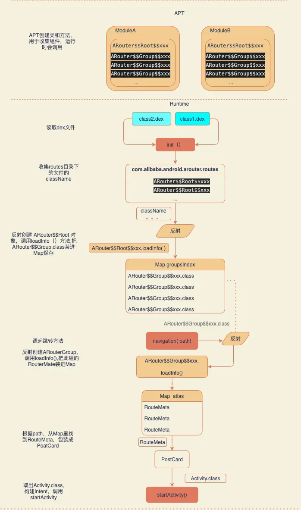

- # 一、 Arouter的组件注册
  collapsed:: true
	- ## 1. 自动注册插件
	  collapsed:: true
		- 在看ARouter源码的过程中看到，在初始化方法 init（），有个 boolean 变量 registerByPlugin, 表示是否用了插件注册组件。那么这个插件干了什么，为什么要用插件或者不用插件有啥问题吗？
		- LogisticsCenter
		  collapsed:: true
			- ```
			  init（）{
			           ...
			         //load by plugin first
			          loadRouterMap();
			          if (registerByPlugin) {
			              logger.info(TAG, "Load router map by arouter-auto-register plugin.");
			          } else {
			              ...
			              // These class was generated by arouter-compiler.
			              routerMap = ClassUtils.getFileNameByPackageName(mContext, 
			              ...
			          }
			      }
			  ```
		- build.gradle
			- ```
			  apply plugin: 'com.alibaba.arouter'
			  
			  buildscript {
			     ...
			      dependencies {
			          classpath "com.alibaba:arouter-register:1.0.2"
			      }
			  }
			  ```
	- ## 2. arouter的工作流程：
	  collapsed:: true
		- 流程
		  collapsed:: true
			- 
		- 回顾ARouter的流程，分三个步骤
		- （1）利用APT 编译期生成构建映射表的类和方法
		  collapsed:: true
			- ```
			  public class ARouter$$Root$$MainBusiness implements IRouteRoot {
			      @Override
			      public void loadInto(Map<String, Class<? extends IRouteGroup>> routes) {
			          routes.put("detail", ARouter$$Group$$detail.class);
			          routes.put("home", ARouter$$Group$$home.class);
			      }
			  } 
			  
			  public class ARouter$$Group$$detail implements IRouteGroup {
			      @Override
			      public void loadInto(Map<String, RouteMeta> atlas) {
			          atlas.put("/detail/first", RouteMeta.build(RouteType.ACTIVITY, DetailActivity.class, "/detail/first", "detail", null, -1, -2147483648));
			          ...
			      }
			  }
			  ```
			- ARouter$Root$xxx ： 收集当前模块所有的Group信息，loadInto（）方法 参数传入一个map，把所有ARouter$Group$xxx 放进这个map；
			- ARouter$Group$xxx：用于收集相同group的所有组件，loadInto（）方法参数传入一个map，把所有RouteMeta（保存注解的信息，class、group、path、参数等） 放进这个map；
		- (2)加载ARouter$Root$xxx类，收集一个module的所有的group映射表
		  collapsed:: true
			- 初始化ARout时读取每个dex文件，遍历com.alibaba.android.arouter.routes目录下的文件，收集所有的 ARouter$Root$xxx 类名
			- 反射创建 ARouter$Root$xxx 对象，调用loadInfo()，把 ARouter$Group&xxx.class 装进 Map groupsIndex 保存到内存里
			-
		- (3)跳转时，根据path加载对应的ARouter$Group$xxx.class类，构建一个group的映射表，然后根据path从映射表里找到目标组件，执行跳转
			- 调用 navigation( path)，根据 groupName 从 groupsIndex 里取出 ARouter$Group$xxx.class，反射创建对象 ，调用loadInfo() , 把这个组的 RouteMate 装进 Map routes，完成group的映射表的构建加载。
			- 根据path 从 routers 取出 RouteMate(保存注解的信息class、group、path、参数等) ，获取 Activity.class 构建 Intent ，startActivity() 跳转
	- ## 3、早期版本或者不使用插件存在效率问题
		- 会在一定程度上拖慢启动速度
		- 为了构建组件映射表，APT生成ARouter$Root$xxx类用来构建group映射关系。构建组件映射表之前，要先调用所有ARouter$Root$xxx类的loadInfo()方法，完成group表的构建。也就是上面第二步，通过读取所有dex文件遍历每个entry收集指定包内的所有class类名，找到ARouter$Root$xxx类通过反射创建实例。这个过程效率显然是不高的，如果在Application.onCreate()方法里初始化，会在一定程度上拖慢启动速度。
		- 插件的作用
		- 在编译期扫描即将打包到apk中的所有类，将符合条件的类收集起来，并通过修改字节码生成注册代码到指定的方法中
- # 二、 插件Auto-Register原理
	- 前面说过，影响效率的是扫码dex的过程，扫描dex的目的是为了收集项目中所有的ARouter$Root$xxx类。这个过程发生在运行时，所以插件就是把收集的过程提前到编译期。
	- 下面看看是怎么做的
	- ## 1. 自定义插件，注册Transform
	  collapsed:: true
		- Transform 是 Android 官方提供的在构建（.class -> .dex转换期间）阶段用来修改 .class 文件的一套标准 API。每个 Transform 都是一个 gradle task, 将 class 文件、本地依赖的 jar, aar 和 resource 资源统一处理。每个 Transform 在处理完之后交给下一个 Transform，用户自定义的 Transform 会插在队列的最前面。
		- 图
		  collapsed:: true
			- 
		- PluginLaunch
		  collapsed:: true
			- ```
			   @Override
			      public void apply(Project project) {
			              。。。
			              def transformImpl = new RegisterTransform(project)
			  
			              //init arouter-auto-register settings
			              ArrayList<ScanSetting> list = new ArrayList<>(3)
			              list.add(new ScanSetting('IRouteRoot'))
			              list.add(new ScanSetting('IInterceptorGroup'))
			              list.add(new ScanSetting('IProviderGroup'))
			              RegisterTransform.registerList = list
			  
			              //注册 RegisterTransform
			              android.registerTransform(transformImpl)
			              。。。
			      }
			  ```
		- PluginLaunch 是自定义的gradle Plugin，RegisterTransform是自定义的Transform。apply(）方法先给 registerList 初始化了数据，这里只看IRouteRoot这个接口是怎么处理的，其他俩个流程也是一样的。IRouteRoot的实现类就是一个个的ARouter$Root$xxx
	- ## 2. 扫描Jar文件 和 源码的class 文件
		- 遍历TransformInput集合，扫描所有的jar文件和.class 文件
		-