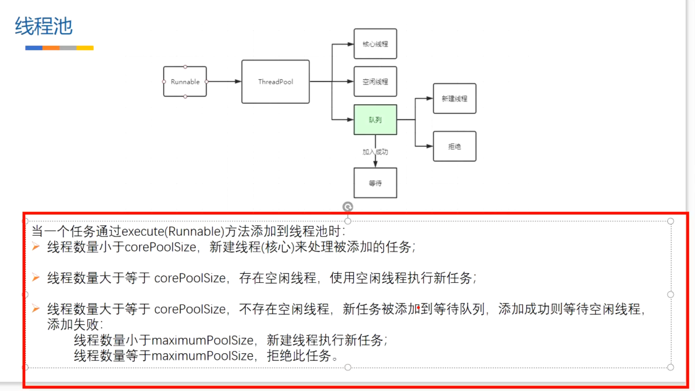

- ```java
  
          // 声明等待队列 必须设置初始容量，这里为1
          ArrayBlockingQueue<Runnable> quq = new ArrayBlockingQueue<>(1);
          // 执行任务
          ThreadPoolExecutor mPoolExecutor = new ThreadPoolExecutor(0, Integer.MAX_VALUE,
                  60,
                  TimeUnit.SECONDS, quq);
          // 第一个任务死循环 永远不会终止，结束
          mPoolExecutor.execute(() -> {
              System.out.println("任务1" + Thread.currentThread());
              while (true) {
              }
          });
  
          mPoolExecutor.execute(() -> {
              System.out.println("任务2" + Thread.currentThread());
          });
  ```
- {:height 430, :width 749}
- ## 线程池的设置
	- 核心线程0个
	- 最大线程 无限
	- 非核心线程 等待时间 60s
	- 队列为 ArrayBlockingQueue 容量为1
- ## 没有核心线程的前提下，上述的任务执行流程
	- 1、当使用此队列时，向线程池提交任务，线程开始执行，没有空闲线程，会首先加入到等待队列中，队列容量为1 加1个就满了
	- 2、开始会 新建线程1，从队列取出任务去执行,队列清空，
	- 3、执行任务2的时候，没有空间线程。且队列没满，也是先加入队列中。等待空闲线程处理才能执行。否则一直不执行
	- > 这时 第二个任务一直不执行，因为1 不出来
	- 4、如果添加第三个任务的话，以这个队列的特性
		- 队列已满，会判断是否达到最大线程数，未达到的话，开启个线程2去执行这个任务。
	- >如果加第三个任务，那么会开线程2执行这个任务，第二个任务还是等待
	- 5、第三个任务跑完 在用线程2 执行任务2