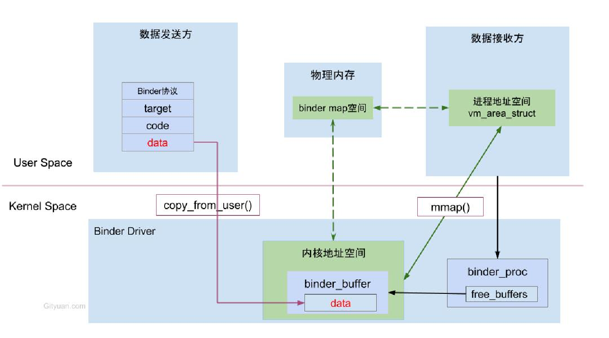

## Binder机制是
	- 1、发送进程==**通过底层内核进程**==向接受进程发送数据的
	- 2、而接受进程和内核进程，通过mmap内存映射共享一块指定的物理内存空间
	- 3、发送进程发送数据到，内核空间中的这个共享内存上，接收进程就存在了。实现了通信。
	- 那么怎么实现共享物理内存技术，就是mmap
- 需要先知道进程间怎么通信的
- ## binder一次拷贝
	- {:height 320, :width 718}
	- 
	- 我们实际操作的是虚拟内存，数据真正存在物理内存上
		- 
		- 类似于我们操作的快捷方式相当于虚拟内存，而实际的文件夹存在的是物理内存