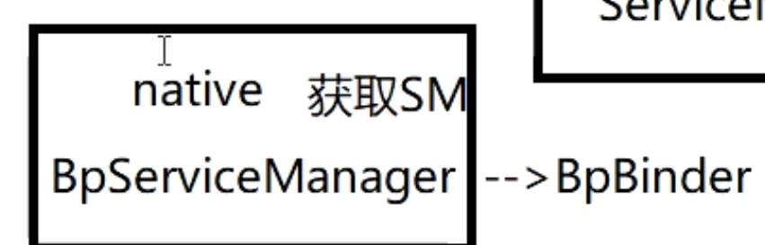

## 详细见
collapsed:: true
	- # 一、[[ServiceManager的启动]]
	- # 二、[[ServiceManager-注册服务到SM时Native层SM的获取]]
- # 一、SM的启动或者注册流程
	- ## 1、init进程通过解析[[#green]]==**init.rc**==文件，[[#green]]==**创建和启动ServiceManager进程**==
	  id:: 64a677a2-f40e-420f-b715-0b41ae4f0174
	- ## 2、在service_manager.c 中的main()入口函数，主要做如下几件事
		- ## 2-1、通过[[#red]]==**binder_open**==()打开binder驱动
		  collapsed:: true
			- 1、通过open打开内核层的binder驱动（SM进程申请128k的内核空间）
			- 2、通过mmap，将内核驱动空间虚拟内存和 SM虚拟内存 映射同一块 物理内存
		- ## 2-2、设置守护进程，并[[#red]]==**设置SM成为Binder机制的大管家**==
		  collapsed:: true
			- 1、==创建SM对应的binder_node==( binder_context_mgr_node) 结构体对象
				- binder_node 代表 驱动层的 Binder 对象 数据结构
				- 这里相当于代表的SM,主要存储SM这个binder对象相关信息）
			- 2、binder_node.proc = proc
				- ==将binder_node.proc 指向 binder_proc（当前进程信息结构体==）
			- 3、==为binder_node 创建 work 和 todo的队列==。
				- 处理客户端和服务端的队列
				- 类似MessageQueue ，客户端或者服务端来消息存里，SM轮训处理这2个队列
		- ## 2-3、通过[[#red]]==binder_loop==，SM开启无限循环，等待客户端来获取注册的系统服务等。
		  collapsed:: true
			- 1、执行BC_ENTER_LOOPER命令，设置写入状态为Loop，开启for循环
			- 2、从循环队列里去读数据，binder_thread_read（）wait_event_freezable_exclusive 方法 没有数据就进入等待。相当于SM注册完成 准备好了
			- (相当于打开SM的线程)
- # 二、Framwork层获取SM的获取流程
	- > 前提
	  1、客户端侧获取SM服务   
	  2、服务端侧是有一个提供SM的服务
	- ## Binder机制中客户端和服务端通信，需要分为两部分
	-
	- ## 1、客户端和Binder驱动通信
		- 1、FramWork层ServiceManagerProxy  持有  BinderProxy
		- 2、BinderProxy 持有 Native层的BpBinder（这个是Native层客户端侧相当于SM的代理对象），
		- 3、BpBinder.transact（）再和内核层 Binder驱动通信
	- ## 2、binder驱动和提供SM的服务端通信
		- 1、Binder驱动 和 服务端的 Native层 BBinder（SM Native层binder对象）通信
		- 2、通过jni层 JavaBBinder 到达 Framework层 SM对应的Binder
	- # 其他，先不看太多了，下边写的是Native层获取SM的
	  collapsed:: true
		- ## 背景
			- Native层获取SM流程
			  collapsed:: true
				- 
			- Java层获取SM的流程
			  collapsed:: true
				- ## [[Binder机制，Framework层获取SM流程]]
				- 
		- ## 前言
			- Native层获取SM，是通过==defaultServiceManager()==方法来完成
			- Native层主要涉及的就是注册服务的获取SM
		- ## 1、 [[ProcessState]].self，实例化ProcessState的时候会
		  id:: 64a689d6-1fd5-4705-988a-0c5721cbcb15
			- 1-1、实例化的时候，打开binder驱动
			- 1-2、设置进程中，Binder线程池，能支持的最大线程数  15个
			- 1-3、用mmap，给 binder驱动和用来[[#red]]==**获取SM 的一个 服务端Service （普通服务）**== 设置共享内存大小 ： (1M-8K)的虚拟地址空间,用来接收获取SM事务
				- 这个服务是用来获取SM的
		- ## 2、通过ProcessState::getContextObject
			- 创建一个BpBinder对象。（这个是客户端侧相当于SM的代理对象）
				- CS架构是相对的，在获取SM这个CS架构中。SM所在的也是服务端
				- 处于获取SM的CS架构的客户端侧
				- （相当于获取SM的CS架构中，服务端是有SM对象，客户端从服务端去获取SM对象。）
		- ## 3、interface_cast（BpBinder），传入2中创建的BpBinder对象（相当于拿到了SM的代理对象）
			- 调用到IServiceManager::asInterface（Bpbinder）会创建出一个BpServiceManager
			- interface_cast（BpBinder） 相当于 new BpServiceManager(new BpBinder)
			  id:: 64a69ea1-decd-49ac-9268-e8257e530a14
		- ## 4、BpServiceManager
			- BpServiceManager持有 BpBinder,BpBinder是可以通过BpBinder.transact（）和远程进行通信