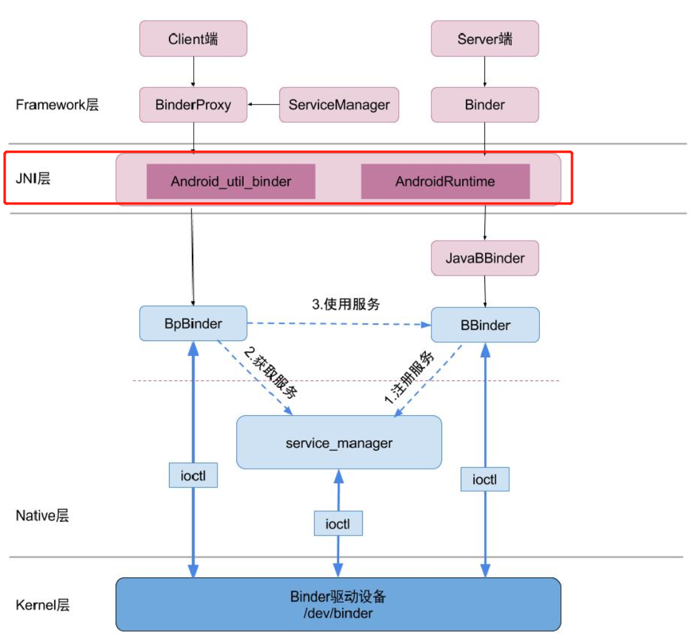

- 
- # 一、zygote启动
  collapsed:: true
	- ## **1-1.****启动****zygote****进程**
		- zygote是由init进程通过解析 ==init.zygote,rc== 文件而创建的，zygote所对应的可执行程序 ==app_process==,所对应的源文件是==app_main.cpp==,进程名为==zygote==。
		- //system/core/rootdir/init.zygote32.rc
			- ```c
			  service zygote /system/bin/app_process -Xzygote /system/bin --zygote --start-system-server
			      class main
			      socket zygote stream 660 root system
			      onrestart write /sys/android_power/request_state wake 
			      onrestart write /sys/power/state on
			      onrestart restart media
			      onrestart restart netd
			      writepid /dev/cpuset/foreground/tasks
			  ```
	- ## 1-2.执行app_main.cpp中的main方法.入口函数
		- 启动zygote的入口函数是app_main.cpp中的main方法。
		- frameworks/base/cmds/app_process/app_main.cpp
		- ```c
		  
		  //186
		  int main(int argc,char* const argv[])
		  {
		      //248  将zygote标志位置为true。
		      if(strcmp(arg,"--zygote")==0){
		          zygote=true;
		      }
		  
		  	//306  运行AndroidRuntime.cpp的start方法
		      if(zygote){
		          runtime.start("com.android.internal.os.ZygoteInit",args,zygote);
		      }
		  }    
		  ```
	- ## 1-3.AndroidRuntime::start
	  collapsed:: true
		- android系统启动的时候  调用startReg方法来完成jni方法的注册。这样java层才能调用jni的方法
		- frameworks/base/core/jni/==AndroidRuntime.==cpp
		- ```c
		  
		  //1007
		  void AndroidRuntime::start(const char* className,const Vector<String8>& options,bool zygote)
		  {
		  	//1051  注册 jni
		  	if(startReg(env)<0){
		  }
		  
		  ```
		- ```
		  frameworks/base/core/jni/AndroidRuntime.cpp
		  // 1440
		  int AndroidRuntime::startReg(JNIEnv* env){
		  	//1459注册jni方法
		  	if(register_jni_procs(gRegJNI,NELEM(gRegJNI),env)<0){
		  }
		  
		  
		  
		  //1283
		  static intregister_jni_procs(const RegJNIRec array[],size_t count,JNIEnv* env)
		  {
		  	//循环注册jni方法
		  	for(size_ti=0;i<count;i++){
		      	if(array[i].mProc(env)<0){
		          	return-1;
		          }
		      }    
		  	return0;
		  }    
		  
		  
		  //1296  注册 binder 的jni 方法
		  static const RegJNIRec gRegJNI[]={
		  	//1312
		  	REG_JNI(register_android_os_Binder),
		  }    
		  ```
- # 二、register_android_os_Binder。binder的jni方法的注册（方法先注册这样java层才可以调用jni）
  collapsed:: true
	- frameworks/base/core/jni/android_util_Binder.cpp
	- ```java
	  //1282
	  int register_android_os_Binder(JNIEnv* env)
	  {   
	    	if(int_register_android_os_Binder(env)<0)
	        	return-1;
	    	if(int_register_android_os_BinderInternal(env)<0)
	        	return-1;
	    	if(int_register_android_os_BinderProxy(env)<0)
	        	return-1;
	  }  
	  ```
	- ## **2-1.int_register_android_os_Binder**
		- frameworks/base/core/jni/==android_util_Binder==.cpp
		- ```c
		  //843  java 层 与 native 方法的映射关系，互相调用
		  static const JNINativeMethod gBinderMethods[]={
		    /*name,signature,funcPtr*/
		    	{"getCallingPid","()I",(void*)android_os_Binder_getCallingPid},
		      {"getCallingUid","()I",(void*)android_os_Binder_getCallingUid},
		      {"clearCallingIdentity","()J",(void*)android_os_Binder_clearCallingIdentity},
		   	{"restoreCallingIdentity","(J)V",(void*)android_os_Binder_restoreCallingIdentity},
		   	{"setThreadStrictModePolicy","(I)V",(void*)android_os_Binder_setThreadStrictModePolicy},
		    	{"getThreadStrictModePolicy","()I",(void*)android_os_Binder_getThreadStrictModePolicy},
		    	{"flushPendingCommands","()V",(void*)android_os_Binder_flushPendingCommands},
		    	{"init","()V",(void*)android_os_Binder_init},
		  	{"destroy","()V",(void*)android_os_Binder_destroy},
		    	{"blockUntilThreadAvailable","()V",(void*)android_os_Binder_blockUntilThreadAvailable}
		  };
		  
		  //857  
		  const char* const kBinderPathName = "android/os/Binder";
		  
		  //859
		  static int int_register_android_os_Binder(JNIEnv* env){
		    	//查找文件kBinderPathName="android/os/Binder"，返回对应Class对象
		    	jclass clazz = FindClassOrDie(env,kBinderPathName);
		     
		   	 //通过gBinderOffsets结构体，保存Java层Binder类的信息，为JNI层访问Java层提供通道
		  	gBinderOffsets.mClass=MakeGlobalRefOrDie(env,clazz);
		   	gBinderOffsets.mExecTransact=GetMethodIDOrDie(env,clazz,"execTransact","(IJJI)Z");
		    	gBinderOffsets.mObject=GetFieldIDOrDie(env,clazz,"mObject","J");
		      
		      //通过RegisterMethodsOrDie，将为gBinderMethods数组完成映射关系，从而为Java层访问JNI层提供通道
		    	return RegisterMethodsOrDie(env,kBinderPathName,
		                                  gBinderMethods,NELEM(gBinderMethods));
		  }  
		  ```
	- ## **2-2.int_register_android_os_BinderInternal**
		- frameworks/base/core/jni/android_util_Binder.cpp
		- ```c
		  //925
		  static const JNI Native Methodg BinderInternalMethods[]={
		    /*name,signature,funcPtr*/
		    {"getContextObject","()Landroid/os/IBinder;",(void*)android_os_BinderInternal_getContextObject},
		    {"joinThreadPool","()V",(void*)android_os_BinderInternal_joinThreadPool},
		    {"disableBackgroundScheduling","(Z)V",(void*)android_os_BinderInternal_disableBackgroundScheduling},
		    {"handleGc","()V",(void*)android_os_BinderInternal_handleGc}};
		  
		  //933
		  const char* const kBinderInternalPathName="com/android/internal/os/BinderInternal";
		  //935
		  static int int_register_android_os_BinderInternal(JNIEnv*env){
		        //查找文件kBinderInternalPathName="com/android/internal/os/BinderInternal"，返回Class对象
		        jclass clazz=FindClassOrDie(env,kBinderInternalPathName);
		        //通过gBinderInternalOffsets，保存Java层BinderInternal类的信息，为JNI层访问java层提供通道
		   	  gBinderInternalOffsets.mClass=MakeGlobalRefOrDie(env,clazz);
		  	  gBinderInternalOffsets.mForceGc=GetStaticMethodIDOrDie(env,clazz,"forceBinderGc","()V");
		        //通过RegisterMethodsOrDie()，将为gBinderInternalMethods数组完成映射关系，从而为Java层访问JNI层提供通道
		        return RegisterMethodsOrDie(env,kBinderInternalPathName,gBinderInternalMethods,NELEM(gBinderInternalMethods));}
		  ```
	- ## **2-3.int_register_android_os_BinderProxy**
		- frameworks/base/core/jni/android_util_Binder.cpp
		- ```C
		  //1241
		  staticconstJNINativeMethodgBinderProxyMethods[]={
		    /*name,signature,funcPtr*/
		    {"pingBinder",   "()Z",(void*)android_os_BinderProxy_pingBinder},
		    {"isBinderAlive",   "()Z",(void*)android_os_BinderProxy_isBinderAlive},
		    {"getInterfaceDescriptor","()Ljava/lang/String;",(void*)android_os_BinderProxy_getInterfaceDescriptor},
		    {"transactNative",  "(ILandroid/os/Parcel;Landroid/os/Parcel;I)Z",(void*)android_os_BinderProxy_transact},
		    {"linkToDeath",    "(Landroid/os/IBinder$DeathRecipient;I)V",（void*)android_os_BinderProxy_linkToDeath},
		    {"unlinkToDeath",   "(Landroid/os/IBinder$DeathRecipient;I)Z",(void*)android_os_BinderProxy_unlinkToDeath},
		    {"destroy",      "()V",(void*)android_os_BinderProxy_destroy},};
		    
		    //1252
		  const char* const kBinderProxyPathName="android/os/BinderProxy";
		  //1254
		  static int int_register_android_os_BinderProxy(JNIEnv*env){
		    //查找文件kBinderProxyPathName="android/os/BinderProxy"，返回对应Class对象
		    	jclass clazz=FindClassOrDie(env,"java/lang/Error");
		  	gErrorOffsets.mClass=MakeGlobalRefOrDie(env,clazz);
		  	//通过gBinderProxyOffsets，保存Java层BinderProxy类的信息，为JNI层访问Java提供通道clazz=FindClassOrDie(env,kBinderProxyPathName);
		  	gBinderProxyOffsets.mClass=MakeGlobalRefOrDie(env,clazz);
		  	gBinderProxyOffsets.mConstructor=GetMethodIDOrDie(env,clazz,"<init>","()V");
		    	gBinderProxyOffsets.mSendDeathNotice=GetStaticMethodIDOrDie(env,clazz,"sendDeathNotice","(Landroid/os/IBinder$DeathRecipient;)V");
		    	gBinderProxyOffsets.mObject=GetFieldIDOrDie(env,clazz,"mObject","J");
		    	gBinderProxyOffsets.mSelf=GetFieldIDOrDie(env,clazz,"mSelf","Ljava/lang/ref/WeakReference;");
		    	gBinderProxyOffsets.mOrgue=GetFieldIDOrDie(env,clazz,"mOrgue","J");
		      clazz=FindClassOrDie(env,"java/lang/Class");
		      gClassOffsets.mGetName=GetMethodIDOrDie(env,clazz,"getName","()Ljava/lang/String;");
		    	//通过RegisterMethodsOrDie()，将为gBinderProxyMethods数组完成映射关系，从而为Java层访问JNI层提供通道
		    	return RegisterMethodsOrDie(
		        	env,kBinderProxyPathName,
		  		gBinderProxyMethods,NELEM(gBinderProxyMethods));  
		  }
		  ```
		-
		-
		-