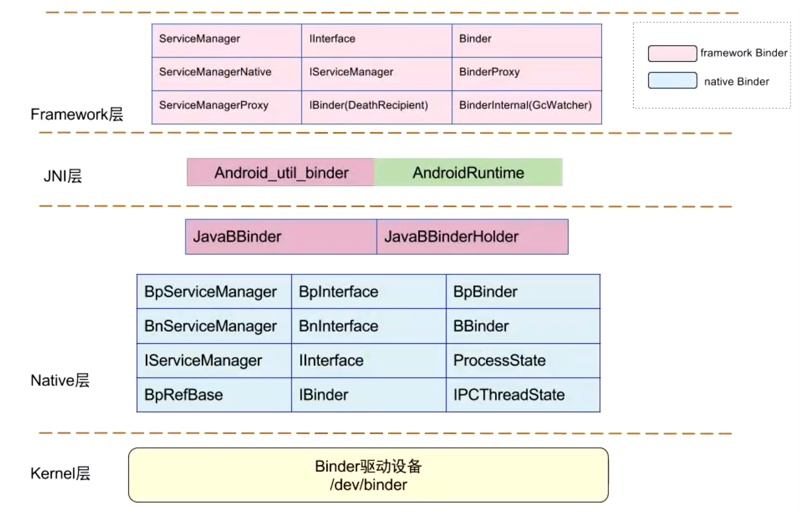

- {:height 517, :width 780}
-
- # Framework
	- ## 1、ServiceManager
	- ## 客户端
		- ## 3、ServiceManagerProxy
			- 客服端的
			- 携带BinderProxy
		- ## 4、BinderProxy
			- 客户端测
			- Framework层 binder代理
	- ## 服务端
		- ## 2、ServiceManagerNative
			- 服务端的
		- ## 5、Binder
			- 服务端侧
			- Framework层 binder对象
- # Native层
	- ## 客户端
		- ## 1、BpBinder，
			- native层中客户端的binder代理对象
		- ## 5、BpServiceManager
			- 客户端测
			- 相当于Framework层 ServiceManagerProxy
	- ## 服务端
		- ## 2、BBinder
			- native层中服务端，binder对象
		- ## 6、BnServiceManager
			- 服务端侧
			- 相当于Framework层 ServiceManagerNative
	-
	- ## 3、ProcessState
		- 进程相关
	- ## 4、IPCThreadState
		- 线程相关
- # 内核层
	- ## dev/binder
		- Binder驱动
-
- # [[#red]]==比较绕的流程==
	- 
	- # 举例1、Framework层 使用服务流程（Framework层使用服务）比如从SM获取AMS
		- ## 客户端和Binder驱动通信（反之一样）
			- FramWork层ServiceManagerProxy  携带 BinderProxy 寻找
			- Native层的BpBinder，
			- Native层的BpBinder再和内核层 Binder驱动通信
		- ## Binder驱动和服务端通信
			- Binder驱动 和 服务端的 Native层 BBinder通信
			- 通过jni层 JavaBBinder 到达 Framework层 Binder
	- # 举例2、Native层 使用服务流程（Native层也有该层服务）
	  collapsed:: true
		- ## 客户端和Binder驱动
			- Native层 同层的，不需要封装 BinderProxy，BpServiceManager 直接 携带 BpBinder，和内核通信
		- ## 服务端和Binder驱动
			- 内核-》BBinder-》BnServiceManager